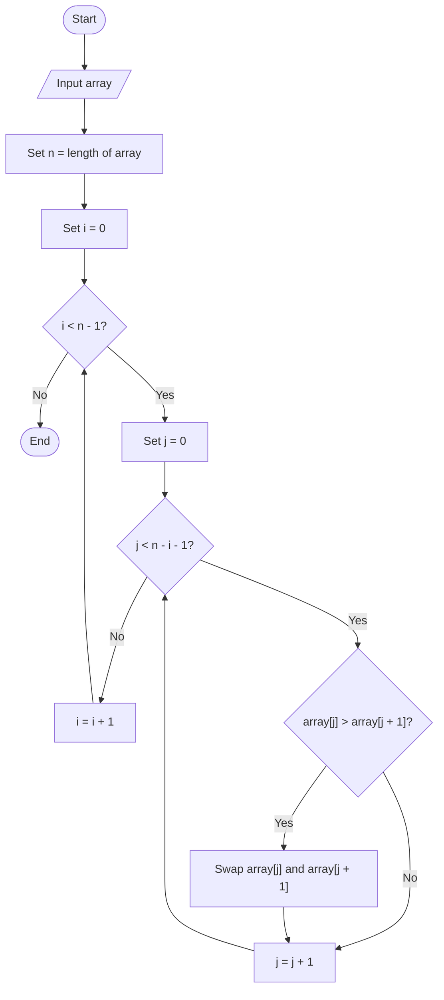

---
tags:
  - pesudocode
  - general
  - decision-table
  - flowchart
  - algorithm
  - theory
---
# Algorithm

An algorithm is a step-by-step procedure (well-defined instructions) to solve a given problem.

# Pesudocode 

Pseudo code is a description of the steps in an algorithm using natural language (such as English) mixed with sequence, selection and iteration constructs.
### Data types

```
INTEGER: A whole number
REAL: A real number
CHAR: A single character
STRING: A sequence of zer or more characters
BOOLEAN: The logical values TRUE or FALSE
DATE: A valid calendar date
```

### Declaring a variable


```
DECLARE <identifier>: <data type>
E.g. DECLARE x: INTEGER
````

### Reading input

```

INPUT <identifier>
E.g. INPUT x
```

### Outputting

```
OUTPUT <identifier>
E.g. OUTPUT x
```

### Assignment

```
<identifier> ← <value>
E.g. x ← 1
```

### If statement

```
IF <condition 1> THEN
	// code
ELSE IF <condition 2> THEN
	// code
.
.
.
ELSE
	// code
ENDIF
```

### While loop

```
WHILE <condition> DO
	// code
ENDWHILE
```

### For loop

```
FOR <identifier>←<start value> TO <end value>
// code
ENDFOR 

OR

FOR <identifier>←<start value> TO <end value>
// code
NEXT <identifier>

OR

FOR <identifier>←<start value> TO <end value>
// code
NEXT
```

### Case statement

```
CASE <identifier> of
	1: // code
	2: // code
	OTHERWISE
		// code
ENDCASE

OR

SELECT <identifier>
	CASE 1
		// code
	CASE 2
		// code
	ELSE
		// code
ENDSELECT
```

### Arrays

```
Declaring 1D-Arrays
DECLARE <identifier>: ARRAY[<L>:<U>] OF <data type>
E.g. DECLARE StudentAges: ARRAY[1:10] OF INTEGER
NOTE: L to U inclusive

Declaring Multidimensional Arrays
DECLARE <identifier>: ARRAY[<L1>:<U1>, <L2>:<U2>] OF <data type>
E.g. DECLARE Attendance: ARRAY[1:5, 1:4] OF CHAR

NOTE:
L1 → U1: Rows
L2 → U2: Columns

Calling elements in an array:
For 1D-arrays:
<identifier>[<idx>]
E.g. StudentAges[1]

For 2D-arrays:
<identifier>[<idx1>, <idx2>] → NOT <identifier>[<idx1>][<idx2>]
E.g. Attendance[2, 3]
```


### File Handling


```
File Modes
READ: for data to be read from the file
WRITE: for data to be written to the file. A new file will be created and any existing data in the file will be lost
APPEND: for data to be added to the file, after any existing data

Opening a file
OPENFILE <File identifier> FOR <File mode>
E.g. OPENFILE FileA.txt FOR READ

Reading from a file
READFILE <File identifier>, <variable>
The variable should be of data type STRING. When the command is executed, the next line of text in the file is read and assigned to the variable.
E.g. READFILE FileA.txt LineOfText

End of File
EOF(<File Identifier>) → returns TRUE or FALSE
Returns TRUE if the file pointer is at the end of the file
Otherwise, returns FALSE.
E.g. WHILE NOT EOF(FileA.txt) DO

Writing on a file
WRITEFILE <File identifier>, <String>
When the command is executed, the string is written into the file and the file pointer moves to the next line.

Closing a file
CLOSEFILE <File identifier>
E.g. CLOSEFILE FileA.txt
```

### Modules/Subroutines

```
Procedures
PROCEDURE <identifier>(<param1> : <datatype1>, <param2> : <datatype2>, …)
	// code
ENDPROCEDURE

Functions
FUNCTION <identifier>(<param1> : <datatype1>, <param2> : <datatype2>, …) RETURNS <data type>
	// code
	RETURN <value>
ENDFUNCTION

Calling procedures/functions
CALL <identifier>(<arg1>, <arg2>, …)

Passing by value
PROCEDURE <identifier>(BYVALUE <param1> : <datatype1>, …)
	// code
ENDPROCEDURE

Passing by reference
PROCEDURE <identifier>(BYREF <param1> : <datatype1>, …)
	// code
ENDPROCEDURE
```


### Declaring Global variables


```
DECLARE GLOBAL <identifier>: <data type>
E.g. DECLARE GLOBAL W: INTEGER
```


### Classes

```
CLASS <class name>
	Private:
		// Private attributes/methods
	Public:
		// Public attributes/methods
ENDCLASS

E.g.
CLASS Carpet
	Private:
		length: REAL
		width: REAL
	Public:
		Constructor(Length, Width)
		Destructor()
		getLength() RETURNS REAL
		getWidth() RETURNS REAL
		setLength(newLength)
		setWidth(newWidth)
ENDCLASS
```


# Flowchart

### Bubble Sort as an example





# Decision Table


<table>
  <thead>
    <tr>
      <th rowspan="2">CONDITIONS</th>
      <th colspan="8">OUTCOMES</th>
    </tr>
    <tr>
      <th>1</th>
      <th>2</th>
      <th>3</th>
      <th>4</th>
      <th>5</th>
      <th>6</th>
      <th>7</th>
      <th>8</th>
    </tr>
  </thead>

  <tbody>
    <tr>
      <td>Is it a weekday?</td>
      <td>Y</td><td>Y</td><td>Y</td><td>Y</td>
      <td>N</td><td>N</td><td>N</td><td>N</td>
    </tr>

    <tr>
      <td>Is it before 7am?</td>
      <td>Y</td><td>Y</td><td>N</td><td>N</td>
      <td>Y</td><td>Y</td><td>N</td><td>N</td>
    </tr>

    <tr>
      <td>Is it after 8am?</td>
      <td>Y</td><td>N</td><td>Y</td><td>N</td>
      <td>Y</td><td>N</td><td>Y</td><td>N</td>
    </tr>

    <tr>
      <th>ACTIONS</th>
      <td colspan="8"></td>
    </tr>

    <tr>
      <td>Breakfast</td>
      <td>*</td><td>X</td><td></td><td>X</td>
      <td>*</td><td></td><td></td><td></td>
    </tr>

    <tr>
      <td>Walk to work</td>
      <td>*</td><td>X</td><td></td><td></td>
      <td>*</td><td></td><td></td><td></td>
    </tr>

    <tr>
      <td>Go by bus</td>
      <td>*</td><td></td><td>X</td><td>X</td>
      <td>*</td><td></td><td></td><td></td>
    </tr>
  </tbody>
</table>

> **\*** means that no such outcomes exist, and these columns have to be omitted.

# Removed Redundancy

<table>
  <thead>
    <tr>
      <th rowspan="2">CONDITIONS</th>
      <th colspan="4" style="text-align: center;">OUTCOMES</th>
    </tr>
    <tr>
      <th>1</th>
      <th>2</th>
      <th>3</th>
      <th>4</th>
    </tr>
  </thead>

  <tbody>
    <tr>
      <td>Is it a weekday?</td>
      <td>Y</td>
      <td>Y</td>
      <td>Y</td>
      <td>N</td>
    </tr>

    <tr>
      <td>Is it before 7am?</td>
      <td>Y</td>
      <td>N</td>
      <td>N</td>
      <td>-</td>
    </tr>

    <tr>
      <td>Is it after 8am?</td>
      <td>N</td>
      <td>Y</td>
      <td>N</td>
      <td>-</td>
    </tr>

    <tr>
      <th>ACTIONS</th>
      <td colspan="4"></td>
    </tr>

    <tr>
      <td>Breakfast</td>
      <td>X</td>
      <td></td>
      <td>X</td>
      <td></td>
    </tr>

    <tr>
      <td>Walk to work</td>
      <td>X</td>
      <td></td>
      <td></td>
      <td></td>
    </tr>

    <tr>
      <td>Go by bus</td>
      <td></td>
      <td>X</td>
      <td>X</td>
      <td></td>
    </tr>
  </tbody>
</table>

> **-** means that the condition does not matter for that outcome.