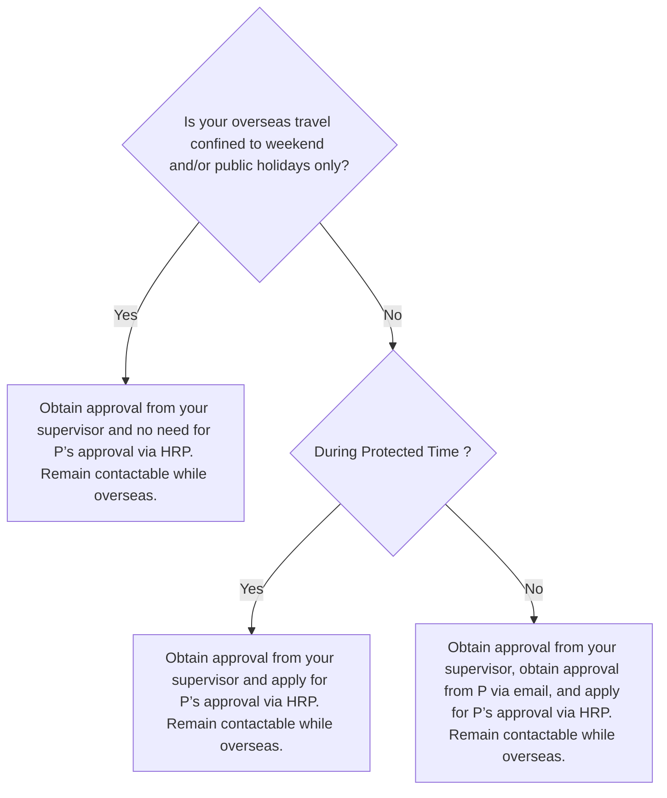
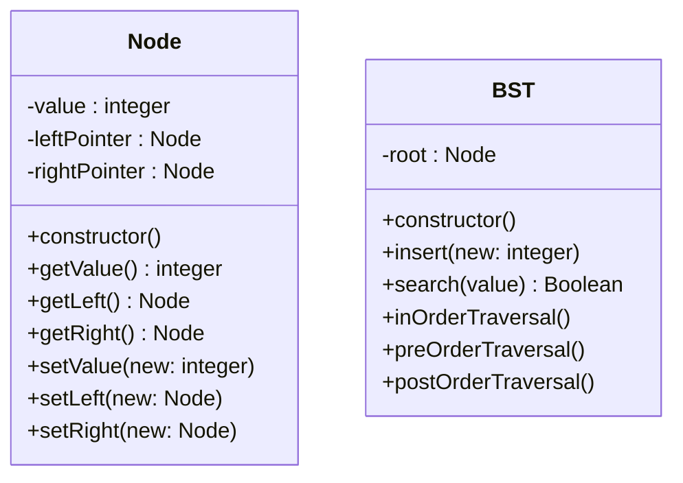
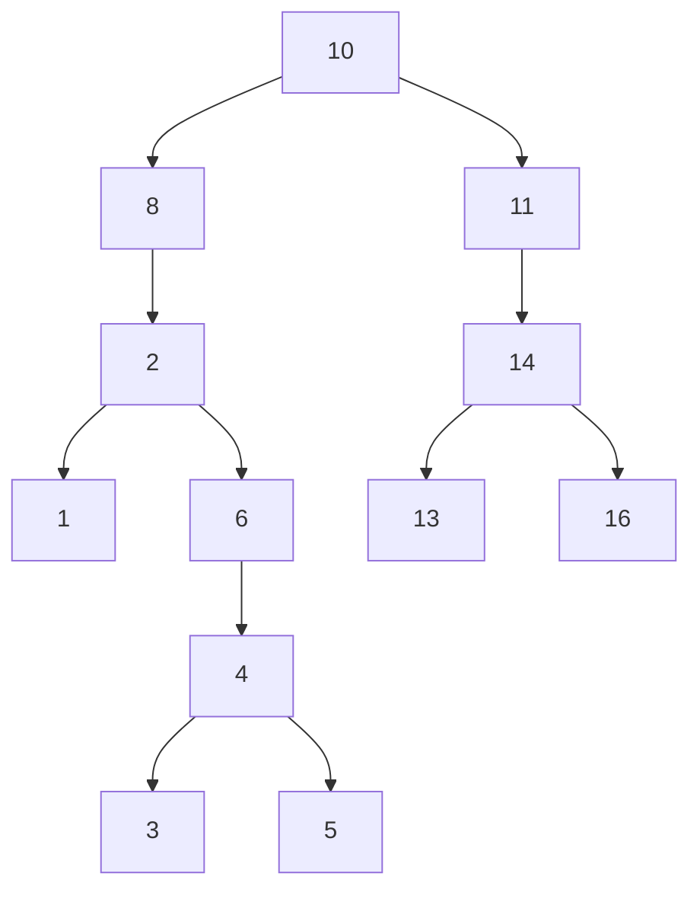
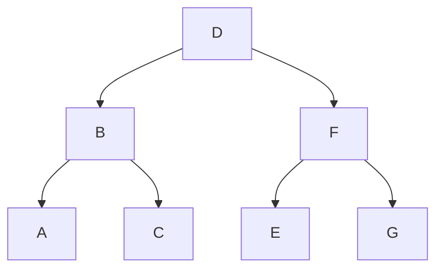
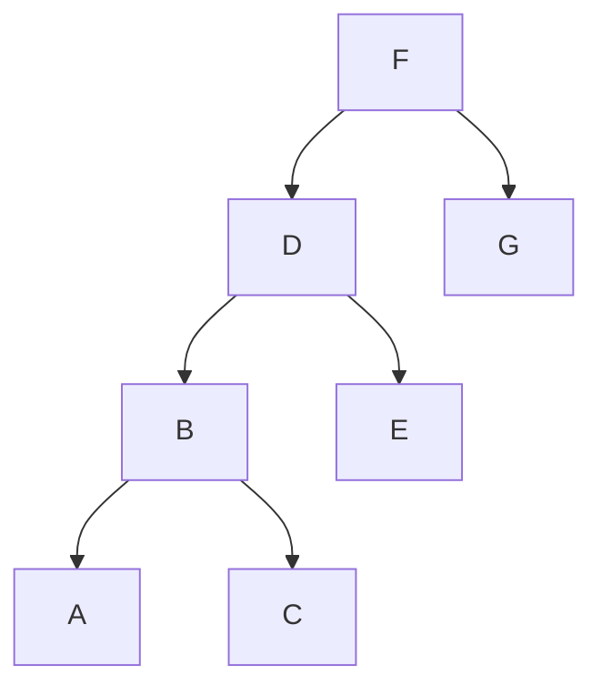
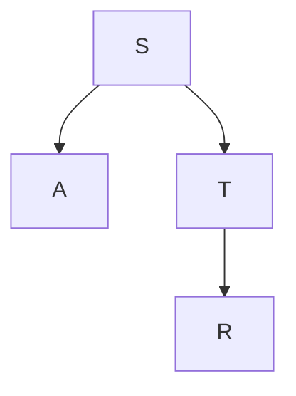
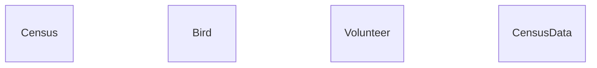

# Table of Contents

| Topic                                                                                                         | Subtopics                                                                                                                                                                                                                          |
| ------------------------------------------------------------------------------------------------------------- | ---------------------------------------------------------------------------------------------------------------------------------------------------------------------------------------------------------------------------------- |
| [Data Representation](#toc-data-representation)                                                               | [Denary to Binary](#toc-data-representation-denary-to-binary)                                                                                                                                                                      |
| [Encoding](#toc-encoding)                                                                                     | [ASCII code](#toc-encoding-ascii-code)                                                                                                                                                                                             |
| [Data Validation and Verification](#toc-data-validation-and-verification)                                     | [Data Validation](#toc-data-validation-and-verification-data-validation)<br>[Program Errors](#toc-data-validation-and-verification-program-errors)                                                                                 |
| [Ethics](#toc-ethics)                                                                                         | [Code of Ethics](#toc-ethics-code-of-ethics)                                                                                                                                                                                       |
| [Algorithms, Pseudocode, Flowcharts & Decision Tables](#toc-algorithms-pseudocode-flowcharts-decision-tables) | [Decision Tables](#toc-algorithms-pseudocode-flowcharts-decision-tables-decision-tables)                                                                                                                                           |
| [Program Development](#toc-program-development)                                                               | [Decomposition and Modularity](#toc-program-development-decomposition-and-modularity)                                                                                                                                              |
| [Recursion](#toc-recursion)                                                                                   | [Definition](#toc-recursion-definition)                                                                                                                                                                                            |
| [Object-Oriented Programming](#toc-object-oriented-programming)                                               | [Class Diagram](#toc-object-oriented-programming-class-diagram)<br>[4 Pillars of OOP](#toc-object-oriented-programming-4-pillars-of-oop)                                                                                           |
| [Searching Algorithms](#toc-searching-algorithms)                                                             | [HashTable Search](#toc-searching-algorithms-hashtable-search)                                                                                                                                                                     |
| [Sorting Algorithms](#toc-sorting-algorithms)                                                                 | [Insertion](#toc-sorting-algorithms-insertion)<br>[Comparison of Sorting Algorithms](#toc-sorting-algorithms-comparison-of-sorting-algorithms)<br>[Merge Sort](#toc-sorting-algorithms-merge-sort)                                 |
| [Data Structures](#toc-data-structures)                                                                       | [Static and Dynamic Data Structures](#toc-data-structures-static-and-dynamic-data-structures)                                                                                                                                      |
| [Stacks](#toc-stacks)                                                                                         | [Core Operations](#toc-stacks-core-operations)                                                                                                                                                                                     |
| [Linked Lists](#toc-linked-lists)                                                                             | [Ordered Insertion](#toc-linked-lists-ordered-insertion)<br>[Core Operations](#toc-linked-lists-core-operations)                                                                                                                   |
| [Trees](#toc-trees)                                                                                           | [Binary Search Tree (BST) Creation](#toc-trees-binary-search-tree-bst-creation)<br>[Tree Traversal](#toc-trees-tree-traversal)                                                                                                     |
| [Data Management](#toc-data-management)                                                                       | [Backup](#toc-data-management-backup)                                                                                                                                                                                              |
| [Relational Databases](#toc-relational-databases)                                                             | [Database Normalisation](#toc-relational-databases-database-normalisation)<br>[ER (Entity Relationship) Diagram](#toc-relational-databases-er-entity-relationship-diagram)<br>[SQL Queries](#toc-relational-databases-sql-queries) |
| [Non-relational Databases](#toc-non-relational-databases)                                                     | [Advantages](#toc-non-relational-databases-advantages)                                                                                                                                                                             |
| [Computer Networks](#toc-computer-networks)                                                                   | [Internet](#toc-computer-networks-internet)<br>[TCP/IP Model](#toc-computer-networks-tcp-ip-model)<br>[LAN (Local Area Network)](#toc-computer-networks-lan-local-area-network)<br>[Packets](#toc-computer-networks-packets)       |
| [Network Security](#toc-network-security)                                                                     | [Malware Attacks](#toc-network-security-malware-attacks)<br>[Secure access method](#toc-network-security-secure-access-method)<br>[Digital signature](#toc-network-security-digital-signature)                                     |
| [Application Design](#toc-application-design)                                                                 | [Web and Native Applications](#toc-application-design-web-and-native-applications)                                                                                                                                                 |

---

<a id="toc-data-representation"></a>

# Data Representation

<a id="toc-data-representation-denary-to-binary"></a>

### Denary to Binary

##### 2024 NYJC Prelim P1 Q4)

**4 A company is developing an application that allows clients to track daily expenses. The application will allow users to record expense data such as dates, categories, amounts, and descriptions among others.**

**(a) Explain an advantage of using Unicode over ASCII for the expense description. [2]**

> [!Answer]
> **Unicode** is able to represent characters beyond the **ASCII** range ...
>
> ... which allows international characters/other symbols to be used for expense description [context]

**(b) Data needs to be validated and verified on entry.**

**(i) State two ways the dates can be validated on entry. [2]**

**(ii) State one way to ensure expense data is verified before submission. [1]**

> [!Answer]
> (i) Format check / range check / presence check; any 2
>
> (ii) Double entry / proofreading

**(c) At a meeting, a suggestion was raised to store expense amounts as cents, using 8 digits.**

**This will allow an expense amount between 0 and 99,999,999 to be stored.**

**(c) What isState the minimum number of bytes required to store the expense amount, using the following data types:**

**(i) integer, [1]**

**(ii) ASCII string. [1]**

> [!Answer]
> (i) 4 bytes
>
> (ii) 7 bytes / 8 bytes

**(d) State one advantage and one disadvantage of storing the expense amount as a string. [2]**

> [!Answer]
> advantage: human-readable
>
> disadvantage: more bytes/storage required / not easily used in calculations, requiring conversion

**(e) During the testing phase of the application, an error popped up on the screen with the following pair of hexadecimal codes, separated by a colon:**

**BFF1:1AF0**

**Represent the hexadecimal code**

**(i) to the left side of the colon as a decimal value, [1]**

**(ii) to the right side of the colon as a binary value. [1]**

> [!Answer]
> (i) BFF1: (11 * 16^3) + (15 * 16^2) + (15 * 16^1) + + (1 * 16^0) = 49137
>
> (ii) 1 --> 0001
>
> A --> 1010
>
> F --> 1111
>
> 0 --> 0000
>
> 1AF0 = 0001 1010 1111 0000

---

<a id="toc-encoding"></a>

# Encoding

<a id="toc-encoding-ascii-code"></a>

### ASCII code

##### 2024 ACJC Prelim P1 Q1)

**1 The ASCII system encodes single characters into integers from 0 to 127. For example, the characters '0' to '9' are encoded into the integers 48 to 57.**

**(i) Convert the integers 48 and 57 into binary, and explain how, in these particular cases, the last 4 binary digits are a helpful way to remember which character they represent. [3]**

**(ii) State the maximum number of binary digits needed to represent an ASCII character. [1]**

**(iii) In some ASCII systems, one more binary digit is added as a check digit. Explain the role of a check digit in data validation. [2]**

**(iv) Explain why ASCII is inadequate for multilingual communication between different countries. [1]**

> [!Answer]
> (i) 48₁₀ = 110000₂ 57₁₀ = 111001₂
>
> The last 4 digits interpreted as a binary number convert to the base 10 digit they represent (0000₂ = 0₁₀, 1001₂ = 9₁₀).
>
> (ii) Since there are 128 characters, 7 bits are needed/
>
> (iii) A check digit is an addition digit such that the sum of all the digits is even (or odd, depending on the system used). This allows single-digit errors to be detected.
>
> (iv) There are more than 128 characters being used by the languages Iin the world. If a text is written in multiple languages, there would need to be an encoding system that can accommodate much more than 128 characters.

---

<a id="toc-data-validation-and-verification"></a>

# Data Validation and Verification

<a id="toc-data-validation-and-verification-data-validation"></a>

### Data Validation

##### 2024 HCI Prelim P1 Q1)

**1 Validation and verification are used in data entry.**

**(a) (i) State the purpose of verification. [1]**

**(ii) State one method of verification. [1]**

> [!Answer]
> (i) Verification checks that data entered is the same as the original source.
>
> (ii) One method is double entry, another is proof reading.

**(b) The use of check digits is one validation technique.**

**(i) State the purpose of validation. [1]**

**(ii) State one method of validation other than check digits. [1]**

**(iii) Name two types of error that check digits usually detect. [2]**

> [!Answer]
> (i) Validation checks that data entered is reasonable or sensible.
>
> (ii) Any one method:
>
> Range check
>
> * check that data entered is within a predefined range of values.
>
> Format check
>
> * check that data entered is in the correct format. Eg. date is in the format dd/mm/yyyy.
>
> Length check - check that data entered has correct length. Eg. length of password.
>
> Presence check - check that a field is not left blank. Eg. username field cannot be empty.
>
> (iii) Errors that check digits usually detect:
>
> Single digit errors. Eg. 1 is wrongly input as 2.
>
> Transposition errors. Eg. 12 is wrongly input as 21.

**ASCII code and Unicode are two of the methods of encoding characters.**

**(c) The ASCII code in denary for the character ‘1’ is 49.**

**(i) Using 7 bits, express the ASCII code for the character ‘4’ in binary. [1]**

**(ii) Express the character ‘4’ as a hexadecimal number. [1]**

**(iii) Convert the hexadecimal number 4B1 to a binary number stored as two bytes. [2]**

> [!Answer]
> (i) 011 0100
>
> (ii) 34₁₆
>
> (iii) 0000 0100 1011 0001

**(d) (i) State the values that are common to both ASCII and Unicode. [1]**

**(ii) Why is Unicode preferred over ASCII in modern computing? [1]**

> [!Answer]
> (i) 0 – 127
>
> (ii) Extended Character Set -- **Unicode** includes a wide range of characters from various languages, symbols, and scripts, while **ASCII** is limited to 128 characters, which is insufficient for international text representation.

---

<a id="toc-data-validation-and-verification-program-errors"></a>

### Program Errors

##### 2024 RI Prelim P1 Q7)

**7 A function is written to validate an array of codes using the ISBN-13 check digit algorithm.**

```text
01    FUNCTION ValidateCodes(Codes : ARRAY OF STRING, NumberOfCodes :
      INTEGER) RETURNS INTEGER
02        DECLARE ValidCount : INTEGER
03        DECLARE i, j, TotalSum, Digit, CheckDigit : INTEGER
04        DECLARE Code : STRING
05        ValidCount ← 0
06        FOR i = 0 TO NumberOfCodes
07            Code ← Codes[i]
08            IF LENGTH(Code) <> 13 OR NOT IsNumeric(Code) THEN
09                CONTINUE
10            ENDIF
11            TotalSum ← 0
12            FOR j = 0 TO 11
13                Digit ← INTEGER(Code[j])
14                IF j MOD 2 = 0 THEN
15                     TotalSum ← TotalSum + Digit
16                ELSE
17                     TotalSum ← TotalSum + Digit * 3
18                ENDIF
19            ENDFOR
20            CheckDigit ← INTEGER(Code[12])
21            IF (TotalSum + CheckDigit) MOD 10 = 0 THEN
22                ValidCount ← ValidCount + 1
23            ENDIF
24        ENDFOR
25        RETURN ValidCount
26    ENDFUNCTION
```

**(a) Line 6 generates an error. Explain why the error occurs and how you would correct it. [2]**

> [!Answer]
> The loop will iterate from 0 to NumberOfCodes, inclusive. This causes the loop to try
>
> accessing an index that is out of bounds for the Codes array.
>
> To fix this issue, the loop should iterate from 0 to NumberOfCodes - 1, ensuring that the loop only accesses valid indices of the Codes array.

**(b) Given the function call with the following arguments:**

**• Codes = ["1234567890128", "123456789012a", "1234567890", "123456789012", "1234567890124"]**

**• NumberOfCodes = 5**

**What is the return value from the function? Explain your answer. [4]**

> [!Answer]
> Valid Codes Count: 1 (only "1234567890128" is valid)
>
> Loop through the Codes:
>
> • For i = 0 (Code: "1234567890128"):
>
> o Length: 13 (valid) o Numeric Check: All digits (valid) o Checksum Calculation:
>
> ▪ TotalSum: (1 * 1) + (2 * 3) + (3 * 1) + (4 * 3) + (5 * 1) + (6 *
>
> 3. * (7 * 1) + (8 * 3) + (9 * 1) + (0 * 3) + (1 * 1) + (2 * 3) = 92
>
> ▪ CheckDigit: 8
>
> ▪ Checksum Validation: (92 + 8) % 10 = 100 % 10 = 0 → Valid
>
> Invalid Codes List: ["123456789012a", "1234567890", "123456789012", "1234567890124"]

**(c) Invalid codes in the Codes array are not processed.**

**Describe how you can modify the function to report these invalid codes. You are not required to rewrite the entire pseudocode. [3]**

> [!Answer]
> Initialisation: Create an empty list InvalidCodes to store invalid codes.
>
> Validation Checks: Add codes to InvalidCodes if they fail length, numeric, or checksum checks.
>
> Return Value: Return a tuple containing the count of valid codes and the list of invalid codes.

---

##### 2024 RVHS Prelim P1 Q4)

**4 You are a software tester for a banking application that allows users to transfer funds between accounts. The application has a "Transfer Funds" feature with the following requirements:**

**• Source Account Number o a text field that only accepts a valid 10-digit account number**

**• Destination Account Number o a text field that only accepts a valid 10-digit account number**

**• Transfer Amount (numeric field):**

**o Minimum transfer amount: $10 o Maximum transfer amount: $10,000 o Must be a multiple of $1 (no cents)**

**The application should validate the inputs and perform the transfer if the inputs are valid. The application should also display an error message if the inputs are invalid. After a successful transfer, the application will display:**

**• The source account balance (updated)**

**• A success message indicating the transfer amount and destination account number**

**• The destination account balance will NOT be displayed for privacy reasons**

**(a) State one data validation technique and one data verification technique for the source and destination account number input. [2]**

> [!Answer]
> **Data validation**:
>
> Length check
>
> check digit
>
> double entry
>
> **Data verification**:
>
> Query the bank's database to confirm the account number exists and is active
>
> Use a bank-provided API to verify the account number and account holder details.

**(b) Design a series of test cases to test the "Transfer Funds" feature completely. You can assume that the Source Account Number is valid. [4]**

> [!Answer]
> Normal test case
>
> $500, expect transfer successful
>
> Abnormal test case [any 3]
>
> Invalid destination account, expect error message
>
> Transfer of $50.0
>
> Transfer of ($5 or $ 20000)
>
> Not enough Balance

**(c) State 1 key difference between white box and black box testing. [1]**

> [!Answer]
> In white box testing, you're testing individual components and functions within the application. In black box testing, you're testing the application's functionality through its user interface, without knowing the internal workings (the source code).

**The transfer pseudocode is as follows.**

```text
PROCEDURE Transfer (src_acc, des_acc, amount)
    IF src_acc.balance >= amount THEN
        src_acc.balance := src_acc.balance - amount
        IF src_acc <> des_acc THEN
            des_acc.balance := des_acc.balance + amount
        END IF
    END IF
END PROCEDURE
```

**(d) State the issue faced by a mistrustful user who always like to transfer a small amount of funds to themselves before carrying out the actual transfer. [1]**

> [!Answer]
> He will realise a deduction of the amount in his account only because of the if statement of src_account <> des_account

**(e) State the type of error for the above. [1]**

> [!Answer]
> Logic error

**(f) Explain how you can fix the issue without editing the transfer code. [1]**

> [!Answer]
> An additional **data validation** check in the transfer feature user interface to ensure that the destination and source destination must not be the same.

**The banking application is developed by a few developers. A software version control system is used during the development.**

**(g) State 2 advantages of using a software version control system in software development. [2]**

> [!Answer]
> Any 2:
>
> VCS allows multiple developers to work on the project simultaneously
>
> VCS resolves conflicts when multiple developers make changes to the same part of the codebase
>
> VCS allows reversion to the older version of code if new code introduces bugs.

---

<a id="toc-ethics"></a>

# Ethics

<a id="toc-ethics-code-of-ethics"></a>

### Code of Ethics

##### 2024 YIJC Prelim P1 Q8)

**8 The tech company CyberCorp designed a software GuardOn, which was designed by the tech company CyberCorp to manage computing devices in the network for other organisations. When the ethical hacker, Alex, discovered a critical vulnerability in the software that could lead to data loss and disclosure of users' information, he promptly informed CyberCorp with detailed information about the vulnerability and a solution to address it.**

**Alex was concerned about the potential risk when CyberCorp did not respond after five weeks and he wrote to the company again. The management at CyberCorp replied that the vulnerability issues had been resolved but did not provide any further details.**

**A few weeks later, news broke out that a malicious hacker had exploited the reported vulnerability in GuardOn and caused thousands of users to lose their access to their data files and devices. The users' personal data were also found on sale on the dark web.**

**This incident raised serious concerns about the security of GuardOn and the legal and ethical implications of CyberCorp's actions.**

**(a) State and explain two ways in which Alex has adhered to the ethical principles of a computing professional. [4]**

> [!Answer]
> Any 2 (1 mark to ID, 1 mark to explain, max 4 marks)
>
> Responsible Disclosure
>
> Alex adhered to the ethical principle of responsible disclosure by informing CyberCorp about the vulnerability in GuardOn promptly.
>
> This shows commitment to protecting users and preventing potential harm by giving the company an opportunity to fix the issue before it could be exploited by malicious actors
>
> Professional Integrity
>
> Alex demonstrated professional integrity by providing detailed information on the nature of the exploit and how it could be addressed.
>
> This reflects honesty and transparency in reporting security issues, ensuring that the company has sufficient information to address the problem effectively, adhering to the professional responsibility to act in the public interest.
>
> Public Interest:
>
> Alex acted in the public interest by prioritizing the safety and security of the broader community over personal gain.
>
> By reporting the vulnerability to CyberCorp instead of exploiting it or selling the information, Alex demonstrated a commitment to protecting users and preventing harm to the public.
>
> Confidentiality:
>
> Alex maintained confidentiality by not publicly disclosing the vulnerability before CyberCorp had a chance to address it.
>
> This adherence to confidentiality respects the professional responsibility to avoid unnecessary panic or exploitation of the vulnerability before a solution is available.
>
> Professional Competence:
>
> Alex demonstrated professional competence by thoroughly researching and understanding the vulnerability and then providing detailed information to CyberCorp on how it could be fixed.
>
> This reflects the ethical principle of ensuring accuracy and expertise in work, showing that Alex not only identified the issue but also contributed to its resolution.
>
> Avoiding Harm:
>
> By reporting the vulnerability to the company instead of exploiting it, Alex took steps to avoid harm to users.
>
> This is a demonstration of the ethical principle of minimizing harm in professional practice, ensuring that the vulnerability would not be used to compromise user data.

**(b) State and explain two ways in which CyberCorp's failure to handle the vulnerability issues promptly breaches the ethical principles and their legal obligations. [4]**

> [!Answer]
> Any 2 (1 mark to ID, 1 mark to explain, max 4 marks)
>
> 1. Failure to Act Promptly (Violation of Ethical Principle: Responsibility, Legal Obligation: Duty of Care)
>
> Explanation: CyberCorp's five-week delay in acknowledging the vulnerability report from Alex demonstrates a breach of the ethical principle of responsibility. Computing professionals are ethically obliged to act promptly to address security issues, especially when they could lead to significant harm to users. This delay shows a lack of diligence and a disregard for the potential risks to users.
>
> Legal Requirement: Under data protection laws such as Singapore's Personal Data Protection Act (**PDPA**), companies are required to take reasonable steps to safeguard personal data. By not addressing the vulnerability in a timely manner, CyberCorp failed in its legal duty to protect the data of its users, potentially exposing them to unauthorized access and data breaches.
>
> 2. Lack of Transparency (Accountability, Notification)
>
> Explanation: CyberCorp’s refusal to provide additional details or confirmation of the steps taken to fix the vulnerability violates the ethical principle of accountability. Computing professionals and organizations must be transparent about how they handle security issues to maintain trust and ensure accountability. CyberCorp's lack of communication undermines this trust and fails to demonstrate accountability.
>
> Legal Requirement: Legally, organizations are often required to notify affected parties and authorities about security breaches, especially when personal data is compromised. CyberCorp’s lack of transparency may also be a violation of legal obligations to inform stakeholders about the measures taken to address the vulnerability and the status of their data security.
>
> 3. Neglecting User Safety (Avoiding Harm, Data Protection)
>
> Explanation: CyberCorp's handling of the vulnerability neglects the ethical principle of avoiding harm. By not addressing the vulnerability promptly and effectively, they exposed thousands of users to significant risks, including data loss and unauthorized access to personal information. Ethical principles dictate that computing professionals should prioritize user safety and take proactive measures to prevent harm.
>
> Legal Requirement: Under data protection laws, organizations have a legal obligation to ensure the security of personal data. CyberCorp’s failure to fix the vulnerability in a timely manner led to a data breach, which could be considered a violation of these legal obligations. This negligence could result in penalties or legal action against the company.
>
> 4. Inadequate Incident Response (Professional Competence, Breach Notification)
>
> Explanation: CyberCorp demonstrated a lack of professional competence in their incident response. The delayed acknowledgment and insufficient communication about the vulnerability indicate that the company was not adequately prepared to handle security incidents, which is a breach of the ethical principle that professionals must maintain high standards of competence in their work.
>
> Legal Requirement: Many jurisdictions require that organizations notify affected individuals and relevant authorities about data breaches within a specified timeframe. CyberCorp’s inadequate response and lack of timely communication could be seen as a failure to meet these legal requirements, further compounding the legal consequences of the breach.
>
> 5. Failure to Protect Confidential Information (Confidentiality, Data Security)
>
> Explanation: By not addressing the vulnerability promptly, CyberCorp allowed confidential user information to be accessed and sold on the dark web. This violates the ethical principle of confidentiality, which requires professionals to protect sensitive information and prevent unauthorized access.
>
> Legal Requirement: Data protection laws mandate that companies implement appropriate security measures to protect confidential information. CyberCorp’s failure to do so, leading to a breach of user data, could be considered a violation of legal data security requirements, potentially exposing the company to legal penalties.

**(c) List and explain four potential societal and economic consequences of this incident. [4]**

> [!Answer]
> Social Impact (Any 2 points, 1 mark each):
>
> Loss of Trust in Technology Companies:
>
> The breach can lead to a significant loss of trust in CyberCorp and similar technology companies. Users may become more hesitant to use such services, fearing that their personal data is not secure. This erosion of trust can have long-term effects on how people interact with technology and rely on digital services.
>
> Privacy Violations and Psychological Impact:
>
> Users whose data has been compromised may face severe privacy violations, such as identity theft or unauthorized access to personal information. This can lead to psychological stress, anxiety, and a feeling of vulnerability among affected individuals, especially if sensitive personal information is involved.
>
> Impact on Vulnerable Groups:
>
> Certain groups, such as elderly users or individuals with less technical knowledge, might be more severely affected by the breach. They could struggle with the consequences of identity theft or data misuse, exacerbating social inequalities in access to security resources and support.
>
> Erosion of Digital Participation:
>
> The breach could lead to a wider societal reluctance to engage with digital platforms, particularly those involving sensitive data. This might slow down the adoption of digital services, hindering societal progress in areas like online education, e-commerce, and e-government services.
>
> Stigmatization and Social Discrimination:
>
> If personal information such as health data or social behaviors are exposed, affected individuals may face stigmatization or discrimination in their communities or workplaces. This can lead to long-term social isolation or reputational damage.
>
> Economic Impact (Any 2 points, 1 mark each):
>
> Financial Loss for Users:
>
> Users may suffer direct financial losses due to fraudulent activities, such as unauthorized transactions or theft of assets. They may also incur costs related to securing their data and recovering from identity theft, such as legal fees or credit monitoring services.
>
> Economic Consequences for CyberCorp:
>
> CyberCorp may face significant financial repercussions, including legal penalties, compensation claims from affected users, and loss of business. The company could also suffer a decline in stock value, loss of customers, and increased costs for implementing enhanced security measures in the aftermath of the breach.
>
> Costs to Government and Public Services:
>
> Governments might have to invest in additional resources to deal with the aftermath of the breach, such as funding for cybersecurity initiatives, legal investigations, or social support programs for victims of the breach. This represents an economic burden on public services.
>
> Broader Economic Instability:
>
> If CyberCorp is a major player in its industry, the breach could create instability within the market. Competitors may also suffer from reduced consumer confidence, leading to decreased investment in the tech sector and potential job losses.
>
> Loss of Productivity:
>
> Both CyberCorp and affected users may experience a loss of productivity. Users might spend time resolving issues related to the breach, while CyberCorp may need to divert resources from other projects to address the breach, slowing down innovation and business operations.
>
> Impact on Insurance and Cybersecurity Costs:
>
> The breach might lead to increased insurance premiums for companies in similar industries, as insurers adjust to the heightened risk. CyberCorp itself might face higher costs in securing its systems post-breach, which could impact its profitability and pricing strategies.

---

<a id="toc-algorithms-pseudocode-flowcharts-decision-tables"></a>

# Algorithms, Pseudocode, Flowcharts & Decision Tables

<a id="toc-algorithms-pseudocode-flowcharts-decision-tables-decision-tables"></a>

### Decision Tables

##### 2024 ASRJC Prelim P1 Q2)

**2 ABC School has the following workflow for teachers to apply for vacation leave.**



**Note:**

**● Each teacher has a reporting supervisor**

**● HRP (Human Resource Portal) is an online platform for teachers to access services such as leave application**

**(a) Convert the workflow to a decision table, showing all possible conditions and actions. [3]**

> [!Answer]
>
> | Conditions                     | 1 | 2 | 3 | 4 |
> | ------------------------------ | - | - | - | - |
> | Weekend and/or public holiday? | Y | Y | N | N |
> | During protected time?         | Y | N | Y | N |
> | **Actions**                    |   |   |   |   |
> | Obtain supervisor approval     | X | X | X | X |
> | Obtain P approval via email    |   |   |   | X |
> | Apply P approval via HRP       |   |   | X | X |

**(b) Simplify your decision table in (a) by removing redundancies. [2]**

> [!Answer]
>
> | Conditions                     | 1 | 2 | 3 |
> | ------------------------------ | - | - | - |
> | Weekend and/or public holiday? | Y | N | N |
> | During protected time?         | - | Y | N |
> | **Actions**                    |   |   |   |
> | Obtain supervisor approval     | X | X | X |
> | Obtain P approval via email    |   |   | X |
> | Apply P approval via HRP       |   | X | X |

**(c) Translate the decision table to pseudocode using appropriate variables. [4]**

> [!Answer]
>
> ```text
> FUNCTION ApplyVacationLeave(isWeekendOrHoliday, isProtectedTime)
>   // Initialize actions
>   obtainSupervisorApproval = true // Always obtain supervisor approval
>   obtainPApprovalViaEmail = false
>   applyPApprovalViaHRP = false
>
>    IF isWeekendOrHoliday
>       obtainPApprovalViaEmail = true
>    ELSE IF isProtectedTime
>       applyPApprovalViaHRP = true
>    ELSE
>       obtainPApprovalViaEmail = true
>       applyPApprovalViaHRP = true
>    ENDIF
>
>   // Return required actions
>   RETURN [obtainSupervisorApproval, obtainPApprovalViaEmail,
> applyPApprovalViaHRP]
> ENDFUNCTION
> ```

---

##### 2024 DHS Prelim P1 Q1)

**1 The rules that are used when deciding whether to offer insurance to customers and whether to offer discounts are as follows:**

**• If the customer has been refused insurance by another company and their car is over 10 years old then insurance is refused.**

**• If the customer has been refused insurance by another company and their car is not more than 10 years old then insurance without any discount is available.**

**• If the customer has not been refused insurance by another company and their car is over 10 years old then insurance without any discount is available.**

**• If the customer has not been refused insurance by another company and their car is less than 10 years old and they have made not more than three claims previously then insurance with a discount is available.**

**(a) Copy and complete the decision table showing all the possible outcomes and results.[4]**

| Condition                                               | 1 | 2 | 3 | 4 | 5 | 6 | 7 | 8 |
| ------------------------------------------------------- | - | - | - | - | - | - | - | - |
| Has customer been refused insurance by another company? |   |   |   |   |   |   |   |   |
| Is car over 10 years old?                               |   |   |   |   |   |   |   |   |
| Has customer make more than 3 claims previously?        |   |   |   |   |   |   |   |   |
| Action                                                  |   |   |   |   |   |   |   |   |

> [!Answer]
>
> | Conditions                                              | 1 | 2 | 3 | 4 | 5 | 6 | 7 | 8 |
> | ------------------------------------------------------- | - | - | - | - | - | - | - | - |
> | Has customer been refused insurance by another company? | Y | Y | Y | Y | N | N | N | N |
> | Is car over 10 years old?                               | Y | Y | N | N | Y | Y | N | N |
> | Has customer make more than 3 claims previously?        | Y | N | Y | N | Y | N | Y | N |
> | **Actions**                                             |   |   |   |   |   |   |   |   |
> | Insurance refused                                       | X | X |   |   |   |   | - |   |
> | Insurance without discount available                    |   |   | X | X | X | X | - |   |
> | Insurance with discount available                       |   |   |   |   |   |   | - | X |

**(b) Simplify your decision table by removing redundancies. [2]**

> [!Answer]
>
> | Conditions                                              | 1 | 2 | 3 | 4 |
> | ------------------------------------------------------- | - | - | - | - |
> | Has customer been refused insurance by another company? | Y | Y | N | N |
> | Is car over 10 years old?                               | Y | N | Y | N |
> | Has customer make more than 3 claims previously?        | - | - | - | N |
> | **Actions**                                             |   |   |   |   |
> | Insurance refused                                       | X |   |   |   |
> | Insurance without discount available                    |   | X | X |   |
> | Insurance with discount available                       |   |   |   | X |

---

##### 2024 NYJC Prelim P1 Q1)

**1 In packet switched networks, data that exceeds a threshold size has to be fragmented into multiple packets. This threshold is called the Maximum Transmission Unit (MTU). Such packets must be reassembled when received by the router.**

**The type of packet is indicated in the IP header with two Boolean flags, the Don’t Fragment (DF) flag, and the More Fragments (MF) flag. The Fragment offset field of the IP header also stores an integer indicating the position of the data in the original packet. The rules for data reassembly are as follows:**

**• A packet must only have either the DF flag or MF flag set to True. A packet with both flags set to True is invalid and must be dropped.**

**• If a packet has the DF flag set to True and a Fragment offset value of 0, it is unfragmented and requires no reassembly. If the Fragment offset field is not 0, the packet is invalid and must be dropped.**

**• A packet with the MF flag set to True is a fragmented packet and requires reassembly. A Fragment offset value of 0 indicates that this is the first packet.**

**• A packet with both the MF and DF flags set to False is the last packet of a set of fragmented packets. The Fragment offset value must be greater than 0, otherwise the packet is invalid and must be dropped.**

**(a) Copy and complete the decision table below:**

| Condition                              | 1 | 2 | 3 | 4 | 5 | 6 | 7 | 8 |
| -------------------------------------- | - | - | - | - | - | - | - | - |
| DF flag = True                         |   |   |   |   |   |   |   |   |
| MF flag = True                         |   |   |   |   |   |   |   |   |
| Fragment offset is 0                   |   |   |   |   |   |   |   |   |
| Action                                 |   |   |   |   |   |   |   |   |
| Drop packet                            |   |   |   |   |   |   |   |   |
| Reassemble as first packet             |   |   |   |   |   |   |   |   |
| Reassemble as subsequent packet        |   |   |   |   |   |   |   |   |
| Pass to application without reassembly |   |   |   |   |   |   |   |   |

**[4]**

> [!Answer]
>
> | Rule | Supplied answer          |
> | ---- | ------------------------ |
> | YYY  | drop packet              |
> | YYN  | drop packet              |
> | YNY  | no reassembly            |
> | YNN  | drop packet              |
> | NYY  | first packet             |
> | NYN  | subsequent packet        |
> | NNY  | drop packet              |
> | NNN  | subsequent (last) packet |

**(b) Simplify your decision table to remove redundancies. [2]**

> [!Answer]
> YY- or Y-N: drop packet
>
> N-N: subsequent packet

---

##### 2024 RI Prelim P1 Q8)

**8 A smart home lighting system is programmed to automatically control the lights based on the following conditions:**

**• If it is nighttime, the lights should be turned on.**

**• If the room is occupied and it is daytime, the lights should be turned on.**

**• If the room is unoccupied, the lights should be turned off regardless of the time of day.**

**• The user can manually override the system to keep the lights off. The lights should remain off even if the other conditions suggest they should be on.**

**• Additionally, the lights can be set to a specific colour if it is nighttime, and the room is occupied.**

**(a) Create a decision table showing all the possible conditions and actions. [4]**

> [!Answer]
>
> | Conditions                   | 1 | 2 | 3 | 4 | 5 | 6 | 7 | 8 |
> | ---------------------------- | - | - | - | - | - | - | - | - |
> | Is night time?               | Y | Y | Y | Y | N | N | N | N |
> | Is room occupied?            | Y | Y | N | N | Y | Y | N | N |
> | Is system manually override? | Y | N | Y | N | Y | N | Y | N |
> | **Actions**                  |   |   |   |   |   |   |   |   |
> | Lights on                    |   | X |   |   |   | X |   |   |
> | Lights off                   | X |   | X | X | X |   | X | X |
> | Set to specific colour       |   | X |   |   |   |   |   |   |

**(b) Simplify your decision table by removing redundancies. [2]**

> [!Answer]
>
> | Conditions                   | 1 | 2 | 3 | 4 |
> | ---------------------------- | - | - | - | - |
> | Is night time?               | - | Y | - | N |
> | Is room occupied?            | - | Y | N | Y |
> | Is system manually override? | Y | N | N | N |
> | **Actions**                  |   |   |   |   |
> | Lights on                    |   | X |   | X |
> | Lights off                   | X |   | X |   |
> | Set to specific colour       |   | X |   |   |

**Another smart home air conditioning system uses various data inputs to control its operations.**

**The data components are:**

**• Cooling status: 1 bit**

|   |     |
| - | --- |
| 0 | Off |
| 1 | On  |

**• Mode setting: 2 bits**

|    |               |
| -- | ------------- |
| 00 | Cooling       |
| 01 | Dehumidifying |
| 10 | Fan           |
| 11 | Auto          |

**• Temperature setting: 4 bits (to represent a range of temperature settings)**

**The binary format is 7 bits (1+2+4) in total. When using a byte, it is organised as follows:**

| Bit position | 7          | 6              | 5–4          | 3–0                 |
| ------------ | ---------- | -------------- | ------------ | ------------------- |
| Purpose      | Unused bit | Cooling status | Mode setting | Temperature setting |

**For example, the binary data 0100 1000 represents the following operations:**

| Bit value | 0          | 1                     | 0 0                                  | 1 0 0 0                               |
| --------- | ---------- | --------------------- | ------------------------------------ | ------------------------------------- |
| Purpose   | Unused bit | Cooling status = ‘On’ | Mode setting = ‘Cooling’ (binary 00) | Temperature setting = 8 (binary 1000) |

**(c) How many different temperature settings are possible? [1]**

> [!Answer]
> 16

**(d) Convert the binary data ‘0100 1000’ to its hexadecimal representation. [1]**

> [!Answer]
> 48

**(e) If the hexadecimal data is ‘6E’, convert it back to binary and interpret the data according to the data components listed above. [2]**

> [!Answer]
> Hex 6E = Bin 0110 1110 Cooling status = ‘on’ Mode setting = ‘fan’
>
> Temperature setting: bin 1110 (14)

**(f) If this system is to be implemented for up to five different rooms, what changes need to be made to the data representation? [2]**

> [!Answer]
> 5 different rooms → need 3 bits (2^3 = 8 possible combinations), add 3 bits for the room identifier, making a total of 10 bits (7 + 3)
>
> To accommodate 10 bits, system requires at least 2 bytes (16 bits) to identify each of the 5 rooms.

---

##### 2024 RVHS Prelim P1 Q1)

**1 In the FDR game, players must flip a coin, draw a card, and roll a die. The prizes awarded depend on the outcomes of these three events:**

**• If a player flips a head, draws a spade, and rolls a six, they win a big prize.**

**• If a player achieves any two of these three events (flipping a head, drawing a spade, or rolling a six), they win a small prize.**

**(a) Draw a reduced decision of the above. [6]**

**Study the pseudocode below carefully.**

```text
01    FUNCTION sieve_eratosthenes(n : INTEGER) RETURNS ARRAY OF INTEGER

        //PART 1
02      DECLARE sieve : ARRAY OF BOOLEAN WITH SIZE n + 1
03      INITIALISE ALL ELEMENTS OF sieve TO TRUE
04      SET sieve[0] TO FALSE
05      SET sieve[1]
```

> [!Answer]
> One mistake 1 mark
>
> | Conditions      | C1 | C2 | C3 | C4 | C5 | C6 | C7 | C8 |
> | --------------- | -- | -- | -- | -- | -- | -- | -- | -- |
> | Is a head       | Y  | Y  | Y  | Y  | N  | N  | N  | N  |
> | Is a spade      | Y  | Y  | N  | N  | Y  | Y  | N  | N  |
> | Is a six        | Y  | N  | Y  | N  | Y  | N  | Y  | N  |
> | **Actions**     |    |    |    |    |    |    |    |    |
> | Win small prize |    | X  | X  |    | X  |    |    |    |
> | Win big prize   | X  |    |    |    |    |    |    |    |
>
> | Conditions      | C1 | C2 | C3 | C4/8 | C5 | C6/8 | C7/8 |
> | --------------- | -- | -- | -- | ---- | -- | ---- | ---- |
> | Is a head       | Y  | Y  | Y  | -    | N  | N    | N    |
> | Is a spade      | Y  | Y  | N  | N    | Y  | -    | N    |
> | Is a six        | Y  | N  | Y  | N    | Y  | N    | -    |
> | **Actions**     |    |    |    |      |    |      |      |
> | Win small prize |    | X  | X  |      | X  |      |      |
> | Win big prize   | X  |    |    |      |    |      |      |

**TO FALSE 06 FOR i FROM 2 TO SQUARE ROOT OF n + 1 07 IF sieve[i] IS TRUE THEN 08 FOR multiple FROM i * i TO n + 1 STEP i 09 SET sieve[multiple] TO FALSE 10 ENDFOR 11 ENDIF 12 ENDFOR**

**//PART 2**

```text
13      DECLARE primes : ARRAY OF INTEGER of SIZE 0
14      INITIALISE index TO 0
15      FOR i FROM 2 TO n
16          IF sieve[i] IS TRUE THEN
17               INCREASE SIZE OF primes BY 1
18               SET primes[index] TO i
19               INCREASE index BY 1
20          ENDIF
21      ENDFOR
22      RETURN primes
```

**23 ENDFUNCTION**

**(b) Draw a flow chart for the part 1 of the pseudocode above. [6]**

> [!Answer]
>
> ```text
> 02    DECLARE sieve : ARRAY OF BOOLEAN WITH SIZE n + 1
> 03    INITIALISE ALL ELEMENTS OF sieve TO TRUE
> 04    SET sieve[0] TO FALSE
> 05    SET sieve[1] TO FALSE
> 06    FOR i FROM 2 TO SQUARE ROOT OF n + 1
> 07        IF sieve[i] IS TRUE THEN
> 08            FOR multiple FROM i * i TO n + 1 STEP i
> 09                SET sieve[multiple] TO FALSE
> 10            ENDFOR
> 11        ENDIF
> 12    ENFOR
> ```

**(c) State the line(s) where static memory allocation happens. [1]**

> [!Answer]
> Bad question. As long as you give line 2, you will get 1 mark.
>
> To be clarified in class.

**(d) State the line where dynamic memory allocation happens. [1]**

> [!Answer]
> 17

**(e) Explain why dynamic memory allocation is used in the context above. [1]**

> [!Answer]
> The number of prime numbers in the array that needs to be returned is unknown before the program run. Therefore, dynamic memory allocation is more suitable in this case.

---

##### 2024 YIJC Prelim P1 Q1)

**1 When a customer inputs the amount of money he wants to withdraw from his bank account into an Automated Teller Machine (ATM), the ATM will dispense the requested amount if:**

**• it is not more than the account balance, and**

**• the customer has not exceeded the daily withdrawal limit.**

**The ATM will also check the amount of money in the ATM and offer the amount available if it is less than the customer's requested amount.**

**(a) Create a decision table to show the conditions and actions. [4]**

> [!Answer]
>
> | Conditions                      | 1 | 2 | 3 | 4 | 5 | 6 | 7 | 8 |
> | ------------------------------- | - | - | - | - | - | - | - | - |
> | Amount < Account balance        | N | N | N | N | Y | Y | y | y |
> | Amount < Daily withdrawal limit | N | N | Y | Y | N | N | Y | Y |
> | Amount < ATM amount             | N | Y | N | Y | N | Y | N | Y |
> | **Actions**                     |   |   |   |   |   |   |   |   |
> | Cash will be dispense           |   |   |   |   |   |   |   | Y |
> | Offer amount available          |   |   |   |   |   |   | Y |   |
> | Cancel transaction              | Y | Y | Y | Y | Y | Y |   |   |

**(b) Remove the redundancies from the decision table. [2]**

> [!Answer]
>
> | Conditions                      | 1 | 2 | 3 | 4 |
> | ------------------------------- | - | - | - | - |
> | Amount < Account balance        | N | - | y | y |
> | Amount < Daily withdrawal limit | - | N | Y | Y |
> | Amount < ATM amount             | - | - | N | Y |
> | **Actions**                     |   |   |   |   |
> | Cash will be dispense           |   |   |   | Y |
> | Offer amount available          |   |   | Y |   |
> | Cancel transaction              | Y | Y |   |   |

**(c) Write pseudocode for the customer to input the requested amount of money, check the account balance, check if the customer has exceeded the daily withdrawal limit and the amount of money available in the ATM. After all the checks, the ATM will output one of these messages:**

**• "ATM will dispense the requested" Amt**

**• "ATM can only dispense" AmtATM**

**• "Transaction cancelled"**

**Use the following variable names in your pseudocode:**

**Variable Name Use Amt Amount of money requested AccBal Account balance DailyLimit Daily withdrawal limit AmtATM Amount of money available in ATM [4]**

> [!Answer]
>
> ```python
> Amt = input('Enter the requested amount of money: ')
>
> if Amt > AccBal:
>   print("Transaction cancelled")
> else:
>   if Amt > DailyLimit:
>     print("Transaction cancelled")
>   else:
>     if Amt < AmtATM:
>       print("ATM will dispense the requested", Amt)
>     else:
>       print("ATM can only dispense", AmtATM)
> ```

---

<a id="toc-program-development"></a>

# Program Development

<a id="toc-program-development-decomposition-and-modularity"></a>

### Decomposition and Modularity

##### 2024 DHS Prelim P1 Q3)

**3 Decomposition and modularity are important concepts in software development. Explain what they mean and how do they benefit in software development. [4]**

> [!Answer]
> Max 4 marks Concepts of decomposition.
>
> The process of identifying first the major task, them further subtasks within them, is known as functional decomposition or top-down design. [1]
>
> • It allows the programmer to concentrate on the overall design of the algorithm without getting too involved with the details of the lower-level modules. [1]
>
> • Another benefit of top-down design is that separate modules, once identified and written, are easily understood, can be reused, and can be independently modified if necessary. [1]
>
> Concepts of modularity.
>
> Modularity refers to the concept of making multiple modules first and then linking and combining them to form a complete system. [1]
>
> • Modularity enables re-usability and minimizes duplication. [1]

---

<a id="toc-recursion"></a>

# Recursion

<a id="toc-recursion-definition"></a>

### Definition

##### 2024 ASRJC Prelim P1 Q3)

**3 The Fibonacci sequence is a series of numbers in which each number is the sum of the two previous numbers: 1, 1, 2, 3, 5, 8, …**

**(a) Draw a program flowchart to iteratively compute the nth Fibonacci number, n > 0. [3]**

> [!Answer]
>
> ```mermaid
> flowchart TD
>  A(["Start"]) --> B[/"Input n"/]
>  B --> C["a = 1; b = 1; count = 1"]
>  C --> D{"count <= n?"}
>  D -->|Y| E["temp = a; b = a + b; a = temp; Increment count"]
>  E --> D
>  D -->|N| F[/"Output b"/]
>  F --> G(["End"])
> ```

**(b) The following pseudocode shows an algorithm to iteratively compute the nth Fibonacci number:**

```text
01 FUNCTION fibonacci_iterative(n)
02     IF n <= 2
03         return n
04     ENDIF
05     a = 1
06     b = 1
07     FOR i FROM 2 TO n
08         temp = a + b
09         a = b
10         b = temp
11     ENDFOR
12     RETURN b
13 ENDFUNCTION
```

**Identify (specify line numbers) and rectify two logic errors with the above algorithm. [4]**

> [!Answer]
> ● line 03 incorrectly returning initial values
>
> ● correction: return 1
>
> ● line 07 incorrect starting value in for loop
>
> ● correction: FOR i FROM 3 to n

**(c) Produce the pseudocode for a fibonacci_recursive(n) algorithm to determine the nth Fibonacci number recursively. [3]**

> [!Answer]
>
> ```text
> FUNCTION fibonacci_recursive(n):
>   IF n <= 2
>      RETURN 1
>   ELSE
>      RETURN fibonacci_recursive(n - 1) + fibonacci_recursive(n - 2)
>   ENDIF
>
> ENDFUNCTION
> ```

**(d) Why is recursive Fibonacci less efficient than iterative Fibonacci for large n? [2]**

> [!Answer]
> ● Redundant calculations: recursive approach recalculates the same Fibonacci numbers multiple times. For example, to calculate F(5), it calculates F(4) and F(3).
>
> But to calculate F(4), it again calculates F(3). This redundancy grows exponentially as n increases.
>
> ● Call **stack** overhead: each **recursive call** adds a new frame to the call **stack**. For large n, this can lead to **stack** overflow errors if the recursion depth exceeds the available **stack** space.

**(e) Suggest a way to overcome the issue identified in (d). [3]**

> [!Answer]
> ● memoisation to store computed fibonacci numbers for future retrieval
>
> ● before performing any calculation, check if result is already in the memo. eliminating redundant calculations
>
> ● while still recursive, significantly reduces the number of recursive calls, lowering the risk of **stack** overflow

---

##### 2024 JPJC Prelim P1 Q7)

**7 Procedure A is a recursively defined and takes in a single integer parameter x as input.**

**The operations y MOD x and y DIV x calculate the remainder and quotient results of dividing y by x.**

```text
Line 1:        PROCEDURE A(x : INTEGER)
Line 2:            IF x=0 OR x=1
Line 3:              THEN
Line 4:                  OUTPUT(x)//converts x to STRING & prints x
Line 5:              ELSE
Line 6:                  CALL A(x DIV 2)
Line 7:                  x ← x MOD 2
Line 8:                  OUTPUT(x)//converts x to STRING & prints x
Line 9:            ENDIF
Line 10:       ENDPROCEDURE
```

**(a) State the three basic programming constructs. [1]**

> [!Answer]
> Sequence, selection, iteration

**(b) (i) State two ways that a coder could visually enhance the code readability. [2]**

**(ii) State the line of code where b(i) could be applied. [1]**

> [!Answer]
> (i) Use of white space and line breaks
>
> (ii) Line 2

**(c) Explain what it means by recursively defined. [1]**

> [!Answer]
> A recursively defined procedure is a function or algorithm that solves a problem by calling itself with a smaller or simpler version of the original problem. Recursive procedures typically have two main components:
>
> 1. **Base Case** (Termination Condition): This is the condition that stops the recursion. It defines the simplest possible scenario, which can be solved directly without further recursion. When the **base case** is reached, the recursion ends.
>
> 2. Recursive Case: This is where the procedure calls itself with a modified input that gradually reduces the problem's complexity.
>
> The recursive calls continue until the **base case** is met.

**(d) State the line number that defines procedure A to be recursive. [1]**

> [!Answer]
> Line 6

**(e) Explain why a stack is used to execute recursive routines. [2]**

> [!Answer]
> A **stack** is used to execute recursive routines because recursion inherently requires a last-in, first-out (**LIFO**) approach to manage the sequence of function calls.
>
> It allows the system to keep track of active function calls, local variables, and return addresses during recursive execution.
>
> Each time a function calls itself (recursively), a new **stack** frame is pushed onto the **stack**. This **stack** frame holds the function’s local state, enabling the program to return to the correct point after the **recursive call** finishes.
>
> When the function completes, its **stack** frame is popped off the **stack**, and control returns to the previous function call

**The table given below allows procedure A to be dry-run when CALL A(43) is executed in the main program.**

**(f) Copy and use the table below to dry-run the recursive procedure A(43) when it is called, showing clearly the values of the parameters and the consolidated printed output. [4]**

| Call procedure | x = 0 or x =1? | x DIV 2 | x MOD 2 | x  | OUTPUT(x) |
| -------------- | -------------- | ------- | ------- | -- | --------- |
| ………            | ……             | ……      | ……      | …… | ……        |

> [!Answer]
>
> | Line | Call Procedure | x=0 or x=1? | x DIV 2 | x MOD 2 | x | Output(x) |
> | ---- | -------------- | ----------- | ------- | ------- | - | --------- |
> | 1    | A(43)          |             |         |         |   |           |
> | 2    |                | FALSE       |         |         |   |           |
> | 6/1  | A(21)          |             | 21      |         |   |           |
> | 2    |                | FALSE       |         |         |   |           |
> | 6/1  | A(10)          |             | 10      |         |   |           |
> | 2    |                | FALSE       |         |         |   |           |
> | 6/1  | A(5)           |             | 5       |         |   |           |
> | 2    |                | FALSE       |         |         |   |           |
> | 6/1  | A(2)           |             | 2       |         |   |           |
> | 2    |                | FALSE       |         |         |   |           |
> | 6/1  | A(1)           |             | 1       |         |   |           |
> | 2    |                | TRUE        |         |         |   |           |
> | 4    |                |             |         |         |   | 1         |
> | 7    |                |             |         | 0       | 0 |           |
> | 8    |                |             |         |         |   | 0         |
> | 7    |                |             |         | 1       | 1 |           |
> | 8    |                |             |         |         |   | 1         |
> | 7    |                |             |         | 0       | 0 |           |
> | 8    |                |             |         |         |   | 0         |
> | 7    |                |             |         | 1       | 1 |           |
> | 8    |                |             |         |         |   | 1         |
> | 7    |                |             |         | 1       | 1 |           |
> | 8    |                |             |         |         |   | 1         |

**(g) What does recursive procedure A do? [1]**

> [!Answer]
> It is a function that takes in an input denary number and covert it into its binary equivalent.

---

##### 2024 RVHS Prelim P1 Q2)

**2 Study the recursive function below.**

```python
def foo(num_lst):
    if num_lst:
        # Remove and return the 1st item of num_lst
        temp = num_lst.pop(0)
        if len(num_lst)%2 == 0:
            return temp + foo(num_lst)
        else:
            return foo(num_lst)
    else:
        return 0
```

**(a) An example of a trace tree diagram showing the recursive function call foo([2,3]) is shown as follows:**

**return 3**

**foo([2,3])**

**return 3 + 0 = 3**

**foo([3])**

**return 0**

**foo([])**

**Use the above example to create a trace tree diagram for the recursive function call foo([1,2,3,4,5]) . [3]**

> [!Answer]
> foo([1,2,3,4,5]) # return 1 + 8 = 9
>
> foo([2,3,4,5]) # return 8
>
> foo([3,4,5]) # return 3 + 5 = 8
>
> foo([4,5]) # return 5
>
> foo([5]) # return 5 + 0 = 5
>
> foo([]) # return 0

**(b) Write in pseudocode the iterative version of foo(num_lst). [3]**

> [!Answer]
>
> ```text
> FUNCTION foo_i(num_lst : ARRAY OF INTEGER) RETURNS INTEGER
>     DECLARE total : INTEGER
>     INITIALISE total TO 0
>     WHILE num_lst IS NOT EMPTY
>         DECLARE temp : INTEGER
>         SET temp TO FIRST ELEMENT OF num_lst
>         REMOVE FIRST ELEMENT FROM num_lst
>         IF LENGTH OF num_lst MOD 2 EQUALS 0 THEN
>             total := total + temp
>     RETURN total
> ENDFUNCTION
> ```

**(c) Identify all the sorting algorithms below.**

**a. This sorting method works by taking each item in a list one by one and placing it in its correct position among the items already sorted.**

**b. This sorting method works by dividing a list into smaller chunks, sorting each chunk, and then combining the sorted chunks into a single, sorted list.**

**c. This sorting method works by choosing a key item in a list and partitioning the other items into two groups: those less than the key and those greater. We then repeat this process with each group, choosing a new key and partitioning the items again, until the entire list is sorted.**

**d. This sorting method works by repeatedly going through a list and swapping adjacent items if they are in the wrong order. [2]**

> [!Answer]
> A **Insertion sort**
>
> B **Merge sort**
>
> C **Quick Sort**
>
> D **Bubble Sort**

**(d) What are the specific conditions under which a simple sorting algorithm would perform better than a complex sorting algorithm? [2]**

> [!Answer]
>
> 1. Small datasets: Simple sorts are faster for small datasets (typically fewer than 10-20 elements) due to their lower overhead.
>
> 2. Nearly sorted data: Simple sorts perform well when the data is already partially sorted or has a small number of unique elements.

---

##### 2024 YIJC Prelim P1 Q2)

**2 The following function X(n) takes a positive integer n and returns an integer value.**

```python
def X(n):
    if n == 0:
         return 0
    else:
         return n + X(n-1)
```

**(a) State 3 features of a successful recursive function. [3]**

> [!Answer]
> A successful recursive function typically exhibits the following key features:
>
> 1. **Base Case** - The **base case** is the condition that stops the recursion by returning a value without making further recursive calls.
>
> 2. **Recursive Call** - The recursive case is where the function calls itself with a modified argument, moving towards the **base case**.
>
> 3. Progress Towards the **Base Case** - Each **recursive call** should work towards making the problem simpler or smaller, reducing the difference between the current state and the **base case**.

**(b) Explain the significance of the line calling the function X with parameter (n-1). [2]**

> [!Answer]
> Each **recursive call** of the function X(n), the parameter n reduces by 1 and eventually becomes 0 which is the **base case** and it will return the value 0, hence terminating the recursive calls.

**(c) Explain the reason why an error message "maximum recursion depth exceeded" is raised when running this recursive function with a very large n value. [2]**

> [!Answer]
> Each time the function is called, a new frame is added into the call **stack**. When the number of frames exceeds the maximum allowed by the system (the recursion depth limit), the program can no longer allow further **recursive call**, hence it raises the error message.

**(d) State a way to avoid the maximum recursion depth error. [1]**

> [!Answer]
> Use iteration instead of recursion.

**(e) Write the pseudocode for the function X(n) using the method stated in (d) to avoid the maximum depth recursion error. [2]**

> [!Answer]
>
> ```python
> def X(n):
>   total = 0
>   for i in range(n+1):
>     total = total + n
>   return total
> ```

---

<a id="toc-object-oriented-programming"></a>

# Object-Oriented Programming

<a id="toc-object-oriented-programming-class-diagram"></a>

### Class Diagram

##### 2024 ACJC Prelim P1 Q2)

**2 A software company has two types of employees – software engineers and marketing personnel.**

**The amount of leave each employee has depends on the type of employee they are, and whether their employment is permanent or contract-based. Permanent engineers get 28 days of leave while contract-based engineers get 21 days of leave. Marketing personnel get 18 days of leave regardless of whether they are permanent or contract-based. In addition, if any employee has been with the company for at least 15 years, they get an additional 7 days of leave.**

**(a) Create a decision table to show the conditions and actions for giving leave to the employees of the software company. [5]**

> [!Answer]
> Full table:
>
> | Conditions                           | 1 | 2 | 3 | 4 | 5 | 6 | 7 | 8 |
> | ------------------------------------ | - | - | - | - | - | - | - | - |
> | Software engineer                    | Y | Y | Y | Y | N | N | N | N |
> | Contract based                       | Y | Y | N | N | Y | Y | N | N |
> | Been with company more than 15 years | Y | N | Y | N | Y | N | Y | N |
> | **Actions**                          |   |   |   |   |   |   |   |   |
> | 35 days of leave                     |   |   | X |   |   |   |   |   |
> | 28 days of leave                     | X |   |   | X |   |   |   |   |
> | 25 days of leave                     |   |   |   |   | X |   | X |   |
> | 21 days of leave                     |   | X |   |   |   |   |   |   |
> | 18 days of leave                     |   |   |   |   |   | X |   | X |
>
> Note: not necessary to create a separate condition for marketing personnel since if they are neither kind of engineer then they are in marketing. Likewise, you could do a table with Permanent Engineer and Marketing instead.
>
> Simplified table (Someone can’t be both kinds of engineer simultaneously):
>
> | Conditions                           | 1 | 2 | 3 | 4 | 5 | 6 |
> | ------------------------------------ | - | - | - | - | - | - |
> | Software engineer                    | Y | Y | Y | Y | N | N |
> | Contract based                       | Y | Y | N | N | - | - |
> | Been with company more than 15 years | Y | N | Y | N | Y | N |
> | **Actions**                          |   |   |   |   |   |   |
> | 35 days of leave                     |   |   | X |   |   |   |
> | 28 days of leave                     | X |   |   | X |   |   |
> | 25 days of leave                     |   |   |   |   | X |   |
> | 21 days of leave                     |   | X |   |   |   |   |
> | 18 days of leave                     |   |   |   |   |   | X |

**The company uses Object Oriented Programming (OOP) to manage the data and calculate the salary of the employees. All employees have the following data recorded:**

**• Name**

**• NRIC/FIN number**

**• Date of birth**

**• Date employed**

**For all engineers, the programming language(s) they are familiar with, and the number of years of experience with that language is also recorded. In addition, for contract-based engineers, the end date of their current contract, and a list of projects they are currently working on, is recorded.**

**For marketing personnel, a list of clients that they sell to is recorded.**

**For all employees, the salary calculation is based on all the data described above.**

**(b) Draw a class diagram that shows the following in the company as described above:**

**• The superclass;**

**• Any subclasses;**

**• Inheritance;**

**• Attributes;**

**• Appropriate methods. [8]**

> [!Answer]
>
> ```mermaid
> classDiagram
> direction TB
> class Employee {
>   -Name : STRING
>   -NRIC : STRING
>   -Date of birth : STRING or DATETIME
>   -Date employed : STRING or DATETIME
>   +get_name()
>   +get_NRIC()
>   +get_DOB()
>   +get_date_employed()
> }
> class ENGINEER {
>   -Languages_Experience : 2D ARRAY
>   +get_languages()
>   +get_experience(language)
>   +add_language(language,years)
>   +get_salary()
> }
> class MARKETING {
>   +Clients : ARRAY
>   +get_clients()
>   +add_client(client)
>   +get_salary()
> }
> class CONTRACT_ENGR {
>   -Projects : ARRAY
>   -End_date : STRING or DATETIME
>   +get_projects()
>   +add_project(project)
>   +remove_project(project)
>   +get_end_date()
>   +get_salary()
> }
> Employee <|-- ENGINEER
> Employee <|-- MARKETING
> ENGINEER <|-- CONTRACT_ENGR
> ```
>
> Accept variations in accessor and mutator methods

**(c) Explain the purpose of inheritance using examples from the class diagram in (b). [2]**

> [!Answer]
> Subclasses inherit attributes and methods from their parent classes. For example, contract engineers inherit the list of programming languages and the years of experience from the parent engineer class. The code is reused, so that changes can be easily made and debugging is easily done.

**(d) Give an example of how polymorphism is useful in this situation. [1]**

> [!Answer]
> The salary calculation is different for each type of employee. However, using the same method name for all of them makes it easy to run code to compute the salary regardless of what type of employee they are.

**(e) Explain which attributes, if any, should be private attributes. [1]**

> [!Answer]
> The NRIC number and date of birth should be private attributes as those are personal data.

**(f) Describe an effective way to store the data about the engineers’ experience with programming languages. [2]**

> [!Answer]
> A 2-dimensional array where each row consists of two elements, the programming language and the number of years’ experience with it.

---

##### 2024 ASRJC Prelim P1 Q1)

**1 A gym's membership management system uses Object Oriented Programming (OOP) in its design. The gym offers three types of membership: Basic, Pro and Family.**

**For every gym member, its member ID, name, mobile number and membership start date need to be stored. The system should also allow for the annual renewal of membership.**

**Basic members are only allowed non-peak hours gym usage daily. There are no restricted hours for Pro and Family memberships.**

**Pro members are entitled to 10 complimentary training sessions with a qualified personal trainer of choice.**

**For Family members, up to three family members' names can be stored.**

**Basic members will be charged a monthly fee, while Pro members will be charged 1.3 times this rate. Each Family member will be charged 1.5 times this rate, with each additional family member being charged 0.5 times this rate. Membership fees are charged via a calculate_fee() method at the start of each membership cycle.**

**(a) For the Basic base class, explain how encapsulation can be achieved. [2]**

> [!Answer]
> ● **Encapsulation** - grouping of data and methods within a class entity with protected access
>
> ● Define all attributes of the class as private to prevent direct access to the data from outside the class.
>
> ● Provide public methods to access and modify the private attributes to allow controlled access to the data

**(b) Explain the rationale of creating the Pro and Family subclasses. [2]**

> [!Answer]
> ● **Inheritance** - ability of subclasses to adopt data(state) and methods(functionality) from superclass
>
> ● Leverage by reusing common data/state and methods/functionality from superclass without reinventing the wheel or unnecessary code duplication (better readability and maintainability)
>
> ● Override and/or Implement data and methods specific to the subclasses allowing them to have new/extended state and functionality

**(c) How does this class relationship demonstrate polymorphism? [3]**

> [!Answer]
> ● **Polymorphism** - ability to invoke different methods(behaviour) using the same method name, promoting code generalisation
>
> ● By having different classes implementing their specific calculate_fee() method, different computation of membership fees can be effected using the same method call without the use of conditional checks for membership types/classes
>
> ● eg b1, p1, f1 representing objects of Basic, Pro and Family classes respectively members = [b1, p1, f1] for member in members:
>
> member.calculate_fee()

**(d) Draw a class diagram for this system showing the base class and the derived classes, including relevant attributes and methods necessary for the system to function. [6]**

> [!Answer]
>
> ```mermaid
> classDiagram
> direction TB
> class Basic {
>   -memberID
>   -name
>   -mobile
>   -startDate
>   +get_memberID()
>   +get_name()
>   +get_mobile()
>   +get_startDate()
>   +set_mobile()
>   +display()
>   +renew()
>   +calculate_fee()
> }
> class Pro {
>   -sessions
>   -trainer
>   +get_sessions()
>   +get_trainer()
>   +set_sessions()
>   +set_trainer()
>   +display()
>   +calculate_fee()
> }
> class Family {
>   -members[]
>   +get_members()
>   +set_members()
>   +display()
>   +calculate_fee()
> }
> Basic <|-- Pro
> Basic <|-- Family
> ```

**(e) The gym business owner wishes to launch a referral promotion for members to refer their friends to join the gym. Each successful referral will extend an existing member's current membership validity period by one month. Describe the necessary change(s) that can be made to the class diagram to accommodate this updated requirement. [2]**

> [!Answer]
> ● add membership end date attribute and referral() method to superclass Basic
>
> ● upon every successful referral, invoke referral() method to extend membership end date by one month
>
> ● modify calculate_fee() method to trigger fee payable using membership end date accept other reasonable answers

---

##### 2024 DHS Prelim P1 Q2)

**2 Guests stay at holiday homes in the Changi Holiday Park for a week at a time. When a guest wants to book an activity (swimming, dining, etc), a computer-based activity booking system will be used. It will contain all the information described below. It will allow guests to book their activities on the Changi Holiday Park 's intranet.**

**When a booking is made, the following details are always required:**

**• hNo: holiday home number, e.g., 02-14: room 14 of level 2**

**• aCode: code of activity, e.g., D1800**

**The following are also required:**

**• sGuest: Status of guest. (M) Member, (N) Non-member**

**• nVisits: Number of visits for member**

**• nmVoucher: a e-voucher worth $2 will be given to non-member for each activity**

**Member will be given 10% discount if number of visits is more than 5 times.**

**(a) Draw a diagram that shows suitable classes and their relationships for a solution to different payment type for guests of different activity that uses OOP techniques.**

**Include appropriate attributes and methods in each class. [6]**

> [!Answer]
>
> ```mermaid
> classDiagram
> direction TB
> class Guest {
>   -nNo
>   -sGuest
>   -aCode
>   +set_hNo()
>   +get_hNo()
>   +set_sGuest()
>   +get_sGuest()
>   +set_aCode()
>   +get_aCode()
>   +Payment()
> }
> class Member {
>   -nVisits
>   +get_nVisits()
>   +set_nVisits()
>   +Payment()
> }
> class Non_Member {
>   -nmVoucher
>   +set_Vouchor()
>   +get_Vouchor()
>   +Payment()
> }
> Guest <|-- Member
> Guest <|-- Non_Member
> ```
>
> Class names [1]
>
> Private attributes [2]
>
> Public methods [2]
>
> Arrow: [1]

**Discuss the following with the class diagram from (a) and the appropriate attributes and methods in each class.**

**(b) What are the benefits of using OOP? [2]**

> [!Answer]
>
> * Reusability: Programs can be assembled from pre-written software components that can be used in many different applications.
>
> * Extensibility: New software components can be written or developed from existing ones without affecting the origin components

**(c) The three key features of the object-oriented approach are often quoted as: [6]**

**(i) Encapsulation**

**(ii) Inheritance**

**(iii) Polymorphism**

**What do these three features mean?**

> [!Answer]
> **Encapsulation** is the mechanism for restricting the access to some of objects' components; this means that the internal representation of an object can't be seen from outside of the objects definition. Access to this data is typically only achieved through special methods.
>
> (ii) **Inheritance** [2]
>
> Ans: **Inheritance** means that one class inherits the attribute and methods from parent class as part of its definition.
>
> (iii) **Polymorphism** [2]
>
> Ans: Allows different objects to respond to the same message in different ways, the response specific to the type of object.
>
> What do these three features mean?

---

##### 2024 HCI Prelim P1 Q6)

**6 A library management system is being developed to manage the catalogue of items available for borrowing. The library has books and DVDs in its collection.**

**For all library items, the data that will be stored include:**

**- Item ID**

**- Title**

**- Creator**

**- Launch Date**

**- Borrowed Status**

**- Due Date**

**For books, the additional data stored include:**

**- ISBN**

**- Number of Pages**

**- Genre**

**For DVDs, the additional data stored include:**

**- Duration (minutes)**

**- Age Rating**

**When an item is borrowed:**

**- Borrowed status is set to TRUE**

**- Due date is set to the borrowing date plus the borrowing period (e.g. 21 days).**

**When an item is returned:**

**- Borrowed status is set to FALSE**

**- Due date is cleared**

**- A fine is calculated based on the number of overdue days multiplied by the standard daily fine rate.**

**Object-oriented programming will be used to model library items.**

**(a) Draw a class diagram that shows the following for the situation described above.**

**- The superclass**

**- Any subclasses**

**- Inheritance**

**- Properties**

**- Appropriate methods [7]**

> [!Answer]
>
> ```mermaid
> classDiagram
> direction TB
> class LibraryItem {
>   -itemID
>   -title
>   -creator
>   -launchDate
>   -borrowedStatus
>   -dueDate
>   +setItemID()
>   +getItemID()
>   +setTitle()
>   +getTitle()
>   +setCreator()
>   +getCreator()
>   ...
>   +setDueDate()
>   +getDueDate()
>   +borrowItem()
>   +returnItem()
>   +calculateFine()
> }
> class Book {
>   -ISBN
>   -numberOfPages
>   -genre
>   +setISBN()
>   +setNumberOfPages()
>   +setGenre()
>   +getISBN()
>   +getNumberOfPages()
>   +getGenre()
> }
> class DVD {
>   -duration
>   -ageRating
>   +setDuration()
>   +setAgeRating()
>   +getDuration()
>   +getAgeRating()
> }
> LibraryItem <|-- Book
> LibraryItem <|-- DVD
> ```

**(b) State the purpose of a superclass. Give an example of a superclass from the library management example. [2]**

> [!Answer]
> provides a common structure and behavior that can be shared by subclasses.
>
> promotes code reuse and maintainability.
>
> Example: ‘LibraryItem’ is the superclass for ‘Book’ and ‘DVD’.

**Encapsulation and polymorphism are fundamental principles of object-oriented programming.**

**(c) State the purpose of encapsulation. [1]**

> [!Answer]
> restricts direct access to object data and methods
>
> ensures data is accessed and modified through public interfaces
>
> promotes **data integrity** and security.

**(d) Explain how data hiding is achieved in a class through encapsulation. Support your answer with examples from the library management system. [3]**

> [!Answer]
> makes the class properties private
>
> provides public getter and setter methods to control access and modification.
>
> Example:
>
> In the ‘LibraryItem’ class, properties like ‘borrowedStatus’, ‘dueDate’ can be private. The class can provide public methods to borrow and return items, ensuring that these properties are modified only in appropriate ways.

**(e) Define the term polymorphism. [1]**

> [!Answer]
> **Polymorphism** refers to an object’s ability to take different forms.
>
> It enables the same operation to behave differently on different classes.

**The library wants to introduce an additional charge for DVDs that varies for each DVD for each day they are overdue, in addition to the standard daily fine.**

**(f) Suggest a modification to the class diagram to accommodate the new charging scheme for DVDs. [2]**

> [!Answer]
> Modify the DVD class to:
>
> include ‘additonalCharge’ property for the extra overdue charge.
>
> override the ‘calculateFine()’ method to include this additional charge.

---

##### 2024 JPJC Prelim P1 Q3)

**3 The IT department of JP Hospital decides to write a program using object-oriented programming language to store billing information of its patients. The following information will be stored each time a patient is billed Patient ID Name Address Contact number Cost of doctor’s consultation Cost of medicine**

**The hospital further classifies patients into two different subsidised categories, Tier-1 subsidised patients and Tier-2 subsidised patients. Tier-1 patient subsidy offers a 40% discount off the total medical bill. Tier-1 subsidised patients need to be referred to the hospital by a local polyclinic, have an average household monthly income per person not more than $1200 and the annual value of the patient’s home must be less than $20000. If a patient has a referral to the hospital by a local polyclinic but satisfies either one out of the two conditions, this patient will be offered Tier-2 subsidy instead. Under Tier-2, patients will get a subsidy of 20% off their total medical bill. In addition, Tier-2 patient subsidy also covers patients who are not referred to the hospital by a local polyclinic but have an average household monthly income per person not more than $1200 and the annual value of the patient’s home must be less than $20000. Any patient who has a household monthly income per person of more than $1200 and home annual value of $20000 and above will receive no patient subsidy.**

**It is also given that information like the name of the polyclinic referral, average household monthly income per person, annual value of home will be captured for both Tier-1 and Tier-2 patients.**

**(a) Draw a class diagram, with base class PATIENT, showing:**

**• appropriate subclass(es)**

**• inheritance,**

**• encapsulation**

**• polymorphism**

**• the properties required**

**• appropriate methods, including one pair of get and set methods for one of the [4] properties for every class.**

> [!Answer]
>
> ```mermaid
> classDiagram
> direction TB
> class PATIENT {
>   -PatientID : STRING
>   -Name : STRING
>   -Address : STRING
>   -ContactNo : STRING
>   -Consult_cost : FLOAT
>   -Med_cost : FLOAT
>   +constructor()
>   +calculateBill()
> }
> class Tier1 {
>   -DR_name : STRING
>   -polyclinic : STRING
>   +constructor()
>   +getDr_Name()
>   +setDrName(dr)
>   +getPolyclinic()
>   +setPolyclinic(poly)
>   +calculateBill()
> }
> class Tier2 {
>   -DR_Name : STRING
>   +constructor()
>   +getDr_Name()
>   +setDrName(dr)
>   +calculateBill()
> }
> class Tier1["Tier-1"]
> class Tier2["Tier-2"]
> PATIENT <|-- Tier1
> PATIENT <|-- Tier2
> ```
>
> // get/set methods for all attributes

**(b) (i) State the three types of access modifiers used in encapsulation. [1]**

**(ii) Explain encapsulation using the examples from this situation [2] .**

> [!Answer]
> (i) Public, private, protected
>
> (ii) **Encapsulation** promotes information hiding:
>
> The internal implementation details of a class eg. attributes of a patient, are made private and inaccessible to the outside world, exposing only necessary parts eg. attributes get and set accessor methods through public methods to the outside world.
>
> This protects the internal state of the object from unintended or harmful modifications and reduces the risk of errors.
>
> OR
>
> **Encapsulation** promotes modularity:
>
> **Encapsulation** allows the internal implementation of any of the classes to change without affecting other parts of the program, as long as the public methods exposed to other parts of the code remains consistent.

**(c) (i) Create a decision table showing all the possible outcomes and results. [3]**

**(ii) Simplify your decision table by removing redundancies. [1]**

> [!Answer]
> (i) Outcomes
>
> | Conditions                         | 1 | 2 | 3 | 4 | 5 | 6 | 7 | 8 |
> | ---------------------------------- | - | - | - | - | - | - | - | - |
> | Rerferred by Polyclinic            | Y | Y | Y | Y | N | N | N | N |
> | Annual Value of HDB < $25000       | Y | Y | N | N | Y | Y | N | N |
> | Monthly income per person <= $1200 | Y | N | Y | N | Y | N | Y | N |
> | **Actions**                        |   |   |   |   |   |   |   |   |
> | Award full subsidy to patient      | X |   |   |   |   |   |   |   |
> | Award partial susidy to patient    |   | X | X |   | X |   |   |   |
> | Do not award subsidy to patient    |   |   |   | X |   | X | X | X |
>
> (ii) Outcomes
>
> | Conditions                         | 1 | 2 | 3 | 4&8 | 5 | 6 | 7 |
> | ---------------------------------- | - | - | - | --- | - | - | - |
> | Rerferred by Polyclinic            | Y | Y | Y | -   | N | N | N |
> | Annual Value of HDB < $25000       | Y | Y | N | N   | Y | Y | N |
> | Monthly income per person <= $1200 | Y | N | Y | N   | Y | N | Y |
> | **Actions**                        |   |   |   |     |   |   |   |
> | Award full subsidy to patient      | X |   |   |     |   |   |   |
> | Award partial susidy to patient    |   | X | X |     | X |   |   |
> | Do not award subsidy to patient    |   |   |   | X   |   | X | X |

---

##### 2024 NYJC Prelim P1 Q5)

**5 NVT Inc. is an IT company that works on two types of projects:**

**• software projects,**

**• installation of local area networks.**

**All projects undertaken by NVT Inc. will have the following information documented:**

**• project ID,**

**• project start date,**

**• project leader.**

**A software project can either be**

**• a bespoke software project for a client, or**

**• an off-the-shelf software project.**

**All software projects will have the following information documented:**

**• programming language used,**

**• software development budget, and**

**• state of testing:**

**• not started, or**

**• in progress, or**

**• completed.**

**All software projects will have a base development budget of S$50,000.**

**Besides the information documented for all software projects, bespoke software projects will have the following additional information documented:**

**• client’s name,**

**• delivery date,**

**• annual maintenance fee.**

**Due to the complexity of bespoke software development, the development budget is calculated to be 150% of the base development budget.**

**In addition, the annual maintenance fee for the bespoke software is calculated as 10% of the bespoke software development budget.**

**On the other hand, all off-the-shelf software development projects will have the following additional information documented:**

**• project title,**

**• anticipated retail price,**

**• sales forecast for the first year of sales, expressed as the number of purchases /or subscribers.**

**The sales forecast is typically derived from market analysis of the sales / subscription rates of similar software in the market.**

**The anticipated retail price is then calculated as**

**120% × (base development budget / total purchase or subscription)**

**All projects for the installation of local area networks will have the following information documented:**

**• client company,**

**• installation cost,**

**• manpower cost.**

**The manpower cost is calculated as 20% of the installation cost.**

**NVT Inc. wishes to implement a documentation system of their project management structure using object-oriented programming.**

**(a) Draw the class diagram for a possible object-oriented implementation of the documentation system. Your design should include all relevant attributes and methods, as well as demonstrate appropriate inheritance and polymorphism. [12]**

> [!Answer]
> **Encapsulation**: Project
>
> * project_ID
>
> * project_start_date
>
> * project_leader
>
> appropriate getters and setters (all classes)
>
> **Inheritance**: SoftwareProject inherits Project
>
> * programming_language
>
> * base_development_budget
>
> * testing_state
>
> **Inheritance**: BespokeSoftwareProject inherits SoftwareProject
>
> * client_name
>
> * delivery_date
>
> * maintenance_fee (may be implemented as method)
>
> method to determine development budget
>
> method to determine annual maintenance fee
>
> **Inheritance**: OfftheshelfSoftwareProject inherits Project
>
> * project title
>
> * anticipated_retail_price (may be implemented as method)
>
> * sales_forecast (may be implemented as method)
>
> method to determine anticipated retail price
>
> **Inheritance**: InstallationProject inherits Project
>
> * client_company
>
> * installation_cost
>
> * manpower_cost (may be implemented as method)

**(b) Explain the difference between a class and an object. [2]**

> [!Answer]
> A class is a blueprint/template for an object
>
> Objects are instantiated from classes / A class is used to create an object

**(c) (i) State what is meant by encapsulation. [1]**

**(ii) Explain how encapsulation allows you to achieve data and information hiding in your design. [2]**

> [!Answer]
> (i) **Encapsulation** involves the bundling of data and methods that act on the data into an object
>
> (not accepted: information hiding; already given in cii)
>
> (ii) **Encapsulation** involves restricting access to private attributes using public methods
>
> thus separating interface from implementation / hiding private information by exposing only allowed public methods

**(d) (i) Explain the purpose of inheritance in object-oriented programming. [1]**

**(ii) Describe the advantages inheritance provides to your design of NVT’s documentation system. [3]**

> [!Answer]
> (i) **Inheritance** enables child classes to access public methods from parent classes, promoting code reuse
>
> (ii) **Inheritance** enables classes to share methods/code, reducing code duplication [point]
>
> ... code only needs to be updated in one place / there is lower chance of duplicated code being edited out of sync ... [elaboration]
>
> ... making code maintenance easier / reducing likelihood of bugs [context]

**(e) (i) State the purpose of polymorphism. [1]**

**(ii) Explain the advantages polymorphism provides in software development, citing one relevant example from your design in (a). [2]**

> [!Answer]
> (i) **Polymorphism** promotes code generalisation
>
> (ii) **Polymorphism** reduces the complexity of code / the need for conditional handling of objects [advantage]
>
> Software objects/instances are expected to have a <name of getter/setter>, which can be invoked regardless of type of software object [context/example]

---

##### 2024 RI Prelim P1 Q2)

**2 A local community centre organises various types of events. These events are categorised into three categories:**

**• Workshops: Interactive sessions where participants learn new skills.**

**• Seminars: Informative sessions led by experts on specific topics.**

**• Fundraisers: Events aimed to raise funds for a cause.**

**Each type of event shares some common attributes but also has specific features that distinguish them. The common attributes include:**

**• event ID,**

**• event name,**

**• date,**

**• duration,**

**• organiser.**

**The common methods for all events are:**

**• scheduleEvent(),**

**• registerParticipant(),**

**• calculateCost().**

**The additional attributes for each type of event are:**

**• Workshop: materials provided, maximum number of participants.**

**• Seminar: speaker name, handouts provided.**

**• Fundraiser: target amount, donation received.**

**(a) Draw a class diagram for the situation described, showing**

**• the superclass**

**• any subclasses**

**• inheritance**

**• properties**

**• appropriate methods**

**• polymorphism [8]**

> [!Answer]
>
> ```mermaid
> classDiagram
> direction TB
> class Event {
>   -eventID : String
>   -eventName : String
>   -date : String
>   -duration : String
>   -organiser : String
>   +scheduleEvent()
>   +registerParticipant()
>   +calculateCost()
>   +geteventID()
>   +seteventID()
>   +geteventName()
>   +seteventName()
>   +getDate()
>   +setDate()
>   +getDuration()
>   +setDuration()
>   +getOrganiser()
>   +setOrganiser()
> }
> class Workshop {
>   -materials : Str
>   -maxParticipants : Int
>   +calculateCost()
>   +getMaterials()
>   +setMaterials()
>   +getMaxParticipants()
>   +setMaxParticipants()
> }
> class Seminar {
>   -speakerName : Str
>   -handouts : Boolean
>   +calculateCost()
>   +getSpeakerName()
>   +setSpeakerName()
>   +getHandouts()
>   +setHandouts()
> }
> class Fundraiser {
>   -targetAmount : Real
>   -donationReceived : Real
>   +calculateCost()
>   +getTargetAmount()
>   +setTargetAmount()
>   +getDonationRec()
>   +setDonationRec()
> }
> Event <|-- Workshop
> Event <|-- Seminar
> Event <|-- Fundraiser
> ```

**(b) Explain polymorphism using the example in your class diagram. [3]**

> [!Answer]
> Enables a single method to be used in different ways depending on the object that invokes it.
>
> Demonstrated through the calculateCost() method. Each subclass inherits this method but provides its specific implementation, the way it calculates the cost varies depending on whether the event is a workshop, seminar, or fundraiser.
>
> For instance, call calculateCost() method on each subclass object, the calculateCost() method for each specific event type will be executed.

**(c) Explain how encapsulation is implemented in the situation described. [2]**

> [!Answer]
> Bundling the attributes and methods that operate on the data into a single unit, usually a class. Restrict access to the internal state of the object and only allow access through well-defined interfaces.
>
> Implemented by grouping the attributes like eventID, eventName, date, duration, organiser and methods like scheduleEvent(), registerParticipant(), calculateCost() into the Event class. The specific attributes of each event type are encapsulated within their respective subclasses. Access to these attributes is typically controlled through public methods (getters and setters), ensuring that the internal state of an object is protected from unauthorised access or modification.

---

##### 2024 RVHS Prelim P1 Q7)

**7 Read the following description.**

**“This is a conceptual system for representing and modeling computing devices, such as laptops and handphones, in an object-oriented programming (OOP) context. The system consists of several classes that work together to capture the characteristics and behaviors of these devices.**

**Firstly, the CPU is represented by a class that captures its brand, model, and speed.**

**The Computer class serves as a foundation for all computing devices. It has attributes CPU, memory, storage, and a Boolean flag to indicate whether the device is on or off. It also provides methods for starting and shutting down the device, as well as connecting to a network.**

**Laptops and handphones are two types of devices that share all the characteristics with computers. They have additional attributes, such as keyboard type and battery life for laptops, and camera and battery life for handphones. Interestingly, they also have distinct ways of connecting to a network.”**

**(a) By examining the attributes and methods of these classes, draw the UML**

```python
class diagram.
```

> [!Answer]
> C- 1 mark for 4 classes
>
> I - 1 mark for correct **inheritance** shown (hollow arrow heads)
>
> A – 1 mark for all correct attribute with data type and getters/setters
>
> M - 1 mark for identification of appropriate methods e.g. connect(), turn_on() and turn_off()
>
> C – 1 mark for constructor
>
> P - 1 mark for **polymorphism** – 2 connect in subclass
>
> ```mermaid
> classDiagram
> direction TB
> class CPU {
>   -brand : str
>   -model : str
>   -speed : float
>   +CPU(brand: str, model: str, speed: float)
> }
> class Computer {
>   -cpu : CPU
>   -memory : str
>   -storage : str
>   -is_on : Boolean
>   +Computer(cpu: CPU, memory: str, storage: str, is_on: Boolean)
>   +turn_on()
>   +turn_off()
>   +connect_network()
> }
> class Laptop {
>   -keyboard_type : string
>   -battery_life : int
>   +Laptop(cpu: CPU, memory: str, storage: str, is_on: Boolean, keyboard_type: string, battery_life: int)
>   +connect_network()
> }
> class Handphone {
>   -camera_type : string
>   -battery_life : int
>   +Handphone(cpu: CPU, memory: str, storage: str, is_on: Boolean, camera_type: string, battery_life: int)
>   +connect_network()
> }
> Computer <|-- Laptop
> Computer <|-- Handphone
> ```
>
> CPU and Computer: + getters/setters of all attributes
>
> Laptop and Handphone: + getters/setters of all additional attributes

**(b) Explain what polymorphism is. Circle the polymorphed functions. [2]**

> [!Answer]
> **Polymorphism** is the ability of an object to take on multiple forms by implementing a function of the sub class different from the parent class without changing the name of the function.
>
> No need give example:
>
> * Laptop class: connect_network method connects to the network via WiFi
>
> * Handphone class: connect_network method connects to the network via 5G

**(c) Explain what data encapsulation is. Give an example using the example given. [2]**

> [!Answer]
> Data **encapsulation** is the concept of bundling data and methods that operate on that data within a single unit, called a class or object which allows internal implementation details to be hidden and access to the data to be controlled.
>
> The CPU class hides its internal data (brand, model, speed) and provides methods to access or modify that data. This is an example of data **encapsulation**, where the internal details are hidden, and access is controlled through methods.

---

<a id="toc-object-oriented-programming-4-pillars-of-oop"></a>

### 4 Pillars of OOP

##### 2024 YIJC Prelim P1 Q4)

**4 Object-Oriented Programming (OOP) is a programming paradigm that uses classes and objects to model real-world entities and their interactions, promoting modularity, reusability, and maintainability in software design.**

**(a) Explain the difference between a class and an object. [2]**

> [!Answer]
> A class is a blueprint or template that defines the attributes (properties) and methods (functions) that the objects created from the class will have. It represents the general concept or idea of what an object can be, but it does not represent an actual object itself.
>
> An object is an instance of a class. When a class is used to create an object, the object is a specific realization of that class with its own set of values for the attributes defined in the class.

**(b) Explain the concept of inheritance in OOP. Use a relevant example to illustrate your explanation. [3]**

> [!Answer]
> **Inheritance** is a **OOP** feature that allows a class (known as the child class or subclass) to inherit attributes and methods from another class (known as the parent class or superclass).
>
> This enables code reuse and allows the child class to extend or modify the functionality of the parent class by adding additional attributes or methods.
>
> Consider a Rectangle class that has attributes like length and width and a method to calculate the area. A Square class can be created as a child class that inherits the properties and methods of the Rectangle class. However, since a square has equal sides, the Square class can override the constructor to take a single attribute, side, and assign it to both length and width.

**(c) Describe the concept of polymorphism and discuss how it enables code generalisation. [2]**

**A Binary Search Tree (BST) is a data structure used to store elements in a hierarchical manner.**

> [!Answer]
> **Polymorphism** is a **OOP** feature that allows methods in a child class to have the same name as methods in the parent class but perform different actions. This means that the same method name can be used in different classes to perform various tasks depending on the specific object that invokes the method.
>
> **Polymorphism** enables code generalization because a single method can work with different types of objects, allowing for more flexible and reusable code.

**(d) Define a BST and explain its key properties. [3]**

> [!Answer]
> A **Binary Search Tree** (BST) is a data structure that stores elements in a hierarchical order. Each node in a BST contains a value, and has at most two child pointers, one to the left child and one to the right child.
>
> For any node in the BST, the values of all nodes in its left subtree are less than the value of the node,
>
> and the values of all nodes in its right subtree are greater than the value of the node.

**To implement a BST using OOP, two classes, Node and BST, are defined. The UML diagrams of the classes are provided below:**



**(e) Describe the algorithm for the method insert()in the BST class. [3]**

> [!Answer]
> Start at the Root: Begin at the root of the BST.
>
> Traverse the Tree: Compare the value to be inserted (new) with the current node's value:
>
> If new is less than the current node's value, move to the left child.
>
> If new is greater than the current node's value, move to the right child.
>
> Insert the Node:
>
> If you reach a position where the left or right child is None (i.e., the position is empty), insert the new node at that position.
>
> Recursion/**Base Case**: The process repeats recursively until the correct position is found and the new node is inserted.

**An incomplete program code for the method search()in the BST class is given below:**

```text
01 def search(self, value):
02     <A>
03     while current is not None:
04         if current.getValue() == value:
05             return True
06         elif current.getValue() > value:
07             <B>
08         else:
09             <C>
10     <D>
```

**(f) Write the missing lines of code at <A>, <B>, <C>, and <D>. [3]**

> [!Answer]
>
> ```text
> <A> current = self.root
> <B> current = current.getLeft()
> <C> current = current.getRight()
> <D> return False
> ```

**An example of a BST is given below:**



**(g) For the following traversal methods, state the order of traversal and write the output when they are used for the above BST:**

**(i) preOrderTraversal() [2]**

**(ii) postOrderTraversal() [2]**

> [!Answer]
> (i) Root, Left, Right
>
> 10, 8, 2, 1, 6, 4, 3, 5, 11, 14, 13, 16
>
> Minus 1 mark per error
>
> (ii) Left, Right, Root
>
> 1, 3, 5, 4, 6, 2, 8, 13, 16, 14, 11, 10
>
> Minus 1 mark per error

---

<a id="toc-searching-algorithms"></a>

# Searching Algorithms

<a id="toc-searching-algorithms-hashtable-search"></a>

### HashTable Search

##### 2024 ACJC Prelim P1 Q6)

**6 A company would like to store sales records of its employees. The sales records would need to be frequently accessed and modified. You may assume the number of employees in the company is fixed and would not change.**

**Binary search trees and hash tables are two data structures that can be used to store the data.**

**(a) Explain whether binary search tree or hash tables is the more appropriate choice. [3]**

> [!Answer]
> Any 3 of the below points and a conclusion **Hash table** has constant search/insert/delete time O(1), while BST has O(lgn), so **hash table** search is faster
>
> Collisions might occur in hash tables that increases the search time, and it could be O(n) in the worst case.
>
> BST could have O(n) search time if the tree is unbalanced, while collisions are rare when the **hash function** is good.
>
> BST can get list of sorted items by doing in-order traversal, but not for **hash table**
>
> BST is more memory efficient as it does not require more memory than necessary but hash tables require a lot more memory than required to prevent collisions.

**(b) Hash functions are used to calculate the index of a hash table from a record key. State two features of a good hash function. [2]**

**A binary search tree is implemented using a 2-dimensional array. The free nodes are linked through the Left pointer. The contents of a particular binary search tree myarray are shown below.**

**myarray**

|     | Data | Left | Right |
| --- | ---- | ---- | ----- |
| [0] | 30   | 4    | 2     |
| [1] |      | 3    | None  |
| [2] | 40   | None | None  |
| [3] |      | None | None  |
| [4] | 10   | None | None  |
| [5] | 80   | None | 7     |
| [6] |      | 1    | None  |
| [7] | 90   | None | None  |
| [8] | 50   | 0    | 5     |

**RootPointer = 8**

**FreePointer = 6**

> [!Answer]
> • has a **time complexity** of O(1)
>
> • returns a unique output when provided a unique input uses the entire input to determine the address

**(c) State the data values accessed in a post-order traversal. [2]**

> [!Answer]
> 10, 40, 30, 90, 80, 50

**(d) Using pseudo-code, write a recursive function search(arr, Root, target) that takes in an array arr, root pointer Root, and search value target. The function checks if target can be found in the binary search tree stored in arr that is descended from Root, and returns True or False accordingly. [4]**

> [!Answer]
> Function search(arr, Root, target) IF Root == None THEN // 1 RETURN False ELSE IF target == arr[Root][0] THEN // 1 RETURN True ELSE IF target < arr[Root][0] THEN // 1 RETURN search(arr, arr[Root][1], target) ELSE IF target > arr[Root][0] THEN // 1 RETURN search(arr, arr[Root][2], target)

**(e) Draw a trace diagram for a recursive function call of search(myarray, 8, 10), where myarray is the example array given above. [2]**

> [!Answer]
> Return True Search(arr, 8, 10) Return True Search(arr, 0, 10) Return True Search(arr, 4, 10)

**(f) A binary search can be implemented either as a recursively or an iteratively. Explain how an iterative implementation could be better than a recursive implementation. [2]**

> [!Answer]
> Iterative algorithm has constant space requirement regardless of how long the list is.
>
> The amount of memory space required for recursive algorithm is depending on the number of recursive calls made. More recursive calls (which usually occurs when list is longer) leads to greater memory use.

---

##### 2024 ASRJC Prelim P1 Q5)

**5 Every year, there is a large number of people balloting for a fixed and limited number of National Day Parade (NDP) tickets. For NDP2024, successful applicants were notified via email. While official figures are not disclosed, about or more than 15,000 spectators were reported by mainstream media.**

**Moving forward, to prevent the problems of bounced emails and phishing, the organising committee would like to provide a web service to allow applicants to check their application status online.**

**While there is no perfect data structure, after careful consideration, the organising committee is contemplating the use of a hash table to store successful applicants' identification and their status.**

**(a) Justify why a hash table would be a suitable data structure in this context. [3]**

> [!Answer]
> ● Maps potentially large address key space to fixed **hash table** size with ideally O(1) lookup performance and practically O(small k) performance if number of collisions is small given well designed hashing function
>
> ● For both successful and unsuccessful applicants, search performance can be from best case O(1) (no collision) to O(k) (with collision)
>
> ● Fast lookup time: Hash tables offer O(1) average-case **time complexity** for lookups, allowing for near-instant status checks regardless of the number of applicants.
>
> ● Space efficiency: Hash tables provide a good balance between memory usage and performance, storing only necessary information (ID and status) without excessive overhead.
>
> ● Scalability: Hash tables can easily accommodate a growing number of applicants without significant performance degradation, making them suitable for future NDPs with potentially larger applicant pools.

**(b) What would be a suitable hash table size and why? [2]**

> [!Answer]
> ● Prime number slightly larger than 30,000: This accounts for the reported 15,000 spectators and allows for potential growth, while being prime ensures more uniform distribution and reduces the risk of clustering.
>
> ● Load factor consideration: This size maintains a load factor of about 0.5, balancing space efficiency and performance. It leaves room for additional entries without requiring frequent resizing, while keeping collision probabilities low.

**(c) To handle collision resolution, the developer decides to implement quadratic probing.**

**What problem does quadratic probing address? [2]**

> [!Answer]
> ● Primary clustering: Unlike linear probing, quadratic probing helps prevent the formation of long contiguous blocks of occupied slots.
>
> ● Quadratic increments spread out collisions more evenly, reducing likelihood of performance degradation that occurs when many elements cluster together.

**(d) Devise an algorithm to perform hash table search using quadratic probing collision resolution strategy. [5]**

> [!Answer]
>
> ```text
> FUNCTION hash_table_search(hash_table, ID):
>   table_size = length(hash_table)
>
>    hash_value = hash(ID) % table_size
>    original_hash = hash_value
>
>   i=0
>   WHILE True
>     IF hash_table[hash_value] == None: # Not found
>        RETURN "Unsuccessful"
>     ELSE IF hash_table[hash_value][0] == ID: # Found
>        RETURN "Success!"
>     ELSE # Collision
>        i=i+1
>        hash_value = (original_hash + i * i) % table_size # Quadratic probing
>   ENDWHILE
> ENDFUNCTION
> ```

**(e) Compare and contrast the advantages and disadvantages of using an array over a hash table to store successful applicants’ identification and ballot status information. [3]**

> [!Answer]
> Lookup Time:
>
> ● Array: O(n) average and worst-case **time complexity** for lookups, as it may require scanning the entire array.
>
> ● **Hash Table**: O(1) average-case **time complexity** for lookups, offering near-instant access.
>
> ● Advantage: **Hash table** significantly outperforms for large datasets.
>
> Memory Usage:
>
> ● Array: Can be more memory-efficient if the applicant IDs are sequential and dense, as it doesn't require additional structures.
>
> ● **Hash Table**: May use more memory due to its internal structure and the need for empty slots to manage collisions.
>
> ● Advantage: Array can be more space-efficient in specific scenarios.
>
> Flexibility and Maintenance:
>
> ● Array: Simpler to implement but less flexible. Adding or removing entries can be inefficient, especially if maintaining sorted order.
>
> ● **Hash Table**: More complex but highly flexible. Easily handles dynamic data with efficient insertions and deletions.
>
> ● Advantage: **Hash table** offers better adaptability to changing data.
>
> In summary, while arrays are simpler and can be memory-efficient in specific cases, hash tables generally provide superior performance and flexibility for the NDP ticket application.

---

##### 2024 DHS Prelim P1 Q8)

**8 The location of a record in a random file is determined using a hashing algorithm.**

**A collision may occur during the process of adding a record.**

**(a) Outline what is meant by the term collision in this context. [2]**

> [!Answer]
> One mark per mark point (Max 2)
>
> • A collision is when the two values / data items in the key field for two records (pass through a hashing algorithm and) result in the same hash value [1]
>
> • …so the location identified (by the hashing algorithm) may already be in use // two records cannot occupy the same address. [1]

**(b) Explain how a collision can be dealt with when writing records to a random file. [3]**

> [!Answer]
> One mark per mark point (Max 3)
>
> • A process of collision resolution is used [1]
>
> • Start at the original hashed storage space [1]
>
> • …go through the following spaces in a linear fashion [1]
>
> • …and store the data item in the first available slot. [1] OR
>
> • Search the overflow area [1]
>
> • …go through the following spaces in a linear fashion [1]
>
> • …and store the data item in the first available slot. [1] OR
>
> • Each storage space holds a reference to a collection / chain of items [1]
>
> • …which can be searched individually. [1]
>
> • The data item is stored in the first available space in this chain. [1]

---

##### 2024 JPJC Prelim P1 Q1)

**1 The in-house IT department of JP Hospital was tasked to design a data structure that can store details of patients who have registered and sought medical treatment at their Accident & Emergency (A&E) department. A patient record contains information related to the patient like the national identity number, name, gender, address etc, that can be uniquely identified by a four-digit patient number. The IT department has decided to use a zero-based array data structure that is made up of 500 ordered memory blocks of equal sizes with each memory block capable of storing at most two patient records. The four-digit patient number is used as input to a hash algorithm where the hashed result gives the location to the memory block the patient record is stored. The hash algorithm is defined as follows:**

**1. Divide the three rightmost digits of the four-digit patient number by 2.**

**2. The integer result obtained in step (1) will be the location of memory block used to store the patient’s record.**

**Using the hashing algorithm above, the patient record with patient number 0317 will be stored in memory location 158. If a patient record is hashed to a memory block that is full, a sequential search will be performed repeatedly until a free area is found into which the patient record is written.**

**(a) State and justify a suitable data type for the four-digit patient number. [2]**

> [!Answer]
> String data type.
>
> Patient number has always got to be 4 digits in length, where some patients may have patient numbers with leading zeros eg. 0031.

**(b) What is meant by a collision in this context and state the method used to resolve collisions. [2]**

> [!Answer]
> A collision happens when a patient record is hashed by the hashing algorithm to a memory location that is already full.
>
> OR
>
> A collision happens when a patient record is hashed by the hashing algorithm to a memory location that already stores two patient records stored within.

**(c) Four new patients with patient numbers 1422, 1425, 2422, 3423 are added into the system in the order given above. Given that the memory blocks are all empty before the insertion, use a diagram to show where the patient records are stored in the memory blocks of the data structure after every single successful insertion. [3]**

> [!Answer]
>
> | Memory location | Memory    |                       |
> | --------------- | --------- | --------------------- |
> | …               |           |                       |
> | 212             | 1425 (1m) | 3423 (collision) (1m) |
> | 211 (1m)        | 1422      | 2422                  |
> | 210             |           |                       |
> | ……              |           |                       |

**(d) Explain why a patient record can be deleted without re-organising the memory block. [2]**

> [!Answer]
> • The data of the patient record that is to be deleted will be marked by a tombstone value to indicate that it has been deleted.
>
> • The patient record deleted is intentionally left in position within the memory location for the purpose of allowing future search to be performed

**(e) Describe how a new patient record with a unique patient number gets inserted into a memory block. Your answer should answer how collisions are handled. [4]**

> [!Answer]
> • Apply the rightmost three digits of the patient number to the hash algorithm to obtain the hashed memory location to store the patient record.
>
> • Go to the hashed memory location, if there is an empty item in the memory location, insert patient record to the empty item of the memory location, and break out. Else
>
> • Repeat
>
> • Check if memory location is full
>
> • Check if first item of memory location is tombstone marked.
>
> If yes, overwrite new patient record in to the first item in memory location Break Check if second item of memory location is tombstone marked If yes, store new patient record in to the second item in memory location Break If both items in memory location are occupied, move to
>
> the following memory location
>
> • Until patient record gets stored.

**To strengthen the security of patients’ information, JP Hospital has decided not to store the national identity number of a patient. Instead, a new patient ID that is made up of eight alphanumeric characters will be used. The leftmost three characters of the new patient ID is obtained from the result of applying the four-digit patient number to the hash algorithm given above, followed by the rightmost four-digit taken from the patient’s national identity number. The rightmost character of the new patient ID will be used as the check digit. For instance, a patient with a four-digit patient number 3425 and national identity number S1234567A has a new patient ID 21245673 as shown below:**

**Example:**

**Patient’s number: 3425 hash(425) = 212 Patient’s national identity number: S1234567A Therefore new patient ID with c as check digit = 2 1 2 4 5 6 7 c**

**Check digit c can be obtained using the following rules:**

**1. Label every character of the new patient ID with a digit position, with the leftmost character as digit at position 8 and the rightmost character as digit at position 1**

**2. Except for the check digit, multiply each character digit of the new patient ID with its respective digit position**

**3. Sum all the multiplication results obtained in step (2)**

**4. Divide the product sum obtained in step (3) by 11 to obtain the remainder**

**5. Subtract the result obtained in step (4) from 11**

**6. Divide the result in step (5) by 11 and obtain the remainder as the check digit.**

| Digit position | 8  | 7 | 6  | 5  | 4  | 3  | 2  | 1 |
| -------------- | -- | - | -- | -- | -- | -- | -- | - |
| New Patient ID | 2  | 1 | 2  | 4  | 5  | 6  | 7  | c |
| Product        | 16 | 7 | 12 | 20 | 20 | 18 | 14 | c |

**Sum of products = 16 + 7 + 12 + 20 + 20 + 18 +14 = 107 Remainder of 107 divided by 11 = 8 11 – 8 = 3 c = 3 MOD 11 = 3 Therefore, new patient ID = 2 1 2 4 5 6 7 3**

**(f) With workings shown clearly, find the new Patient ID for the following patients with the following details:**

**Patient A: Patient Number = 1246, National Identity Number = S7654301Z,**

**Patient B: Patient Number = 5323, National Identity Number = S8563222B. [5]**

> [!Answer]
> Patient A:
>
> Patient Number = 1246, National Identity Number = S7654301Z
>
> H(1246) = 123
>
> | Pos     | 8 | 7  | 6  | 5  | 4  | 3 | 2 | 1 |
> | ------- | - | -- | -- | -- | -- | - | - | - |
> | ID      | 1 | 2  | 3  | 4  | 3  | 0 | 1 | C |
> | Product | 8 | 14 | 18 | 20 | 12 | 0 | 2 | C |
>
> Product sum = 8 + 14 + 19 + 20 + 12 + 0 + 2 = 74 74 mod 11 = 8 C = (11 – 8) mod 11 = 3
>
> Therefore, Patient A new Patient ID is 12343013
>
> Patient B:
>
> Patient Number = 5323, National Identity Number = S8563222B.
>
> H(323) = 161
>
> | Pos     | 8 | 7  | 6 | 5  | 4 | 3 | 2 | 1 |
> | ------- | - | -- | - | -- | - | - | - | - |
> | ID      | 1 | 6  | 1 | 3  | 2 | 2 | 2 | C |
> | Product | 8 | 42 | 6 | 15 | 8 | 6 | 4 | C |
>
> Product sum = 8 + 42 + 6 + 15 + 8 + 6 + 4 = 89 89 mod 11 = 1 C = (11 – 1) mod 11 = 10
>
> Therefore, Patient B new Patient ID is 1313222X (where X = 10)

**Using the same assignment of digit position to every character of a new patient ID, the new patient ID can be validated by first obtaining the sum of product of every digit of the new patient ID and its digit position, including the rightmost check digit. The new patient ID can only be valid if the product of sum is exactly divisible by 11.**

**(g) With workings shown clearly, validate Patient’s C ID = 21167892. [2]**

> [!Answer]
> New Patient ID of Patient C = 21167892
>
> | Pos     | 8  | 7 | 6 | 5  | 4  | 3  | 2  | 1 |
> | ------- | -- | - | - | -- | -- | -- | -- | - |
> | ID      | 2  | 1 | 1 | 6  | 7  | 8  | 9  | 2 |
> | Product | 16 | 7 | 6 | 30 | 28 | 24 | 18 | 2 |
>
> Product sum = 16 + 7 + 6 + 30 + 28 + 24 + 18 + 2 = 131 Since 131 mod 11 <> 0 Therefore, the new patient ID of Patient C is invalid.

---

##### 2024 RVHS Prelim P1 Q3)

**3 You want to create a simple phone contact book that stores names and phone numbers for a collection of contacts, approximately 500 in total, with a fixed maximum limit of 500 entries. You decide to use an array to store the contacts, where each element of the array represents a single contact. To optimize storage and minimize empty gaps:**

**• The array has a fixed size of 500 entries.**

**• When a contact is added, it will be placed at the first empty slot in the array, if available. If the array is full, no new contacts can be added.**

**• When a contact is deleted, the last contact entry in the array will replace the deleted contact and the last contact entry slot is then freed up.**

**Part of the array structure is as follow:**

```python
contacts[0] = ["John Doe", "123-456-7890"]
contacts[1] = ["Zen Smith", "987-654-3210"]
contacts[2] = ["Bob Johnson", "555-123-4567"]
…
```

**(a) State the time complexity of searching for a contact by name in the phone contact book array. Justify your answer. [2]**

> [!Answer]
> O(n) **linear search**.
>
> Explaining only using worst case is not enough. Should mention items are not arranged in order, hence iterating each item in the array to find the search item is required.

**(b) How would you modify the addition and deletion operations in the phone contact book array to enable the use of binary search for finding contacts by name, while maintaining a fixed array size of 500 entries? [2]**

> [!Answer]
> To enable **binary search**, the array must be sorted in ascending order by contact name. Therefore:
>
> * Addition operation: When adding a new contact, insert it into the appropriate position in the sorted array, shifting existing contacts as needed to maintain the sorted order.
>
> * Deletion operation: When deleting a contact, remove it from the array and shift the remaining contacts to fill the gap, maintaining the sorted order.

**(c) State the advantage of using a hash table to store the contact instead. [1]**

> [!Answer]
> Fast lookups generally O(1) **time complexity** if managed properly: Hash tables allow for constant-time searching, inserting, and deleting operations, making them ideal for large datasets like the phone contact book.

**(d) Suggest a possible hash function for this hash table. [1]**

> [!Answer]
> It is a phone book application, so key is name and not phone number.
>
> hash(name) = sum(**ASCII** values of characters in name) modulo table size

**(e) Suggest a possible hash table size. Justify your answer. [1]**

> [!Answer]
> Accept a prime number just better than 500.
>
> A better answer would be the follow:
>
> To achieve efficient search, a load factor of 0.75 is desired. Therefore, a good **hash table** size would be a prime number greater than 666 (which is approximately 500 / 0.75).
>
> A suitable prime number could be 709 or 719, as they are both greater than 666 and provide a good balance between memory usage and performance.
>
> Using a prime number as the **hash table** size helps to reduce collisions and ensures a more even distribution of contacts in the table, resulting in efficient search and retrieval operations.

**(f) State 3 characteristic of a good hash function. [3]**

> [!Answer]
> Any three
>
> Even distribution of outputs (not bias): aim to distribute outputs evenly across all possible inputs
>
> Holistic input usage: both use all the information from the input to determine the output
>
> Minimizes collisions
>
> Fast to compute

---

##### 2024 YIJC Prelim P1 Q5)

**5 Data can be stored in a fixed size hash table or an array.**

**(a) State and explain two advantages of using a fixed size hash table over an array for data storage. [4]**

> [!Answer]
> Advantages of **hash table** over array:
>
> 1. Efficient for search – **Time complexity** for **hash table** is O(1) and O(n) for unsorted array or O(log n) for sorted array.
>
> 2. Efficient for delete and insert – Deletion and insertion for **hash table** removes or insert an element based on the index position obtained with the hash value, it is not dependent on the table size; for unsorted array, it requires shifting the existing elements.

**(b) When storing data into a fixed size hash table, the two common strategies to overcome collisions are Separate Chaining (Open Hashing) and Linear Probing (Closed Hashing).**

**(i) Describe how each of these strategies works. [2]**

**(ii) State one disadvantage of applying each of these strategies. [2]**

> [!Answer]
> (i) Separate Chaining – when collision occurs, all the elements with the same hash value will be added to another data structure so that they occupy the same location in the **hash table**.
>
> Open Addressing (Linear Probing) – when collision occurs, the algorithm will search sequentially from the point of collision for the next available slot to insert the element.
>
> (ii) One disadvantage of:
>
> Separate Chaining – increase memory usage due to additional data structure and slow down the search function.
>
> Open Addressing (Linear Probing) – may lead to clustering of the data and degrade the insert, delete and search procedures.

**(c) In terms of memory allocation, compare dynamic and static data structures by stating one advantage and one disadvantage of each type of data structure. [4]**

> [!Answer]
> State any one advantage and disadvantage:
>
> Dynamic Data Structures:
>
> Advantages:
>
> Memory flexibility: allocate memory as needed at runtime; no memory wastage.
>
> Scalability: ideal for applications where the amount of data is unpredictable or changes frequently.
>
> No limited by predetermined memory size.
>
> Disadvantages:
>
> Memory fragmentation: free memory is split into small non-contiguous blocks and large data need to be fragmented which lead to slower performance.
>
> Additional overhead for pointers and memory management to implement the dynamic structure.
>
> Slower access since it uses pointers to link the elements.
>
> Static Data Structures:
>
> Advantages:
>
> Simpler memory management: memory is allocated at compile time, less chance of runtime errors due to memory allocation.
>
> Faster access: data are stored in contiguous block of memory and can be accessed directly using their memory addresses.
>
> Disadvantages:
>
> Inefficient memory use: If allocated memory is larger than needed, the extra memory is wasted.
>
> Limited by predetermined memory size: the data cannot be larger than the allocated size.

---

<a id="toc-sorting-algorithms"></a>

# Sorting Algorithms

<a id="toc-sorting-algorithms-insertion"></a>

### Insertion

##### 2024 ACJC Prelim P1 Q5)

**5 The pseudo-code for an insertion sort algorithm is shown below. The indices in the array start from 1.**

```text
01 PROCEDURE InsertionSort(Arr: ARRAY OF INTEGER)
02     ... (A) ...
03
04     FOR i ← 2 TO N
05         ... (B) ...
06         j ← i - 1
07
09         WHILE j > 0 AND Arr[j] > key
10             Arr[j + 1] ← Arr[j]
11             ... (C) ...
12         ENDWHILE
13
13         ... (D) ...
15     ENDFOR
16 ENDPROCEDURE
```

**(a) Write the correct pseudo-code for (A), (B), (C) and (D) in the algorithm above. [4]**

> [!Answer]
>
> ```text
> 1 PROCEDURE InsertionSort(Arr: ARRAY OF INTEGER)
> 2 N ← LENGTH(Arr)
> 3
> 4 FOR i ← 2 TO N DO
> 5     key ← Arr[i]
> 6     j←i-1
> 7
> 9     WHILE j > 0 AND Arr[j] > key
> 10       Arr[j + 1] ← A[j]
> 11       j←j-1
> 12     ENDWHILE
> 13
> 13    Arr[j + 1] ← key
> 15 ENDFOR
> 16 ENDPROCEDURE
> ```

**(b) State the worst-case time complexity of insertion sort. [1]**

> [!Answer]
> O(N²)

**(c) State, with reasons, the best-case scenario for this version of insertion sort. [2]**

> [!Answer]
> When the list is already sorted in ascending order. The condition for the while loop from line 9 to line 12 will not be fulfilled, hence the while loop will not be executed. The **time complexity** becomes O(N).

**The pseudo-code for a variant of insertion sort, called binary insertion sort, is shown below.**

```text
01 PROCEDURE BinaryInsertionSort(A: ARRAY OF INTEGERS)
02     N ← LENGTH(A)
03     i ← 2
04
05     WHILE i <= N DO
06         key ← A[i]
07         left ← 1
08         right ← i - 1
09
10         WHILE left <= right DO
11             mid ← (left + right) DIV 2
12             IF A[mid] > key THEN
13                 right ← mid - 1
14             ELSE
15                 left ← mid + 1
16             ENDIF
17         ENDWHILE
18
19         j ← i - 1
20         WHILE j >= left DO
21             A[j + 1] ← A[j]
22             j ← j - 1
23         ENDWHILE
24
25         A[left] ← key
26         i ← i + 1
27     ENDWHILE
28 ENDPROCEDURE
```

**(d) Copy and fill in the trace table below for BinaryInsertionSort([3,1,6,5,4,2,7]). [4]**

| i | key | left | right | mid | A | j |
| - | --- | ---- | ----- | --- | - | - |
|   |     |      |       |     |   |   |

> [!Answer]
>
> | i | key | left | right | mid | A             | j |
> | - | --- | ---- | ----- | --- | ------------- | - |
> | 2 | 1   | 1    | 1     | 1   | 3,1,6,5,4,2,7 | 1 |
> |   |     |      |       |     | 1,3,6,5,4,2,7 |   |
> | 3 | 6   | 1    | 2     | 1   | 1,3,6,5,4,2,7 | 2 |
> |   |     |      |       |     | 1,3,6,5,4,2,7 |   |
> | 4 | 5   | 1    | 3     | 2   | 1,3,6,5,4,2,7 | 3 |
> |   |     |      |       |     | 1,3,5,6,4,2,7 |   |
> | 5 | 4   | 1    | 4     | 2   | 1,3,5,6,4,2,7 | 4 |
> |   |     |      |       |     | 1,3,4,5,6,2,7 |   |
> | 6 | 2   | 1    | 5     | 3   | 1,3,4,5,6,2,7 | 5 |
> |   |     |      |       |     | 1,2,3,4,5,6,7 |   |
> | 7 | 7   | 1    | 6     | 3   | 1,2,3,4,5,6,7 | 6 |
> |   |     |      |       |     | 1,2,3,4,5,6,7 |   |

**(e) Explain how BinaryInsertionSort is better than InsertionSort. [3]**

> [!Answer]
> **Insertion sort** uses **linear search** to find the correct position for the key to be inserted into.
>
> Binary **insertion sort** uses **binary search** to find the correct position. For a large list, this reduces the time taken to find the position.
>
> Binary **insertion sort** faster than **insertion sort**.
>
> Note: For inserting the i-th element in its correct position in the sorted, finding the position (pos) will take O(log i) steps. However, to insert the element, we need to shift all the elements from pos to i-1. This will take i steps in the worst case (when we have to insert at the starting position).
>
> We make a total of N insertions — so, the worst-case **time complexity** of binary **insertion sort** is O(N^2).
>
> This occurs when the array is initially sorted in descending order.

**(f) The algorithm sorts the array in ascending order. State the changes that need to be made to sort the array in descending order instead. [1]**

> [!Answer]
> Line 12: IF A[mid] < key

**(g) State the time complexity of BinaryInsertionSort. [1]**

> [!Answer]
> O(N²)

**(h) BinaryInsertionSort can be implemented either in-place or not in-place. Explain the differences between an algorithm which is in-place and one that is not in-place. [2]**

> [!Answer]
> An algorithm is considered in-place if it sorts or processes data using only a small, constant amount of extra memory space beyond the input data itself.
>
> An algorithm is considered not in-place if it requires additional memory that scales with the size of the input data.

**(i) State one advantage and one disadvantage of an algorithm that is in-place. [2]**

> [!Answer]
> Advantage: Minimal additional memory usage, which can be important in memory-constrained environments.
>
> Disadvantage: The original data is changed, which might not be desirable if the original data needs to be preserved.

---

##### 2024 JPJC Prelim P1 Q8)

**8 A one-dimensional array ar with index locations 1 to 7 stores integers as shown below:**

| ar[1] | ar[2] | ar[3] | ar[4] | ar[5] | ar[6] | ar[7] |
| ----- | ----- | ----- | ----- | ----- | ----- | ----- |
| 18    | 39    | 6     | 44    | 41    | 5     | 30    |

**The insertion sort can be used to arrange the integers of ar a predefined order.**

**(a) Describe with the aid of diagrams how the insertion sort algorithm can be used to sort all elements of ar into ascending order. [3]**

> [!Answer]
>
> | ar[1]  | ar[2]    | ar[3]    | ar[4]    | ar[5]    | ar[6]    | ar[7]    |
> | ------ | -------- | -------- | -------- | -------- | -------- | -------- |
> | sorted | unsorted | unsorted | unsorted | unsorted | unsorted | unsorted |
> | 18     | 39       | 6        | 44       | 41       | 5        | 30       |
>
> First item is taken to be sorted. Hence **insertion sort** starts with the second element.
>
> | ar[1]  | ar[2]  | ar[3]    | ar[4]    | ar[5]    | ar[6]    | ar[7]    |
> | ------ | ------ | -------- | -------- | -------- | -------- | -------- |
> | sorted | sorted | unsorted | unsorted | unsorted | unsorted | unsorted |
> | 18     | 39     | 6        | 44       | 41       | 5        | 30       |
>
> Compare 39 with 18. Since 39 > 18 no change needed.
>
> | ar[1]  | ar[2]  | ar[3]  | ar[4]    | ar[5]    | ar[6]    | ar[7]    |
> | ------ | ------ | ------ | -------- | -------- | -------- | -------- |
> | sorted | sorted | sorted | unsorted | unsorted | unsorted | unsorted |
> | 6      | 18     | 39     | 44       | 41       | 5        | 30       |
>
> Compare 6 with 39. Since 6 < 39, swap 6 and 39 Compare 6 with 18. Since 6 < 18, swap 6 and 18.
>
> | ar[1]  | ar[2]  | ar[3]  | ar[4]  | ar[5]    | ar[6]    | ar[7]    |
> | ------ | ------ | ------ | ------ | -------- | -------- | -------- |
> | sorted | sorted | sorted | sorted | unsorted | unsorted | unsorted |
> | 6      | 18     | 39     | 44     | 41       | 5        | 30       |
>
> Compare 44 with 39, Since 44 > 39, no change needed.
>
> | ar[1]  | ar[2]  | ar[3]  | ar[4]  | ar[5]  | ar[6]    | ar[7]    |
> | ------ | ------ | ------ | ------ | ------ | -------- | -------- |
> | sorted | sorted | sorted | sorted | sorted | unsorted | unsorted |
> | 6      | 18     | 39     | 41     | 44     | 5        | 30       |
>
> Compare 41 with 44. Since 41 < 44, swap 41 and 44 Compare 41 with 39. Since 41 > 39, no change needed.
>
> | ar[1]  | ar[2]  | ar[3]  | ar[4]  | ar[5]  | ar[6]  | ar[7]    |
> | ------ | ------ | ------ | ------ | ------ | ------ | -------- |
> | sorted | sorted | sorted | sorted | sorted | sorted | unsorted |
> | 5      | 6      | 18     | 39     | 41     | 44     | 30       |
>
> Compare 5 with 44. Since 5 < 44, swap 5 and 44 Compare 5 with 41. Since 5 < 41, swap 5 and 41 Compare 5 with 39. Since 5 < 39, swap 5 and 39 Compare 5 with 18. Since 5 < 18, swap 5 and 18 Compare 5 with 6. Since 5 < 6, swap 5 and 6
>
> | ar[1]  | ar[2]  | ar[3]  | ar[4]  | ar[5]  | ar[6]  | ar[7]  |
> | ------ | ------ | ------ | ------ | ------ | ------ | ------ |
> | sorted | sorted | sorted | sorted | sorted | sorted | sorted |
> | 5      | 6      | 18     | 30     | 39     | 41     | 44     |
>
> Compare 30 with 44. Since 30 < 44, swap 30 and 44 Compare 30 with 41. Since 30 < 41, swap 30 and 41 Compare 30 with 39. Since 30 < 39, swap 30 and 39 Compare 30 with 18. Since 30 > 18, no change.
>
> **Insertion sort** completes and terminates.

**(b) State the worst-case time complexity for insertion sort and describe how this can happen. [2]**

**After arranging the integers in ar into ascending order, a binary search function bin(ar, x) will only return TRUE if integer x is found in the array of integers ar.**

**ar[1] ar[2] ar[3] ar[4] ar[5] ar[6] ar[7] 5 6 18 30 39 41 44**

> [!Answer]
> O(n²) **time complexity**. Happens when every item in the pre-sort data set is in a complete reverse order as opposed to the algorithm’s sort order

**(c) Write down the value of the items in the order they were accessed when bin(ar, 26) is executed. [2]**

> [!Answer]
> 30, 6, 18

**(d) State the worst-case time complexity for binary search. [1]**

> [!Answer]
> O(log2n)

---

##### 2024 NYJC Prelim P1 Q2)

**2 A procedure to process an array of numbers is defined as follows:**

```text
PROCEDURE P(arr_num)
    FOR pointer ← 1 TO number_of_items - 1
        key ← arr_num[pointer]
        current_item ← pointer – 1
        WHILE (arr_num[current_item] > key) AND (current_item > -1) DO
            arr_num[current_item + 1] ← arr_num[current_item]
            current_item ← current_item – 1
        ENDWHILE
        arr_num[current_item + 1] ← key
    ENDFOR
ENDPROCEDURE
```

**An array of numbers, containing 17, 11, 9, 21, 23, 15 is to be processed by procedure P.**

**(a) List the contents of the array after the FOR loop has finished executing the iteration pointer pointer = = 2. [1]**

> [!Answer]
> [9, 11, 17, 21, 23, 15]

**(b) Name the algorithm that procedure P implements. [1]**

> [!Answer]
> **Insertion sort**

**(c) Comment on the efficiency of procedure P if it is used when the elements of the array are largely sorted. [2]**

> [!Answer]
> If array is largely sorted such that elements do not need to be shifted much, the **time complexity** can be more efficient / closer to O(n)
>
> because the inner loop (WHILE) will complete in a small number of iterations (<< n)

**(d) Rewrite procedure P as a recursive procedure that accepts two parameters: arr_num and index_of_item. [5]**

> [!Answer]
>
> ```text
> PROCEDURE P(arr_num: ARRAY, index_of_item: INTEGER)
> // Correct procedure interface
> ...
> ENDPROCEDURE
> // Base case
> IF index_of_item < number_of_items THEN
> // Follow given pattern for iterating index
> ...
> ENDIF
> ...
> // logically, index_of_item can only represent
> // one pointer
> // makes more sense for it to represent
> // pointer from original code
> // iterate through unsorted items
> key ← arr_num[index_of_item]
> ...
> ...
> // determine insertion point, carry out insertion
> // Done by shifting elements
> current_item ← index_of_item – 1
> WHILE (arr_num[current_item] > key) AND (current_item > -1) DO
> arr_num[current_item + 1] ← arr_num[current_item]
> current_item ← current_item – 1
> ENDWHILE
> arr_num[current_item + 1] ← key
> ...
> ...
> // recursive call
> P(arr_num, index_of_item + 1)
> ...
> ```

---

<a id="toc-sorting-algorithms-comparison-of-sorting-algorithms"></a>

### Comparison of Sorting Algorithms

##### 2024 ASRJC Prelim P1 Q4)

**(a) What advantage does binary search and merge sort have in common compared to linear search and bubble sort? [3]**

> [!Answer]
> ● Both **binary search** and **merge sort** utilise divide and conquer approach, involving breaking down the problem into smaller subproblems, solving them, and then combining the results, giving significantly better performance on large datasets.
>
> ● For searching, **binary search** can eliminate half of the remaining elements with each comparison, while **linear search** must check each element sequentially.
>
> ● For sorting, **merge sort** divides the array into smaller subarrays, sorts them, and then merges them back together, while **bubble sort** makes multiple passes through the entire array, swapping adjacent elements.
>
> ● Both **binary search** and **merge sort** efficiency involve logarithmic **time complexity** due to this divide characteristic compared to the linear one in **linear search** and **bubble sort**

**(b) For a small dataset which is almost sorted, explain if quick sort is a suitable sorting algorithm. If not, suggest and justify a suitable sorting algorithm. [3]**

> [!Answer]
> ● **Quick sort** is not ideal for small, almost sorted datasets due to potential worst-case performance (O(n^2)) and overhead from partitioning.
>
> ● **Insertion sort** is more suitable because it's adaptive, performing efficiently (O(n) in best case) on nearly sorted data with minimal comparisons and swaps.
>
> ● For small datasets, **insertion sort**'s simplicity and lower overhead often outweigh the average-case benefits of more complex algorithms like **quick sort**.

**(c) For a large dataset with duplicates, explain if quick sort is a suitable algorithm. If not, suggest and justify a suitable sorting algorithm. [3]**

> [!Answer]
> ● **Quick sort** can be inefficient for datasets with many duplicates, potentially leading to unbalanced partitions and O(n^2) worst-case performance.
>
> ● **Merge sort** is more suitable for large datasets with duplicates, offering consistent O(n log n) **time complexity** regardless of data distribution.
>
> ● **Merge sort** efficiently handles duplicates without special treatment, maintains stability, and performs reliably on large datasets, though it requires O(n) additional space.

**(d) Explain why the efficiency of merge sort is O(n lg n). [4]**

> [!Answer]
> ● Divide and Conquer: **Merge sort** repeatedly divides the input array into halves until individual elements are reached.
>
> ● Logarithmic Depth: The number of divisions required to reach individual elements is log₂(n), where n is the number of elements.
>
> ● Linear Merging: Each level of merging combines subarrays in linear time, proportional to the number of elements being merged.
>
> ● Total Complexity: The algorithm performs log₂(n) levels of merging, each taking O(n) time, resulting in a total **time complexity** of O(n log n).

**(e) For the purpose of illustration, using the integers 1 to 15 inclusive and each only once (i.e. no duplicates), give and explain a best case dataset scenario for quick sort if the middle element is selected as the pivot.**

**For example, for integers 1 to 5 inclusive and no duplicates, a worst case dataset scenario for quicksort is [5, 4, 3, 2, 1] if the first element is selected as the pivot because the pivot will always have maximum number of elements in the left array and minimum number or no elements in the right array, resulting in the maximum number of recursive calls and worst case efficiency of quadratic time complexity O(n²). [3]**

> [!Answer]
> ● Best-case dataset: [8, 4, 2, 1, 3, 6, 5, 7, 9, 12, 10, 11, 14, 13, 15]
>
> ● Explanation: The middle element (8) is the median, creating perfectly balanced partitions. This pattern continues recursively, with each subarray's middle element being its median.
>
> ● Result: Balanced partitioning at each step leads to minimal recursion depth (log₂n), with each element used as pivot only once, achieving the best-case O(n log n) **time complexity**.

---

##### 2024 HCI Prelim P1 Q5)

**(a) State the ideal pivot for the quicksort algorithm and explain why it improves the efficiency of the algorithm. [2]**

> [!Answer]
> Ideal pivot is the median of the data set, since it will produce more balanced partitions.

**(b) The following function implements the bubble sort in Python.**

```python
def bubble(array):
    n = len(array)
    for i in range(n-1):
       for j in range(n-i-1):
          if array[j] > array[j+1]:
             array[j+1], array[j]= array[j], array[j+1]
```

**Amend the function to improve its efficiency. Give one set of test data that could be used to demonstrate the improvement of efficiency in you amended function. [4]**

> [!Answer]
>
> ```python
> def bubble(array):
>     n = len(array)
>     swapped = True
>     while swapped:
>         swapped = False
>         n -= 1
>         for j in range(n):
>             if array[j] > array[j+1]:
>                 array[j+1], array[j] = array[j], array[j+1]
>                 swapped = True
> ```
>
> ```python
> def bubble(array):
>     n = len(array)
>     last_check = n - 1  # initialize flag
>     while last_check > 0:
>         last_swap = 0
>         for j in range(last_check):
>             if array[j] > array[j+1]:
>                 array[j+1], array[j] = array[j], array[j+1]
>                 last_swap = j  # move flag
>         last_check = last_swap
> ```
>
> Test case for any largely sorted array

**(c) The contents of an array are shown:**

**47 82 16 54 91 37**

**Show how the array can be sorted in ascending order using insertion sort and merge sort. [5]**

> [!Answer]
> **Insertion Sort**:
>
> |                        |
> | ---------------------- |
> | 47                     |
> | 47, 82                 |
> | 16, 47, 82             |
> | 16, 47, 54, 82         |
> | 16, 47, 54, 82, 91     |
> | 16, 37, 47, 54, 82, 91 |
>
> **Merge Sort**:
>
> |        |                               |
> | ------ | ----------------------------- |
> |        | 47, 82, 16, 54, 91, 37        |
> | Divide | [47, 82, 16] [54, 91, 37]     |
> | Divide | [47, 82] [16] [54, 91] [37]   |
> | Divide | [47] [82] [16] [54] [91] [37] |
> | Merge  | [47, 82] [16] [54, 91] [37]   |
> | Merge  | [16, 47, 82] [37, 54, 91]     |
> | Merge  | [16, 37, 47, 54, 82, 91]      |

**(d) A given data set is largely sorted. Explain why a programmer might choose to use an insertion sort rather than merge sort in this situation. [2]**

> [!Answer]
> Since the data set is largely sorted, each pass of **insertion sort** will require few movements, making the **time complexity** close to O(N). But **merge sort** requires at least O(NlogN) regardless of the initial order of the data. Hence **insertion sort** is better for this situation.

---

<a id="toc-sorting-algorithms-merge-sort"></a>

### Merge Sort

##### 2024 RI Prelim P1 Q5)

**5 Merge sort is an algorithm used to sort data items into ascending or descending order.**

**(a) Explain why merge sort is a divide-and-conquer algorithm. [3]**

> [!Answer]
> By repeatedly dividing the problem into smaller, more manageable subproblems and
>
> then combining the solutions.
>
> Works by dividing the dataset into smaller subsets, until each subset contains only one element.
>
> The single element subset is considered sorted.
>
> The sorted subsets are merged back together in a way that maintains the sorted order.

**(b) Explain why merge sort is preferred over insertion sort for handling large datasets. [2]**

> [!Answer]
> Compared to **Insertion Sort**, which has a worst-case **time complexity** of O(n^2), **Merge Sort** consistently achieves a **time complexity** of O(n log n).
>
> As size of the dataset increases, time taken by **Merge Sort** grows at a significantly slower rate, making it more efficient for large-scale sorting.

**(c) Merge sort may be implemented recursively and iteratively.**

**What are the advantages of each implementation? [2]**

> [!Answer]
> Recursive: Simple to understand and implement; recursion naturally follows the divide-and-conquer strategy.
>
> Iterative: Avoids recursion overhead and reduces the risk of **stack** overflow, making it more suitable for large datasets.

---

##### 2024 YIJC Prelim P1 Q3)

**3 Insertion sort is often described as an incremental sorting algorithm, while merge sort is a divide and conquer algorithm.**

**(a) Describe the insertion sort algorithm. Your description should include how the algorithm processes each element, inserts it into the correct position, and sorts the list incrementally. [3]**

> [!Answer]
> Assume the first item is sorted. This forms the sorted part of the list.
>
> Take each subsequent item from the unsorted part, and insert it into the correct position within the sorted part."
>
> Continue this process until all elements from the unsorted part are inserted into the sorted part.

**(b) Describe the merge sort algorithm. Your description should include how the algorithm divides the data, processes the data at each step, and merges the data. [4]**

> [!Answer]
> The list is recursively split into two halves
>
> until each list contains 1 item.
>
> The two sublists are merged by comparing elements and arranging them in the correct order.
>
> This merging process continues recursively until all sublists are combined into a single sorted list.

**The sentence 'The quick brown fox jumps over the lazy dog.' is a pangram in the English language – it contains all the 26 letters of the alphabet in the nine words. These nine words are placed in the following list seq:**

```python
seq = ['the', 'quick', 'brown', 'fox', 'jumps', 'over', 'the',
'lazy', 'dog']
```

**(c) Show, step by step, how the elements in seq can be sorted in ascending order using the merge sort algorithm. Clearly indicate how the data are divided, processed, and merged during the sorting process. [3]**

> [!Answer]
>
> |   |                                                                                 |
> | - | ------------------------------------------------------------------------------- |
> |   | ['the', 'quick', 'brown', 'fox', 'jumps', 'over', 'the', 'lazy', 'dog']         |
> |   | ['the', 'quick', 'brown', 'fox', 'jumps'] ['over', 'the', 'lazy', 'dog']        |
> |   | ['the', 'quick', 'brown'] ['fox', 'jumps'] ['over', 'the'] ['lazy', 'dog']      |
> |   | ['the', 'quick'] ['brown'] ['fox'] ['jumps'] ['over'] ['the'] ['lazy'] ['dog']  |
> |   | ['the'] ['quick'] ['brown'] ['fox'] ['jumps'] ['over'] ['the'] ['lazy'] ['dog'] |
> |   | ['quick', 'the'] ['brown'] ['fox'] ['jumps'] ['over'] ['the'] ['lazy'] ['dog']  |
> |   | ['brown', 'quick', 'the'] ['fox', 'jumps'] ['over', 'the'] ['dog', 'lazy']      |
> |   | ['brown', 'fox', 'jumps', 'quick', 'the'] ['dog', 'lazy', 'over', 'the']        |
> |   | ['brown', 'dog', 'fox', 'jumps', 'lazy', 'over', 'quick', 'the', 'the']         |
>
> 1 mark: correct split
>
> 1 mark: correct merging
>
> 1 mark: correct output

**(d) By stating the Big-O time complexities for the insertion sort and merge sort algorithms, explain which algorithm is more efficient and under what circumstances. [2]**

> [!Answer]
> Insertion: O(n²)
>
> Merge: O(n log n)
>
> **Merge Sort** is more efficient for large datasets due to its O(nlog⁡n) complexity, whereas **Insertion Sort** may be preferred for small or nearly sorted datasets due to its simplicity and lower overhead.

---

<a id="toc-data-structures"></a>

# Data Structures

<a id="toc-data-structures-static-and-dynamic-data-structures"></a>

### Static and Dynamic Data Structures

##### 2024 RVHS Prelim P1 Q5)

**5 Study the 4 scenarios below carefully.**

**Scenario 1: Job Scheduling System In a job scheduling system, tasks are added to a data structure and processed in the order they are received.**

**Scenario 2: Music Playlist Editor A music playlist editor application uses a data structure to manage a user's favorite songs. Users can insert a new song between two existing songs and remove a song from the middle of the playlist.**

**Scenario 3: File System Directory Management A file system directory management needs to manage many files and directories. Fast lookup, insertion, and deletion of files and directories, as well as efficient traversal of the directory structure, are required.**

**Scenario 4: Image Processing Application An image processing application needs to store a fixed-size buffer of pixel values for an image. The buffer has a fixed size, and we need to access and manipulate pixel values randomly.**

**(a) State the most appropriate data structure for each scenario above. [4]**

> [!Answer]
> Use data structures that are in the syllabus.
>
> **Queue**
>
> **Linked list**
>
> BST
>
> Array

**(b) State the condition where a static data structure is preferred over a dynamic data structure. [1]**

**A BST that is used to stored integers in order is designed with the left subtree containing larger integers than the right subtree. The following integers are inserted into the BST in the same order as shown.**

**5, 4, 2, 8, 7, 6, 3, 1**

> [!Answer]
> Static data structure is preferred over dynamic data structure when the memory space required by the application is known in advance.

**(c) Draw the logical BST as described above. [1]**

> [!Answer]
>
> ```mermaid
> flowchart TD
>  n5["5"] -->|left| n8["8"]
>  n5 -->|right| n4["4"]
>  n8 -->|right| n7["7"]
>  n7 -->|right| n6["6"]
>  n4 -->|right| n2["2"]
>  n2 -->|left| n3["3"]
>  n2 -->|right| n1["1"]
> ```

**(d) State the post order traversal of the BST above. Take note that the right subtree is to be traversed before the left subtree. [2]**

> [!Answer]
> 1,3,2,4,6,7,8,5

---

<a id="toc-stacks"></a>

# Stacks

<a id="toc-stacks-core-operations"></a>

### Core Operations

##### 2024 DHS Prelim P1 Q7)

**7 A stack Abstract Data Type (ADT) is to be implemented using pseudocode, with procedures to initialise it, to push new items onto the stack and pop an item from stack.**

**A 1D array Stack stores the decimal numbers of the stack.**

```text
CONSTANT MaxSize = 40
DECLARE BasePointer : INTEGER // Points to the bottom of the stack
DECLARE TopPointer : INTEGER // Points to the top of the stack
DECLARE Stack : ARRAY[1:40] OF REAL
```

**// initialisation of stack**

```text
PROCEDURE Initialise()
   BasePointer ← 1
   TopPointer ← 0
ENDPROCEDURE
```

**(a) Copy and complete the pseudocode procedure Push() to push an item into Stack. [3]**

**// adding an item onto the stack**

```text
PROCEDURE Push(NewItem : REAL)
:
:
ENDPROCEDURE
```

> [!Answer]
> One mark for each correctly completed line (Max 3) // adding an item to the **stack**
>
> ```text
> PROCEDURE Push(NewItem: REAL)
>       IF TopPointer < MaxSize THEN
>          TopPointer ← TopPointer + 1
>          Stack[TopPointer] ← NewItem
>       ELSE
>         OUTPUT "The stack is full – error"
>
>       ENDIF
> ENDPROCEDURE
> ```

**(b) Copy and complete the pseudocode function Pop() to pop an item from Stack. [5]**

**// popping an item from the stack**

```text
FUNCTION Pop()
:
:
ENDFUNCTION
```

> [!Answer]
> One mark for each correctly completed line (Max 5) // popping an item from the **stack**
>
> ```text
> FUNCTION Pop() RETURNS REAL
>     DECLARE Item : REAL
>     IF TopPointer >= BasePointer THEN
>         Item ← Stack[TopPointer]
>         TopPointer ← TopPointer – 1
>     ELSE
>         OUTPUT "The stack is empty – error"
>     ENDIF
>     RETURN Item
> ENDFUNCTION
> ```

**(c) Justify the use of a linked list instead of an array to implement a stack. [2]**

> [!Answer]
> One mark for **linked list** and one mark for array (Max 2) **Linked list**
>
> • A **linked list** is a dynamic data structure / not restricted in size [1]
>
> • Has greater freedom to expand or contract by adding or removing nodes as necessary [1]
>
> • Allows more efficient editing using pointers (instead of moving the data). [1] Array
>
> • An array is a static data structure generally fixed in size [1]
>
> • When the array is full, the **stack** cannot be extended any further. [1]

**(d) Explain how to make use of a stack when translating recursive programming code. [3]**

> [!Answer]
> One mark per mark point (Max 3)
>
> • …push return addresses / values of local variables onto a **stack** [1]
>
> • …with each **recursive call** // … to set up winding [1]
>
> • …pop return addresses / values of local variables off the **stack** … [1]
>
> • …after the **base case** is reached // … to implement unwinding. [1]

**(e) Compare and contrast the queue and stack Abstract Data Types (ADT). [3]**

> [!Answer]
> One mark per mark point (Max 3)
>
> • A **queue** is a first in first out / **FIFO** data structure and a **stack** is a first in last out / FILO / **LIFO** data structure // Data is removed from a **queue** in the order it is received and removed from a **stack** in the reverse order to which it is received [1]
>
> • Both ADTs can vary in size / are of indeterminate length [1]
>
> • Data is popped and pushed (onto/from a **stack**) at the same end but it is enqueued and dequeued (to/from a **queue**) at different/opposite ends // a **queue** has two accessible ends and a **stack** has only one [1]
>
> • A **stack** has only one moveable pointer whereas a **queue** has two. [1]

---

<a id="toc-linked-lists"></a>

# Linked Lists

<a id="toc-linked-lists-ordered-insertion"></a>

### Ordered Insertion

##### 2024 DHS Prelim P1 Q6)

**(a) Describe, with the aid of a diagram, the data structure called a linked list. [4]**

> [!Answer]
> Each element contains data and a pointer to the next element The last element has a null pointer There is a head pointer, pointing to the first element of the list
>
> Maximum 4 in total 1 mark per point for description In diagram give 1 mark for head pointer, 1 for element showing data and pointer, 1 mark for null pointer

**(b) Describe, with the aid of diagrams, an algorithm to add a new data item into the linked list, so that this new data item occupies position n. You may assume that the linked list contains at least n - 1 items before the addition. [6]**

> [!Answer]
>
> ```text
> IF n = 1, make new data item point to old first item
>            Make head point to new data item
>        ELSE, move through list to (n - 1)th data item
>           IF pointer in (n-1)th is not NULL
>              Make pointer in new data item = pointer in (n)th data item
>           ELSE // n = number in list + 1
>              Make pointer in new data item = NULL
>           ENDIF
>           And make (n - 1)th item point to new data item
>        ENDIF
> ```
>
> Description - give 1 mark per point Diagrams - give 1 mark per case illustrated Give a total maximum of 6 marks

**(c) An alternative type of list structure is one whose data items are always held in a contiguous area of store (an array). Give one advantage and one disadvantage that this has over the linked list organisation. [2]**

> [!Answer]
> Max 2 marks 1 mark for an advantage and 1 for a disadvantage Advantages - All high-level languages support arrays but not all support pointers Arrays are easier to program Can go directly to a data item without going through preceding items
>
> Disadvantages - Static, so must know amount of store needed early on Can't grow as more data is needed Can waste space Cannot re-use unwanted space

---

##### 2024 JPJC Prelim P1 Q4)

**4 A specialist clinic in JP Hospital plans to store the registration information of patients for the day in a linked list data structure. When a patient arrives and registers at the counter of the specialist clinic, the registration time and name of a patient will be stored as a tuple in a node of the linked list.**

**(a) Explain why a linked list does not allow direct access to any individual element it stores. [2]**

> [!Answer]
> The elements of a **linked list** are not stored in contiguous memory locations in the computer’s memory.
>
> In the case of a **linked list**, the location of the current node can only be determined at its preceding node. Hence, the only way to find a node is to follow the chain of pointers.

**The linked list data structure used to store the registration details of patients. An array is used to implement two different linked lists. The data linked list will contain the name of registration time of a patient, while the free space linked list manages the unused space allocated for this data structure.**

**Head is a pointer in the data linked list that references to the first node element of the data linked list, while NextFree is a pointer in the free space linked list that references to the next available free node to be inserted into the data linked list. When a node is deleted from the data linked list, the deleted node will be returned and referenced to the tail of the free spaces linked list. The nodes in the data linked list are ordered chronologically by the patient’s registration time.**

**Below shows the memory diagram when the data linked list and the free space linked list are loaded into the memory:**

| location | data                  | nextPointer |
| -------- | --------------------- | ----------- |
| 1        | (1600, Pete Tsai)     | 3           |
| 2        | (1300, Annie How)     | A           |
| 3        | (1500, Michael Tan)   | 6           |
| 4        | (1630, Lucy Leow)     | B           |
| 5        | (1100, Chew Eng Giam) | C           |
| 6        | (1200, Lester Moh)    | 0           |
| 7        | (0900, Cindy Koo)     | D           |
| 8        | (1759, Phua Peh Sim)  | 1           |
| 9        | (1500, Boh Tee Chu)   | E           |
| 10       | (1400, Paul Chan)     | F           |

**Head: 7**

**NextFree: 8**

**(b) It is known that patient Cindy Koo was the first patient to register on a particular day, deduce and write down the values for A, B, C, D, E, and F. [2]**

> [!Answer]
> Free space list memory locations: 8, 1, 3, 6 A = 10 B=0 C=2 D=5 E=4 F=9 G=7

**(c) Draw the linked list diagram for the data linked list and the free space linked list. [3]**

> [!Answer]
> Actual Data
>
> START: 7
>
> | location | data | nextPointer |
> | -------- | ---- | ----------- |
> | 7        | 0900 | 5           |
> | 5        | 1100 | 2           |
> | 2        | 1300 | 10          |
> | 10       | 1400 | 9           |
> | 9        | 1500 | 4           |
> | 4        | 1630 | 0           |
>
> Free space
>
> NEXTFREE: 8
>
> | location | data | nextPointer |
> | -------- | ---- | ----------- |
> | 8        | 1759 | 1           |
> | 1        | 1600 | 3           |
> | 3        | 1500 | 6           |
> | 6        | 1200 | -1          |

**(d) Draw the linked list diagrams for data linked list and the free space linked list immediately after each of the following operation has been performed:**

**(i) add patient with name Gina See who registered at timing 1130. [1]**

**(ii) remove patient Annie How from data linked list. [2]**

> [!Answer]
> (i)Actual Data
>
> START: 7
>
> | location | data | nextPointer |
> | -------- | ---- | ----------- |
> | 7        | 0900 | 5           |
> | 5        | 1100 | 8           |
> | 8        | 1130 | 2           |
> | 2        | 1300 | 10          |
> | 10       | 1400 | 9           |
> | 9        | 1500 | 4           |
> | 4        | 1630 | 0           |
>
> Free space
>
> NEXTFREE: 1
>
> | location | data | nextPointer |
> | -------- | ---- | ----------- |
> | 1        | 1600 | 3           |
> | 3        | 1500 | 6           |
> | 6        | 1200 | -1          |
>
> (ii)Actual Data
>
> START: 7
>
> | location | data | nextPointer |
> | -------- | ---- | ----------- |
> | 7        | 0900 | 5           |
> | 5        | 1100 | 8           |
> | 8        | 1130 | 10          |
> | 10       | 1400 | 9           |
> | 9        | 1500 | 4           |
> | 4        | 1630 | 0           |
>
> Free space
>
> NEXTFREE: 1
>
> | location | data | nextPointer |
> | -------- | ---- | ----------- |
> | 1        | 1600 | 3           |
> | 3        | 1500 | 6           |
> | 6        | 1200 | 2           |
> | 2        | 1300 | 0           |

> [!Note]
> The supplied solution includes (e), but this part is absent from the supplied question paper.

> [!Answer]
> (e) Array elements are fixed in size
>
> Array can only store elements of the same data type
>
> Array elements need to be stored in contiguous memory locations. Hence, any insertion or deletion operation will likely require much resources to move the existing elements of the array from one memory location to another.

---

<a id="toc-linked-lists-core-operations"></a>

### Core Operations

##### 2024 RI Prelim P1 Q3)

**3 You are designing a music player application that needs to manage playlists efficiently. Each playlist consists of a collection of songs, and the application allows users to frequently perform operations such as adding new songs, removing existing songs, and accessing songs at specific positions in the playlist.**

**Consider these functions for the adding of new songs to the playlists, one implemented using an array, and the other implemented using a linked list.**

```text
FUNCTION AddSongToArray(playlistArray: ARRAY, newSong: STRING,
currentSize: INTEGER, maxSize:INTEGER)
    IF currentSize >= maxSize THEN
        // Resize array if necessary
        newMaxSize ← maxSize * 2
        newArray ← New Array of size newMaxSize
        FOR i = 0 to currentSize - 1
            newArray[i] ← playlistArray[i]
        ENDFOR
        playlistArray ← newArray
        maxSize ← newMaxSize
    ENDIF
    // Add new song
    playlistArray[currentSize] ← newSong
    currentSize ← currentSize + 1
    RETURN playlistArray, currentSize, maxSize
ENDFUNCTION
```

```text
FUNCTION AddSongToLinkedList(head: POINTER, newSong: STRING)
    newNode ← New Node
    newNode.song ← newSong
    newNode.next ← NULL

      IF head = NULL THEN
          head ← newNode
      ELSE
          current ← head
          head ← newNode
          newNode.next ← current
      ENDIF

    RETURN head
ENDFUNCTION
```

**(a) Explain, in terms of time complexity, the performance of adding a new song to the playlist using an array and a linked list for this situation. [3]**

> [!Answer]
> Array:
>
> Best Case: O(1) - If there is space available in the array, adding a new song simply involves placing it in the next available position, which takes constant time.
>
> Worst Case: O(n) - If array full, resizing is required. Involves creating a new array and copying all n elements from old array to new one.
>
> **Linked List**:
>
> **Time Complexity**: Adding a new song to a **linked list** (adding it to the beginning of the list in the pseudocode) has **time complexity** of O(1). Involves creating a new node and adjusting pointers, without need to traverse the list or resize any structure.

**(b) Using pseudocode, write a function RemoveSongFromArray that will delete a song from the array. The algorithm should locate the song to delete in the array by iterating through the playlist. If the song is found, it should maintain the order of the playlist by shifting all the elements after the deleted song by one position to fill the gap.**

**The function specification is:**

```text
FUNCTION     RemoveSongFromArray  (playlistArray:   ARRAY,
songToDelete: STRING, currentSize: INTEGER) RETURNS TUPLE
(playlistArray, currentSize)
```

> [!Answer]
>
> ```text
> FUNCTION RemoveSongFromArray(playlistArray, songToDelete,
> currentSize) RETURNS playlistArray, currentSize
>        foundIndex ← -1
>        // Locate the index of the song to delete
>        FOR i = 0 to currentSize - 1
>              IF playlistArray[i] = songToDelete THEN
>                  foundIndex ← i
>                  BREAK
>              ENDIF
>        ENDFOR
>        // If the song was found, remove it
>        IF foundIndex <> -1 THEN
>              // Shift elements to fill the gap
>              FOR i = foundIndex to currentSize - 2
>                  playlistArray[i] ← playlistArray[i + 1]
>              ENDFOR
>              // Clear the last element (optional)
>              playlistArray[currentSize - 1] ← NULL
>              currentSize ← currentSize - 1
>        ENDIF
>
>      RETURN playlistArray, currentSize
> ENDFUNCTION
> ```

**(c) Using pseudocode, write a function RemoveSongFromLinkedList that will delete a song from the linked list. The algorithm should search for the song to delete by traversing the linked list. If the song is found, delete it from the linked list.**

**The function specification is:**

```text
FUNCTION RemoveSongFromLinkedList (head: POINTER, songToDelete:
STRING) RETURNS head
```

> [!Answer]
>
> ```text
> FUNCTION RemoveSongFromLinkedList(head, songToDelete) RETURNS
> head
>      current ← head
>      previous ← NULL
>
>      // Traverse the linked list to find the song
>      WHILE current <> NULL DO
>          IF current.song = songToDelete THEN
>               // If the song to delete is the head
>               IF previous = NULL THEN
>                    head ← current.next
>               ELSE
>                    previous.next ← current.next
>               ENDIF
>               // Remove the node by updating the pointers
>               current ← NULL
>               BREAK
>          ENDIF
>          previous ← current
>          current ← current.next
>      ENDWHILE
>
>     RETURN head
> ENDFUNCTION
> ```

**(d) If a hash table were used to manage the songs in each playlist instead of arrays or linked lists, which operation would improve significantly? Explain why. [3]**

> [!Answer]
> Search in an extremely large playlist.
>
> Ideal **hash table** O(1), compared to array O(n) and **linked list** O(n).

---

<a id="toc-trees"></a>

# Trees

<a id="toc-trees-binary-search-tree-bst-creation"></a>

### Binary Search Tree (BST) Creation

##### 2024 HCI Prelim P1 Q7)

**7 A binary search tree (BST) holding the first 10 prime numbers is implemented using object- oriented programming. Each node comprises three attributes: a left pointer, the data and a right pointer. None indicates there are no further nodes in a particular direction.**

**(a) Draw the BST given its preorder traversal: 11, 7, 3, 2, 5, 19, 13, 17, 29, 23. [3]**

> [!Answer]
>
> ```mermaid
> flowchart TD
>  n11["11"] --> n7["7"]
>  n11 --> n19["19"]
>  n7 --> n3["3"]
>  n3 --> n2["2"]
>  n3 --> n5["5"]
>  n19 --> n13["13"]
>  n19 --> n29["29"]
>  n13 --> n17["17"]
>  n29 --> n23["23"]
> ```

**(b) Write a recursive function in pseudocode that takes the root node of a BST as a parameter and returns the number of nodes in the tree. [3]**

> [!Answer]
>
> ```text
> FUNCTION CountNodes(root)
>     IF root = None
>             RETURN 0
>     ELSE
>             RETURN  1 + CountNodes(root.left) + CountNodes(root.right)
>     ENDIF
> ENDFUNCTION
> ```

**(c) Write a recursive function in pseudocode that returns a list of the prime numbers in the BST in in-order sequence. [3]**

**A binary search tree may be balanced (with the left and right subtrees of about the same size) or unbalanced (with left and right subtrees of significantly different sizes).**

**Balanced tree**



**Unbalanced tree**



> [!Answer]
>
> ```text
> FUNCTION InOrder(root)
>                 IF root = None
>                         RETURN []
>                 ELSE
>                         leftList = InOrder(root.left)
>                         rightList = InOrder(root.right)
>                         RETURN leftList + [root.data] + rightList
>                 ENDIF
> ENDFUNCTION
> ```
>
> OR
>
> ```text
> FUNCTION InOrder(root, primeList)
>         IF root <> None
>                 InOrder(root.left, primeList)
>                 primeList.append(root,data)
>                 InOrder(root.right, primeList)
>         ENDIF
> ENDFUNCTION
> ```

**(d) What is the main advantage that a balanced BST has over an unbalanced BST? [1]**

> [!Answer]
> Balanced BSTs offer efficient performance for operations like search, insertion, and deletion, with a **time complexity** of O(log n), while unbalanced BSTs exhibit a **time complexity** of O(n).

**(e) Outline how you would transform an unbalanced BST into a balanced BST. [4]**

> [!Answer]
> Traverse the unbalanced BST in inorder and store each element into an array
>
> Select the middle element of the array and make it root node
>
> Arrange all elements preceding the middle element as the left subtree, and those succeeding it as the right subtree
>
> Repeat this process recursively for each subtree, selecting the middle element as the root and arranging smaller subtrees to its left and right, until each subtree is either null or consists of a single leaf node.

---

##### 2024 NYJC Prelim P1 Q3)

**3 An airport uses a binary tree to manage landing time of international flights on its runways. Each node in the tree represents a plane with a unique flight number and its landing time in hours. A binary search tree (BST) is used to manage the schedule in such a way that for each node, all nodes in its left subtree have landing times less than the node's landing time, and all nodes in its right subtree have landing times greater than the node's landing time.**

**(a) The following flight details are inserted into a binary search tree (BST) in the order given:**

**[FL555, 1200], [FL222, 1100], [FL777, 1400], [FL123, 0900], [FL678, 1000], [FL444, 1300], [FL333, 1500], [FL345, 0800], [FL111, 0930]**

**(i) Draw a diagram of the resulting BST. [5]**

**(ii) List the result of an in-order traversal of the BST from (a)(i). [1]**

**(iii) State the time complexity of inserting a flight detail into the BST. [1]**

> [!Answer]
>
> ```mermaid
> flowchart TD
>  n555["FL555, 1200"] --> n222["FL222, 1100"]
>  n555 --> n777["FL777, 1400"]
>  n222 --> n123["FL123, 0900"]
>  n123 --> n345["FL345, 0800"]
>  n123 --> n678["FL678, 1000"]
>  n678 --> n111["FL111, 0930"]
>  n777 --> n444["FL444, 1300"]
>  n777 --> n333["FL333, 1500"]
> ```
>
> (i) [-1 per mistake]
>
> (ii) FL345, FL123, FL111, FL678, FL222, FL555, FL444, FL777, FL333
>
> (iii) O(log n)

**(b) The airport also maintains a linked list for domestic flights in ascending order of the landing time. The linked list contains the following flight numbers:**

**[FL999, 0830] → [FL888,1030] → [FL777,1130] → [FL666,1230] → [FL555,1330]**

**(i) Explain how [FL253, 0900] would be inserted into the above linked list. [3]**

**(ii) State the worst-case time complexity of inserting a flight detail into the above linked list. [1]**

> [!Answer]
> (i) Starting from the head node, walk the linkedlist
>
> compare each node to [FL253, 0900]. if the arrival time of the node is later than 0900 (at FL888), FL253 is inserted ...
>
> by linking the pointer of the previous node to FL253, and the pointer of FL253 to the target/next node
>
> (ii) O(n)

**(c) (i) Explain whether it will be faster to insert a flight detail into the BST, or into an ordered linked list. [2]**

**(ii) Give one possible reason why the airport uses a linked list for domestic flights but a BST for international flights. [2]**

> [!Answer]
> (i) **Time complexity** determines how execution time increases with the input size/data structure size
>
> Hence, the speed of insertion cannot be determined from **time complexity** alone
>
> (ii) Insertion into a BST has lower **time complexity** than insertion into a **linked list**, thus the execution time grows more slowly as the data structure grows
>
> (**Time complexity** of BST & linkdlist insertoion need not be stated again in student answer since it is already stated in aiii and bii)
>
> If the airport expects many more international flight arrivals compared to domestic flights, the BST would be a more appropriate choice of data structure [context]

---

<a id="toc-trees-tree-traversal"></a>

### Tree Traversal

##### 2024 JPJC Prelim P1 Q6)

**6 Primary school students were taught to use the acronym ‘PEMDAS’ to help them recall the order of precedence for commonly used mathematical operators when evaluating an arithmetic expression. ‘PEMDAS’ stands for Parenthesis, Exponents, Multiplication and Division, Addition and Subtraction performed from the left to the right of the expression.**

**Computers on the other hand evaluate infix expressions by first converting its postfix equivalence.**

**(a) Draw a binary expression tree to represent the infix expression 9 + ( 4 – 1 ) / 3 ^ 2 [3]**

> [!Answer]
>
> ```mermaid
> flowchart TD
>  a["+"] --> b["9"]
>  a --> c["/"]
>  c --> d["−"]
>  c --> e["^"]
>  d --> f["4"]
>  d --> g["1"]
>  e --> h["3"]
>  e --> i["2"]
> ```

**(b) Write down the pre-order and post-order tree traversal of the binary expression tree obtained in (a). [2]**

> [!Answer]
> Postorder traversal: 941-32^/+
>
> Preorder traversal: +9/-41^32

**(c) Explain why it is more efficient to evaluate an arithmetic expression in postfix than it is in infix. [2]**

> [!Answer]
> In postfix notation, the order of operations is performed by the position of the operators and operands, ie. left to right.
>
> There is no need for parentheses to indicate precedence or grouping, which simplifies both the expression and the evaluation process.

**(d) Describe step by step in details how the postfix expression can be evaluated by the computer by using a stack. [3]**

> [!Answer]
> To evaluate the postfix expression 941-32^/+ using a **stack**, we'll follow these steps:
>
> 1. Push operands onto the **stack** when encountered.
>
> 2. Pop operands off the **stack**, apply the operator, and push the result back onto the **stack** when an operator is encountered.
>
> 3. Continue this process until the entire expression is evaluated.
>
> • Initial Expression: 941-32^/+
>
> • **Stack**: Empty
>
> 1. 9: Push 9 onto the **stack**.
>
> o **Stack**: [9]
>
> 2. 4: Push 4 onto the **stack**.
>
> o **Stack**: [9, 4]
>
> 3. 1: Push 1 onto the **stack**.
>
> o **Stack**: [9, 4, 1]
>
> 4. -: Pop the top two elements (1 and 4) from the **stack**, subtract them (4 - 1 = 3), and push the result (3) back onto the **stack**.
>
> o **Stack**: [9, 3]
>
> 5. 3: Push 3 onto the **stack**.
>
> o **Stack**: [9, 3, 3]
>
> 6. 2: Push 2 onto the **stack**.
>
> o **Stack**: [9, 3, 3, 2]
>
> 7. ^: Pop the top two elements (2 and 3) from the **stack**, apply the exponentiation operation (3 ^ 2 = 9), and push the result (9) back onto the **stack**.
>
> o **Stack**: [9, 3, 9]
>
> 8. /: Pop the top two elements (9 and 3) from the **stack**, divide them (3 / 9 = 0.3333...), and push the result (0.3333...) back onto the **stack**.
>
> o **Stack**: [9, 0.3333...]
>
> 9. +: Pop the top two elements (0.3333... and 9) from the **stack**, add them (9 + 0.3333... = 9.3333...), and push the result (9.3333...) back onto the **stack**.
>
> o **Stack**: [9.3333...]
>
> 10. Pop 9.3333…from **stack** and return as answer

---

##### 2024 RI Prelim P1 Q6)

**6 The algorithm performs a traversal on a binary tree.**

```text
PROCEDURE Process(root)
    stack ← CreateStack() // Initialise an empty stack
    node ← root
    WHILE node IS NOT null OR stack IS NOT empty
        WHILE node IS NOT null
            Push node to stack
            node ← node.left
        ENDWHILE
        node ← Pop from stack
        Output(node.value)
        node ← node.right
    ENDWHILE
ENDPROCEDURE
```

**(a) Copy and complete the trace table for the function call Process(tree.root), where tree.root refers to the root node of a binary tree.**



| Step   | node | stack  | Output |
| ------ | ---- | ------ | ------ |
| 1      | S    | Empty  |        |
| 2      | A    | [S]    |        |
| 3      | null | [S, A] |        |
| ...... |      |        |        |

**Insert rows to complete the trace table. [4]**

> [!Answer]
>
> | Step | node | Stack  | Output     |
> | ---- | ---- | ------ | ---------- |
> | 1    | S    | []     |            |
> | 2    | A    | [S]    |            |
> | 3    | null | [S, A] |            |
> | 4    | A    | [S]    | A          |
> | 5    | null | [S]    | A          |
> | 6    | S    | []     | A, S       |
> | 7    | T    | []     | A, S       |
> | 8    | R    | [T]    | A, S       |
> | 9    | null | [T, R] | A, S       |
> | 10   | R    | [T]    | A, S, R    |
> | 11   | null | [T]    | A, S, R    |
> | 12   | T    | []     | A, S, R, T |
> | 13   | null | []     | A, S, R, T |

**(b) Rewrite the given algorithm using recursion instead of using a stack. [4]**

> [!Answer]
>
> ```text
> FUNCTION ProcessRecursive(root)
>        IF root is not null THEN
>              ProcessRecursive(root.left)
>              print(root.value)
>              ProcessRecursive(root.right)
>        ENDIF
> ENDFUNCTION
> ```

**(c) State two differences between a binary tree and a binary search tree. [2]**

> [!Answer]
> Structure: values on left subtree < root value < values on right subtree
>
> **Time complexity**: Searching on binary tree may be O(n) due to no order Searching on BST is O(log n) as you can narrow down the search space by half each time

**(d) What are the consequences of having an unbalanced binary search tree? [2]**

> [!Answer]
> Decrease search efficiency → O(n) in worst case, like a **linked list** Inefficient insertions and deletions → due to increased height of tree, therefore more comparisons

---

<a id="toc-data-management"></a>

# Data Management

<a id="toc-data-management-backup"></a>

### Backup

##### 2024 DHS Prelim P1 Q4)

**4 The following questions are not related to each other.**

**(a) State the meaning of privacy of data. [1]**

> [!Answer]
> 1 mark for Either
>
> • Ensuring data can only be accessed by / disclosed to authorised persons Or
>
> • Ensuring data cannot be accessed by / disclosed to unauthorised persons

**(b) State the meaning of integrity of data. [1]**

> [!Answer]
> 1 mark for each bullet point (max 1)
>
> • Ensuring the accuracy / completeness / consistency of data (during / after processing)
>
> • Ensuring the data is up to date

**(c) What is the difference between back up and archive? [1]**

> [!Answer]
> A **backup** is a copy of your data that is made to protect against loss of that data while an **archive** is a copy of data made for long-term storage and reference.

**(d) What is the advantage of version control in software development? [2]**

> [!Answer]
> Version control software keeps track of every modification to the code in a special kind of database. [1] If a mistake is made, developers can turn back the clock and compare earlier versions of the code to help fix the mistake while minimizing disruption to all team members. [1]

---

<a id="toc-relational-databases"></a>

# Relational Databases

<a id="toc-relational-databases-database-normalisation"></a>

### Database Normalisation

##### 2024 ACJC Prelim P1 Q7)

**7 A running club stores information about the events it organizes and the members of the club in a database.**

**Each event has a unique name, a distance and a location. The top three runners of every event is also recorded. Members who are in the top three are awarded a score in the range of 1 to 3 inclusive, with the top runner scoring 3 points. Each event has an organizer, who is a member of the club.**

**Each member has a unique member ID, name, email address, phone number. The events that each member has taken part in, and the number of accumulated points of each member, are also stored.**

**(a) A table description can be expressed as:**

**TableName(Attribute1, Attribute2, Attribute3, …)**

**The primary key is indicated by underlining one or more attributes. Foreign keys are indicated by using a dashed underline.**

**Write table descriptions for all the required tables in the database so that they are in third normal form (3NF). [4]**

> [!Answer]
> Member(<u>MemberID</u>, MemberName, Email, phone, points)
>
> MemberEvents(<u>MemberID</u>*, <u>EventName</u>*)
>
> Events(<u>EventName</u>, distance, location, number1*, number2*, number3*, organizerID*)
>
> Alternative answer
>
> Member(<u>MemberID</u>, MemberName, Email, phone, points)
>
> Events(<u>EventName</u>, distance, location, organizerID*)
>
> MemberEvents(<u>MemberID</u>*, <u>EventName</u>*, points)

**(b) Explain the purpose of any foreign keys that have been used from your table descriptions in (a). [2]**

> [!Answer]
> MemberID in MemberEvents ensures each event is joined by a valid member.
>
> EventName in MemberEvents ensures each member joins a valid event.

**(c) Draw the entity-relationship (ER) diagram of the above database. [4]**

> [!Answer]
>
> ```mermaid
> erDiagram
> Member ||--o{ MemberEvents : ""
> Events ||--o{ MemberEvents : ""
> ```

**(d) A table in 3NF must have all data being atomic. State two more conditions for a table to be in 3NF. [2]**

> [!Answer]
> Ensure all non-key attributes are fully functional dependent on the entire **primary key** in each table; hence the tables are in **2NF**.
>
> For the **2NF** tables, ensure that there is no **transitive dependency** for all the non-**primary key** attributes in the tables.

**(e) Write an SQL query to output all the names of the runners who took part in the “Charlestown Marathon 2002” and have accumulated points below 20. [3]**

> [!Answer]
>
> ```sql
> SELECT Member.MemberName FROM Member INNER JOIN MemberEvents ON Member.MemberID =
> MemberEvents.MemberID WHERE EventName = “Charlestown Marathon 2002” AND Member.points < 20
> ```

---

##### 2024 ASRJC Prelim P1 Q6)

**6 A theatre has an existing computer system that stores customer bookings in a spreadsheet.**

**The following are some sample entries recorded:**

| CustomerName    | Email                                               | ShowName          | ShowTime        | Duration | Seats              | Amount  |
| --------------- | --------------------------------------------------- | ----------------- | --------------- | -------- | ------------------ | ------- |
| Amil Bin Osman  | [amilbo@email.com](mailto:amilbo@email.com)         | Miss Saigon       | 2024-08-30 1930 | 160      | F09                | $128.00 |
| Bridgette Smith | [bridgettes@email.com](mailto:bridgettes@email.com) | Playing with Fire | 2024-09-06 2000 | 90       | G07, G08, G09, G10 | $220.00 |
| Chen Tiong Kai  | [chentk@email.com](mailto:chentk@email.com)         | Miss Saigon       | 2024-08-30 1930 | 160      | J20, J21, J22      | $196.00 |

**(a) Explain the problems arising using this method of storing booking records. [2]**

> [!Answer]
> ● **Data redundancy**, which increases risk of inconsistencies (e.g. updating timing of a show across all relevant records may not be done properly).
>
> ● Unable to enforce **data integrity** constraints (e.g. a seat may be doubly booked for the same show)

**(b) State why the table is not in First Normal Form. [1]**

**A relational database in Third Normal Form is to be used for the updated booking system.**

**The database contains three tables: Customer, Show and Booking.**

> [!Answer]
> ● The ‘seats’ column contains multiple seat entries for some of the records, which violates **1NF**, which requires each field to contain only atomic values.

**(c) Create an entity-relationship diagram for the database. [3]**

> [!Answer]
>
> ```mermaid
> erDiagram
> Customer ||--o{ Booking : ""
> Show ||--o{ Booking : ""
> ```

**(d) One of the tables is designed as follows:**

**Customer(CustomerID, CustomerName, Email) Give the table specification for the other two tables in the database, clearly identifying all primary and foreign keys required. [3]**

> [!Answer]
> ● Show(<u>ShowID</u>, ShowName, ShowTime, Duration)
>
> ● Booking(<u>CustomerID</u>#, <u>ShowID</u>#, Seats, Amount) # **foreign key**
>
> assume one customer can only make one booking for each show (not unreasonable)

**(e) In the nomalised database design above, explain why the Booking table requires a composite key. [2]**

> [!Answer]
> ● Uniqueness: The combination of CustomerID and ShowID uniquely identifies each booking. This ensures that each customer can have only one booking for a particular show, preventing duplicate entries and maintaining **data integrity**.
>
> ● Relationship representation: The **composite key** effectively represents the many-to- many relationship between customers and shows. It directly links each customer to the shows they have booked, without needing an additional artificial / system- generated unique identifier.

**(f) A practical alternative to a composite key is to use a system-generated primary key.**

**Discuss the pros and cons of this approach. [2]**

> [!Answer]
> Pros
>
> ● Simplicity: A single-column **primary key** is simpler to manage and reference, especially in queries and when creating relationships with other tables. It provides a straightforward, unique identifier for each booking.
>
> ● Flexibility: This approach allows for multiple bookings by the same customer for the same show, which might be necessary in some scenarios (e.g., booking tickets for friends or family).
>
> Cons:
>
> ● Additional storage: Introducing an extra column (BookingID) increases the storage requirements, albeit minimally in most cases.
>
> ● Less natural representation: The system-generated ID is an artificial construct that does not inherently represent the booking relationship between customers and shows, potentially making the data model less intuitive at a glance.

---

##### 2024 HCI Prelim P1 Q8)

**8 The Singapore Bird Group (SBG) conducts numerous bird censuses annually to count and record the number and species of birds in Singapore over a defined period. Volunteers will report the number and species of birds at the locations they are situated.**

**The following table shows the data sheet that contains the collected information:**

| Census Date | Census Duration | Volunteer Name | Volunteer Contact | Bird Name    | Location         | Bird No |
| ----------- | --------------- | -------------- | ----------------- | ------------ | ---------------- | ------- |
| 20230301    | 0800 to 1000    | John           | 98765432          | Javan Myna   | Botanic Garden   | 20      |
| 20230301    | 0800 to 1000    | John           | 98765432          | Spotted Dove | Botanic Garden   | 5       |
| 20230301    | 0800 to 1000    | Keith          | 91234567          | Javan Myna   | Admiralty Park   | 15      |
| 20230301    | 0800 to 1000    | Keith          | 91234567          | House Crow   | Admiralty Park   | 5       |
| 20230601    | 1600 to 1800    | John           | 98765432          | Javan Myna   | Kranji Marsh     | 25      |
| 20230601    | 1600 to 1800    | John           | 98765432          | House Crow   | Kranji Marsh     | 15      |
| 20230601    | 1600 to 1800    | Keith          | 91234567          | Javan Myna   | Lower Pierce Res | 5       |
| 20230601    | 1600 to 1800    | Keith          | 91234567          | Spotted Dove | Lower Pierce Res | 4       |

**(a) Describe, with example, one possible issue with the way the collected information is stored. [2]**

> [!Answer]
> **Data redundancy** - the same data is being stored more than once. Example volunteer name is stored in multiple records.

**(b) Normalisation is a process used when designing database tables. The above table is already in first normal form (1NF). State two other requirements of the table being in third normal form (3NF). [2]**

> [!Answer]
> Two other requirements for the table to be in **3NF**
>
> The table must be in **2NF** -- All non-key attributes must be fully functionally dependent on the **primary key**. If the table has a **composite key** as the **primary key**, then each non-key attribute must be fully dependent on the entire composite **primary key**, and not the subset of the **primary key**.
>
> The table must have no transitive dependencies -- Every non-key attribute must be directly dependent on the **primary key**, and not on any other non-key attributes.

**SBG decides to develop a system and model it using a relational database. A database designer identified the following entities based on the data sheet given.**

**(c) Copy and complete the entity-relationship (E-R) diagram for the database.**



**[3]**

**A table description can be expressed as:**

**TableName( Attribute1, Attribute2, Attribute3, …)**

**The primary key is indicated by underlining one or more attributes. Foreign keys are indicated by using a dashed underline.**

> [!Answer]
>
> ```mermaid
> erDiagram
> Census ||--o{ CensusData : ""
> Bird ||--o{ CensusData : ""
> Volunteer ||--o{ CensusData : ""
> ```

**(d) Using the information given, write table descriptions for each of the tables listed below.**

**(i) Census [2]**

**(ii) Bird [1]**

**(iii) Volunteer [1]**

**(iv) CensusData [3]**

> [!Answer]
> Bird(<u>BirdID</u>, BirdName)
>
> Census(<u>CensusID</u>, CensusDate, CensusDuration)
>
> Volunteer(<u>VolunteerID</u>, VolunteerName, VolunteerContact)
>
> CensusData(<u><span style="text-decoration: underline dashed">CensusID</span></u>, <u><span style="text-decoration: underline dashed">BirdID</span></u>, <u><span style="text-decoration: underline dashed">VolunteerID</span></u>, Location, BirdNo)

**Based on the table descriptions in part (d),**

**(e) write an SQL query to output the bird name, location, bird number and volunteer name for census conducted on '20230301'. [5]**

> [!Answer]
>
> ```sql
> SELECT Bird.BirdName, CensusData.Location, CensusData.BirdNo, Volunteer.VolunteerName
> FROM CensusData
> INNER JOIN Bird ON CensusData.BirdID = Bird.BirdID                INNER JOIN Census on CensusData.CensusID = Census.CensusID
>
> INNER JOIN Volunteer on CensusData.VolunteerID = Volunteer.VolunteerID
> WHERE Census.CensusDate = '20230301'
> ```

**(f) write an SQL query to output location and the total number of birds for each location for the census conducted on '20230601'. [4]**

> [!Answer]
>
> ```sql
> SELECT CensusData.Location, SUM(CensusData.BirdNo) as Total_Birds
> FROM CensusData
> INNER JOIN Census on CensusData.CensusID = Census.CensusID
>
> GROUP BY CensusData.Location
> HAVING  Census.CensusDate = '20230601'
> ```

---

##### 2024 JPJC Prelim P1 Q5)

**5 JP Hospital would also like to design a database to store data on its patients who are asked to be warded where they are required to stay overnight. A relational database is used to store the information of the patients and wards:**

**• A patient is uniquely identified by his/her unique Patient ID.**

**• Each patient’s name, gender, address, contact number, medical history stored in the database.**

**• A doctor is uniquely identified by his/her unique Staff ID.**

**• Each doctor’s name, gender, department and appointment details recorded.**

**• A ward is uniquely identified by its unique Ward ID.**

**• Each ward’s information related to its speciality, capacity, number of beds occupied, and doctor in-charge of the ward.**

**When a patient is asked to be admitted to wards by the doctor, the admin staff of the hospital will proceed to admit the patient to the respective ward where a new inpatient admission will be recorded in the database. It is also given that:**

**• An inpatient transaction should produce information of the patient and the ward he/she is assigned, the date of admission, and the date of discharge.**

**• A patient can only be admitted to exactly one ward at any one time but can be admitted to different wards over a period.**

**• Not every doctor will be assigned to be a Ward IC, but every ward will have a one fixed doctor assigned to as the Ward IC.**

**Relational database aims to address data redundancy and data integrity issues that are common to older flat file databases.**

**(a) What is the purpose of normalisation? [1]**

> [!Answer]
> Normalisation is the process of organising data to
>
> * Reduce **data redundancy** by eliminating duplicate data in order to utilise storage space and reduces the potential for data inconsistencies.
>
> * Improve **data integrity** by ensuring that the data remains consistent and accurate across all operations.

**(b) Explain how data redundancy issues can impact the stored data of JP Hospital in the future if left unattended. [2]**

> [!Answer]
> **Data redundancy**
>
> Increased cost:
>
> * Takes up more storage space, which increases costs, especially in large- scale databases like a healthcare data management system.
>
> * This can also affect database performance due to the larger volume of patient, doctor, ward and inpatient data that needs to be managed
>
> Update anomalies:
>
> * When hospital data is stored redundantly, any update to that data must be applied in all the places where it exists. If this is not done consistently, it leads to update anomalies, where different copies of the same data have different values.

**(c) Draw an Entity-Relationship (E-R) diagram show the degree of all relations. [3]**

**A table description can be expressed as:**

**Tablename( Attribute1, Attribute2, Attribute3,…)**

**The primary key is indicated by underlining one or more attributes.**

> [!Answer]
>
> ```mermaid
> erDiagram
> DOCTOR ||--|| WARD : ""
> WARD ||--o{ INPATIENT : ""
> PATIENT ||--o{ INPATIENT : ""
> ```

**(d) Write table descriptions for the required tables in the relational database so they [4] fully normalised.**

> [!Answer]
> PATIENT(<u>patientID</u>, name, sex, address, contactNo, med_history)
>
> DOCTOR(<u>staffID</u>, name, sex, department, appointment)
>
> WARD(<u>wardID</u>, speciality, capacity, bedsOccupied, drIC*)
>
> INPATIENT(<u>patientID</u>*, <u>wardID</u>*, <u>admissionDate</u>, dischargeDate)
>
> *denotes **foreign key** drID of WARD table is a **foreign key** that references the **primary key** staffID of DOCTOR table patientID and wardID of INPATIENT table are foreign keys that reference the primary keys patientID of PATIENT table and wardID of WARD table respectively.

---

##### 2024 NYJC Prelim P1 Q6)

**6 Toppee, an online retailer, uses a relational database to store customer sales information. The relational database tracks customers and their shopping carts.**

**● each shopping cart comprises one or more types of items,**

**● each item in a cart has a quantity,**

**● each cart is associated with one customer only.**

**The relational database contains the following tables:**

**Customer (CustID, CustName, ContactNumber, Email) Item (ItemID, ItemName, Description, Price) Cart (CartID, CustID, ItemID, Quantity)**

**(a) Explain, giving an example, whether the Cart table is in third normal form (3NF). [3]**

**A table description can be expressed as:**

**TableName (Attribute1, Attribute2, Attribute3, ...)**

**The primary key is indicated by underlining one or more attributes.**

> [!Answer]
> Quantity column depends only on ItemID and CartID but not on other key columns (partial dependence)
>
> **partial dependency** violates **2NF**
>
> **3NF** requires **2NF** hence Cart table is not in **2NF**

**(b) Write table descriptions for two tables to hold the data from the Cart table each of which are in third normal form (3NF). [3]**

> [!Answer]
> data in both tables come from Cart table, all columns in Cart table represented [1]
>
> both tables are **3NF** [1]
>
> appropriate identification of PK [1]

**(c) Draw an entity-relationship (ER) diagram showing the three given tables and the relationships between them. [3]**

> [!Answer]
>
> ```mermaid
> erDiagram
> Customer ||--o{ Cart : ""
> Cart }o--o{ Item : ""
> ```

**Toppee wishes to modify the table design to allow the use of vouchers. Each voucher comprises an id, and additional data about how it is applied. Each cart is allowed to use up to one voucher.**

**(d) Describe a change to be made to the existing three-table design to enable the use of vouchers. [2]**

> [!Answer]
> Voucher entity/table is required (with an id PK)
>
> Cart requires a VoucherID column (FK)
>
> (Qn implies Cart <--1--1--> Voucher relationship)

**(e) Write an SQL query for the given tables to output the total price of items in the cart of the customer with id 6. [5]**

> [!Answer]
>
> ```sql
> SELECT SUM(Price * Quantity)
> FROM Cart
> INNER JOIN Item
> ON Cart.ItemID = Item.ItemID
> WHERE Cart.CustID = 6
> ```
>
> (Correct columns [1], correct function use [1])
>
> Correct syntax use (single-quoted literals, correct operators, etc)

**Toppee’s shopping application and database are run on different machines. The shopping application accesses the database over the internet when updating customer shopping carts.**

**(f) (i) State one vulnerability which may result in customer’s personal data being compromised. Describe one measure that Toppee can implement to mitigate this vulnerability. [2]**

**(ii) Explain how the use of digital certificates can improve the security of the shopping experience for Toppee’s customers. [3]**

> [!Answer]
> (i) Malware / unauthorised database queries / leaked database credentials / (any suitable vulnerability within syllabus)
>
> Appropriate measure to address above vulnerability
>
> (ii) Digital certificates are used to authenticate the Toppee server to customers [purpose]
>
> This enables clients/customers to trust the **public key** (for Toppee) ... [elaboration]
>
> which can then be used to improve security through **encryption** / identifying phishing sites / <other suitable points involving correct use of **public key**> [context]

**(g) Besides Protection Obligation, name two other relevant PDPA obligations. For each obligation, suggest one measure Toppee can implement to meet it. [4]**

> [!Answer]
> Relevant **PDPA** obligation
>
> Appropriate measure to implement obligation
>
> Relevant **PDPA** obligation
>
> Appropriate measure to implement obligation

---

##### 2024 RVHS Prelim P1 Q8)

**8 Ang Mo Tan town council is building BBQ pits in various of its residential estates for residents to book to help provide facilities that will improve social cohesion. The BBQ pits will be grouped according to the residential committee (RC) zone within the town and the bookings will be made through the corresponding residential committee office.**

**The contact information of residents will be recorded on first booking to keep the system simple and to avoid maintaining a large database of residents. The last 5 characters of NRIC will also be recorded for verification purposes on the day of pit usage.**

**As part of the developer team on this project, your task is to set up a database to manage bookings of the BBQ pits. Using relational database, you draft out the following tables with sample data for the booking process:**

**- BBQ Pits: information for the BBQ pits**

**- Residents: particulars of the residents making a booking**

**- Bookings: details of the bookings**

**BBQ Pits**

| Pit ID | Description             | RC Zone     | RC Address                             |
| ------ | ----------------------- | ----------- | -------------------------------------- |
| pit01  | In front of Blk 118     | Palmtree RN | 117, Ang Mo Tan Ave 8, #01-285, 123117 |
| pit02  | In front of Blk 118     | Palmtree RN | 117, Ang Mo Tan Ave 8, #01-285, 123117 |
| pit03  | on top of carpark 250   | Raintree RN | 253, Ang Mo Tan Ave 5, #02-110, 125250 |
| pit04  | Blk 255 bridging garden | Raintree RN | 253, Ang Mo Tan Ave 5, #02-110, 125250 |
| …      | …                       | …           | …                                      |

**Residents**

| ID      | Name      | NRIC Last 5 | Contact  |
| ------- | --------- | ----------- | -------- |
| AMT0001 | Lim Peh   | 1546K       | 81234567 |
| AMT0002 | Tan Jingu | 2354L       | 91234588 |
| AMT0003 | Kau Bu    | 5486D       | 92345878 |
| …       | …         | ….          | …        |

**Bookings**

| Booking ID | Pit   | ID      | Date of Use | Start Time | End Time |
| ---------- | ----- | ------- | ----------- | ---------- | -------- |
| 20240001   | pit01 | AMT0001 | 28112024    | 1800       | 2300     |
| 20240002   | pit03 | AMT0002 | 29112024    | 1700       | 2200     |
| 20240003   | pit04 | AMT0003 | 27112024    | 1900       | 2359     |
| …          | …     | …       | …           | …          | …        |

**(a) Explain the main aim for normalisation in a relational database. [1]**

> [!Answer]
> Reduce redundancy

**(b) What is one possible issue when using tables that are not normalised in a relational database? Provide your answer with case example. [1]**

> [!Answer]
> Data may not be updated thoroughly leading to data inconsistency. Eg change in RC Address will produce inconsistency if not all data is being updated.

**(c) State with reasons if the tables in the above tables are in 3rd Normal Form? [2]**

> [!Answer]
> No. BBQ Pit has transitive dependencies for RC Zone and RC Address

**(d) A table description can be expressed as**

**Tablename (Attribute1, Attribute2, Attribute3, …)**

**The primary key is indicated by underlining one or more attributes.**

**Foreign keys are indicated using a dashed underline.**

**Write table descriptions of the normalised tables in the database. If additional table(s) are needed for normalisation, do provide suitable tablename for the new table(s) which make use of the Primary Key column name.**

**Provide suitable Primary Key and indicate the Foreign Key for each table. [8]**

> [!Answer]
> RC(<u>RC Zone</u>, RC Address)
>
> BBQ Pit(<u>Pit ID</u>, Description, <span style="text-decoration: underline dashed">RC Zone</span>)
>
> Residents(<u>ID</u>, Name, NRIC Last 5, Contact)
>
> Bookings(<u>Booking ID</u>, <span style="text-decoration: underline dashed">Pit_ID</span>, Dateuse, StartTime, EndTime)

**(e) Draw out the entity-relationship (ER) diagram for the normalized tables in the database. [7]**

> [!Answer]
>
> ```mermaid
> erDiagram
> RC ||--o{ BBQ_Pits : ""
> BBQ_Pits ||--o{ Bookings : ""
> Residents ||--o{ Bookings : ""
> ```

**The booking process involves the resident coming down to the RC office to request a booking with the RC Manager. The RC manager will assess the residential status and the intent of the booking through physical and verbal checks. The RC manager will then book the pit under the name of the resident within the system.**

**(f) There are plans to put the system online for the residents to make the booking. State a possible social issue which the developer must consider and address before moving the system online. [1]**

> [!Answer]
> Misuse of system by non-resident booking or block booking thus depriving other residents to use the pits

**The launch of the online booking system proves to be effective in improving the efficiency of the booking process as evident from the increasing number of bookings made by residents. The town council thus suggest to expand the booking system to other facilities such as RC activity rooms and community garden plots etc.**

**With this plan moving forward, the developer team decided to migrate the current relational database to a NoSQL database (MongoDB).**

**(g) Provide 2 explanations on why the developer team decided to migrate to NoSQL database. [2]**

> [!Answer]
>
> 1. flexible schema
>
> 2. horizonal scalability (sharding)
>
> 3. fast write and read access with no complex query

**The following is a sample json document file that is sent to the booking system database for booking of a BBQ pit:**

```json
{
                 "bookingid": "20240001",
                 "residentname": "Lim Peh",
                 "nriclast5": "5154D",
                 "type": "pit",
                 "booking": {
                       "pit_id": "pit_1",
                       "dateofuse": "15072024",
                       "starttime": "1700",
                       "endtime": "2300"
                       }
             }
```

**The fields of the pit booking document correspond to the column name used in the earlier relational database tables. There is an additional field “type” which indicates that this document is for booking of BBQ pit.**

**(h) Write down the mongodb query to return all documents for bookings of BBQ pit made for use on the date "15072024". You may assume your own database and collection name which the document is placed. [1]**

> [!Answer]
>
> ```text
> db,collection.find({type: "pit",booking.dateofuse: "15072024"})
> ```

**The first draft of the online system for booking of the BBQ pit involves 2 webpages as shown below after entering the details of the booking RC location, date and time:**

| Page 1                      | Page 2              |
| --------------------------- | ------------------- |
| Pit Booking for Palmtree RC | Palmtree RN pit 1   |
| 1. pit 1                    | Date: 15072024      |
| 2. pit 2                    | Start Time: 1900    |
|                             | End Time: 2300      |
|                             | Status: Unavailable |
|                             | Back / Book         |

**Clicking on the pit id link in page 1 will lead to page 2 for the corresponding pit id. If the pit is available then the resident can proceed to book. Otherwise, the resident will need to navigate back from page 2 to page 1 to reselect another pit id link.**

**(i) Write down the usability issue with the above process and state the associated principle. [2]**

> [!Answer]
> User will need to navigate in and out from page 1 to page repeatedly. This is an issue pertaining to recognition principle.

---

<a id="toc-relational-databases-er-entity-relationship-diagram"></a>

### ER (Entity Relationship) Diagram

##### 2024 DHS Prelim P1 Q9)

**9 A Computing Competition has a Preliminary Round and a Final Round. There is no limit on the number of participants from each school for the Preliminary Round. There are 5 questions to be solved in the Preliminary Round, each with different number of marks (E.g. Question 1 is worth 10 marks and Question 5 is worth 30 marks). A student’s score for the Preliminary Round will be the total marks scored for all 5 questions. The top 3 students from each school will progress to the Final Round.**

**A database is to be used to store the data about the schools, students, questions and marks scored by each student for the Preliminary Round.**

**Each school has a unique 4-digit school ID (E.g. 2222). The school’s name is also stored in the database.**

**Each student has a unique student ID, which is their NRIC (E.g. T0675069D). The student’s name and the school he/she is from is also stored in the database.**

**Each question has a unique question number. The maximum number of marks for each question is also stored in the database.**

**At the end of the Preliminary Round, the number of marks scored by each student for each question is stored in the database.**

**Four entities (School, Student, Question, Marks) are to be used to define the data needs of the competition’s Preliminary Round. All the tables in the database are normalised to the third normal form (3NF).**

**(a) Create an entity-relationship (ER) diagram for the four-table database. [3]**

> [!Answer]
>
> ```mermaid
> erDiagram
> School ||--o{ Student : ""
> Student ||--o{ Marks : ""
> Question ||--o{ Marks : ""
> ```
>
> 1 mark for each correct relationship; total 3 marks

**(b) Write table definitions, indicating the primary key with underline and foreign key with *, for each of the tables. [4]**

> [!Answer]
> 1 mark for each table [4]
>
> School(<u>SchoolID</u>, School Name)
>
> Student(<u>StudentID</u>, Name, SchoolID*)
>
> Question(<u>QuestionID</u>, Marks)
>
> Marks(<u>StudentID</u>*, <u>QuestionID</u>*, Marks Scored)

**Use the format: TableName(Attribute1, Attribute2, Attribute3*, etc.)**

**(c) At the end of the Preliminary Round, the organiser will generate a report for each school to show their top 3 students’ details and their individual total score.**

**Write an SQL query that will output the top 3 students’ details and their individual total score for the school “Dunman High School”. [7]**

> [!Answer]
>
> ```sql
> SELECT "School Name",Student."Student ID", Name, Sum("Marks Scored")
> FROM Student
> INNER JOIN School
> ON Student."School ID" = School."School ID"
> INNER JOIN Marks
> ON Student."Student ID" = Marks."Student ID"
> WHERE "School Name" = "Dunman High School"
> GROUP BY Student."Student ID"
> ORDER BY Sum("Marks Scored") DESC
> LIMIT 3;
> ```
>
> [1 mark for student details; 1 mark for Sum(“Marks Scored”)]
>
> [1 mark for correct joins]
>
> [1 mark for correct WHERE condition]
>
> [1 mark for correct GROUP BY]
>
> [1 mark for correct ORDER BY]
>
> [1 mark for correct LIMIT]

**(d) Normalisation is the process of organising the tables in a database to reduce data redundancy and prevent inconsistent data. Explain why the above tables are considered to be in the third normal form (3NF). [3]**

> [!Answer]
> [3] All columns in all 4 tables are atomic as there are no multi-valued columns. [1 mark]
>
> • Every non-key attributes are fully dependent on the entire **primary key** and there is no transitive dependencies. [1 mark]
>
> • 1 mark for giving any example based on the question.

---

<a id="toc-relational-databases-sql-queries"></a>

### SQL Queries

##### 2024 RI Prelim P1 Q1)

**1 An insurance company offers various plans, such as car, health, and home insurance.**

**Customers can purchase one or more policies, with the assistance of agents who help them select and manage these policies. Each policy is associated with a specific agent, who is responsible for guiding the customer and handling any issues related to the policy. When an insured event occurs, customers can file claims to receive payouts.**

**Design a relational database to manage the following four entities:**

**• Policy: Each policy has a unique policy number, type (e.g., car, health, home), coverage amount, premium (cost), start date, and end date.**

**• Customer: Each customer has personal details like name, contact number, email address and home address.**

**• Claim: Each claim includes the claim date, amount, and status (e.g., approved, pending), and is linked to the corresponding policy.**

**• Agent: Agents assist customers with selecting and managing policies and claims**

**(a) Draw an entity-relationship (ER) diagram showing the four entities and the relationships between them. [3]**

> [!Answer]
>
> ```mermaid
> erDiagram
> Customer ||--o{ Policy : ""
> Agent ||--o{ Policy : ""
> Policy ||--o{ Claim : ""
> ```

**(b) A table description can be expressed as:**

**TableName (Attribute1, Attribute2, Attribute3, …)**

**The primary key is indicated by underlining one or more attributes. Foreign keys are indicated by using a dashed underline.**

**Write table descriptions for the four entities so that they are in third normal form. [6]**

> [!Answer]
> Policy(<u>PolicyNumber</u>, PolicyType, CoverageAmount, Premium, StartDate, EndDate, <span style="text-decoration: underline dashed">CustomerID</span>, <span style="text-decoration: underline dashed">AgentID</span>)
>
> Customer(<u>CustomerID</u>, Name, ContactNumber, EmailAddress, HomeAddress)
>
> Claim(<u>ClaimID</u>, ClaimDate, Amount, Status, <span style="text-decoration: underline dashed">PolicyNumber</span>)
>
> Agent(<u>AgentID</u>, Name, ContactNumber, EmailAddress)

**(c) (i) The company wants to find out which types of insurance policies are associated with the highest total claims. Write an SQL query to find the total amount of claims paid out for each policy type and sort them by total claim amount in descending order. [4]**

**(ii) The company needs to update the premium amount for a specific policy. Write an SQL query to update the premium amount to ‘1500’ for the policy with policy number ‘P12345’. [2]**

> [!Answer]
> (i)
>
> ```sql
> SELECT P.PolicyType, SUM(C.Amount) AS TotalClaimAmount
> FROM Policy P
> INNER JOIN Claim C ON P.PolicyNumber = C.PolicyNumber
> GROUP BY P.PolicyType
> ORDER BY TotalClaimAmount DESC;
> ```
>
> (ii)
>
> ```sql
> UPDATE Policy
> SET Premium = 1500
> WHERE PolicyNumber = 'P12345';
> ```

**(d) The insurance company is expanding its operations to include various types of information, such as customer reviews, social media interactions, and real-time claims data. It is considering using a NoSQL Database Management System (DBMS) instead of a relational database. State three reasons why the company may want to switch to a NoSQL DBMS. [3]**

> [!Answer]
> **NoSQL** databases do not require a predefined schema, allowing for the storage of unstructured or semi-structured data. Advantageous for managing diverse types of information such as customer reviews, social media interactions, and real-time claims data, which may have varying formats and structures.
>
> **NoSQL** databases are designed to scale horizontally by adding more servers to distribute the load. Beneficial for handling large volumes of data and high transaction rates without significant performance degradation.
>
> **NoSQL** databases often support hierarchical data storage, where less frequently accessed data can be moved to more cost-effective storage solutions, optimizing storage costs and performance.

**(e) To prevent fraud, the insurance company plans to collaborate with a third-party vendor for fraud detection services. What actions must the company take before sharing customer data with the vendor? [2]**

> [!Answer]
> Ensure that customers are informed about and consent to their data being shared with the vendor for fraud detection purposes.
>
> Ensure data shared is encrypted and that access is restricted to authorized personnel.
>
> Notify customers about the data sharing arrangement, including how their data will be used and protected.

---

<a id="toc-non-relational-databases"></a>

# Non-relational Databases

<a id="toc-non-relational-databases-advantages"></a>

### Advantages

##### 2024 YIJC Prelim P1 Q7)

**7 State and explain three advantages of using NoSQL databases over relational databases. [6]**

> [!Answer]
> State and explain any three advantages:
>
> 1. Scalability - Horizontal Scaling: **NoSQL** databases are designed to scale out by adding more servers to distribute the load, making them more suitable for handling large-scale data and high-traffic applications. This contrasts with relational databases, which typically scale vertically (by adding more power to a single server).
>
> 2. Flexibility Schema-less Design: **NoSQL** databases allow for flexible, schema-less data models, meaning data structures can evolve without the need for extensive database migrations. This is particularly useful in environments where the data model changes frequently.
>
> Diverse Data Models: **NoSQL** databases support various data models, such as key-value, document, column-family, and graph, allowing developers to choose the model that best fits their application’s needs.
>
> 3. Handling Unstructured Data: Support for Unstructured Data: **NoSQL** databases can efficiently store and manage unstructured and semi-structured data, such as JSON documents, which are cumbersome to handle in relational databases.
>
> 4. High Availability and Fault Tolerance: Many **NoSQL** databases are built on distributed architecture systems, which provide built-in replication and redundancy. This leads to high availability, fault tolerance, and resilience against data loss in the event of hardware failures.
>
> 5. Cost-Effectiveness: **NoSQL** databases often run on clusters of commodity hardware, reducing the cost of scaling compared to the more expensive hardware often required for high-performance relational databases.
>
> 6. Simplified Automated Data Sharding: **NoSQL** databases often provide automatic sharding (splitting and distributing data across multiple servers), simplifying the process of distributing data and improving scalability.

---

<a id="toc-computer-networks"></a>

# Computer Networks

<a id="toc-computer-networks-internet"></a>

### Internet

##### 2024 ACJC Prelim P1 Q3)

**3 People surf the internet by typing Uniform Resource Locators (URLs) into their browser, which sends a request to a local Domain Name Server (DNS) for an IP address.**

**(a) Describe what the local DNS does when it receives this request. [4]**

> [!Answer]
>
> 1. Local **DNS** checks if URL is inside its jurisdiction, sends back **IP** address to the browser if it is.
>
> 2. If URL is not in its domain, it looks up URL in its cache to see if **IP** address is there. If it is, the **IP** address is sent back to the browser
>
> 3. If not, the **DNS** sends out a request to a root server, which provides an address for a **DNS** server with jurisdiction over the top-level domain, which can provide an address for a **DNS** server for the next level domain, and so on, until a server which can provide the **IP** address is found
>
> 4. The **DNS** adds this URL and **IP** address to its cache, and sends the **IP** address to the browser

**(b) The IPv4 system uses 32-bit addresses. It is typically broken into four bytes of eight bits each.**

**(i) How many possible unique IPv4 addresses are there? [1]**

**(ii) In today’s networked world, what issue would arise from the answer in (i)? [1]**

**(iii) The IPv6 system is intended to replace the IPv4 system. An IPv6 address consists of eight groups of four hexadecimal digits each. How does this solve the issue in (ii)? [1]**

> [!Answer]
> (i) 2³² (about 4.2 billion)
>
> (ii) There are more than 4.2 billion unique devices.
>
> (iii) There are 16³² = 2¹²⁸ possible addresses, which is far more than the present number of devices, and will
>
> be for a long time to come.

**(c) The webpage’s data is sent from the host server to the browser using packet switching.**

**(i) Explain what is packet switching. [3]**

**(ii) Describe how packet switching is resilient to damage in the network. [2]**

> [!Answer]
> (i) 1. A message from one computer to another is broken up into individual (numbered) packets and each
>
> packet is sent separately.
>
> 2. The route for each packet is not determined in advance. It is sent from one computer to another in the same network, which then decides to send it to another computer which may be nearer to the destination, and so on, until it reaches the destination. Packets thus travel by different routes.
>
> 3. The destination computer receives the packets and assembles them in the correct order.
>
> (ii) If computer is down, a connection between two computers is damaged, the packet can be rerouted to the
>
> destination by another route. Since the route is not predetermined, the path can be modified to work around changes (damage) in the network.

**(d) Describe how a Denial of Service (DOS) attack may be carried out against the host server. [3]**

> [!Answer]
>
> 1. A malicious user sends many repeated requests to the server.
>
> 2. This overwhelms the server by using up available resources (memory and bandwidth) on the server, causing it to overload.
>
> 3. Legitimate users are not able to use the server, and their normal operations are disrupted.

---

##### 2024 HCI Prelim P1 Q2)

**(a) Describe one real-life application of multi-factor authentication, [1]**

> [!Answer]
> Combining single factors:
>
> Something you know: password, security question
>
> Something you have: third-party app/OTP, staff card
>
> Something you are: facial recognition, eye, fingerprint

**(b) Describe what happens when you type a URL into your web browser and press Enter. Include the role of DNS and web server in your explanation. [4]**

> [!Answer]
> When you type a URL into your web browser and press Enter, the browser first checks its cache to see if it has a recently stored **IP** address for the domain. If not, it sends a **DNS** query to a **DNS** server (usually provided by your ISP). The **DNS** server then checks its own cache. If the **IP** address is not found, the server queries other **DNS** servers in a hierarchical manner, starting with the root **DNS** server, then the top-level domain (TLD) servers, and finally the authoritative **DNS** servers for the domain.
>
> Once the **IP** address is found, it is returned to the browser, which then uses it to establish a connection to the web server hosting the website. The browser sends an HTTP request to the web server, which responds with the requested web page, and the browser displays it to the user.

**(c) An IT company’s employee Mr. K was fired from his role due to poor performance.**

**However, due to an oversight, his access credentials were not revoked immediately.**

**This allowed him to access the company’s systems multiple times between January and March 2023.**

**During these unauthorized accesses, Mr. K deployed scripts he had found online to delete 180 virtual servers used for software testing. The total damage caused by this act was estimated to be around $678,000. For his actions, Mr. K was sentenced to two years and eight months in prison. Identify two breaches of the code of ethics committed by Mr. K as a computer professional. [2]**

> [!Answer]
> Unauthorized Access: Mr. K accessed the company’s systems without authorization after his termination, which is a direct violation of ethical standards that emphasize respecting the boundaries of authorized access.
>
> Misuse of Computing Resources: By deploying scripts found online to delete 180 virtual servers, Mr. K misused computing resources in a destructive manner, causing significant financial damages to the company.

---

<a id="toc-computer-networks-tcp-ip-model"></a>

### TCP/IP Model

##### 2024 DHS Prelim P1 Q5)

**5 A bank has a number of offices all over the world. Each office has a local area network (LAN). The LANs are connected together to create a wide area network (WAN) for use by its staff.**

**A Local Area Network (LAN) contains a number of devices:**

**• a router**

**• twenty laptop computers**

**• a server.**

**(a) The server has the IP address 192.168.3.2**

**Explain why this is not an IPv6 address. [2]**

> [!Answer]
> 1 mark for each bullet point (max 2)
>
> • Only has four groups of digits // IPv6 has eight groups
>
> • Uses dotted notation instead of colons Because it is a 32 bit / 4 byte address // IPv6 is 128 bits / 16 bytes

**(b) The LAN is set up as a star topology as follow:**

**Describe the function of a router in the network. [2]**

> [!Answer]
> 1 mark for each bullet point (max 2)
>
> • Receives packets from internet / external network
>
> • Implements a **firewall**
>
> • Analyses the destination **IP** address of each packet
>
> • Forwards the packet towards its destination // send packets onto local network or external network
>
> • ...using the routing table
>
> • Maintains / updates the routing
>
> • Allocates private **IP** addresses
>
> • Finds the most efficient route to the destination
>
> • Changes the packet format for transmission over the next network //
>
> • Network Address Translation (NAT):NAT is a technique used by routers to allow multiple devices in a private local area network (**LAN**) to share a single public **IP** address.

**(c) Explain how data is transmitted between the two laptops in the LAN. [2]**

> [!Answer]
> 1 mark for each bullet point (max 2)
>
> • The data from the sending laptop is transmitted to the router
>
> • The data has address of recipient
>
> • The router determines recipient’s destination address
>
> • ... by using a routing table The router transmits data directly / only to recipient

**(d) What does protocol define in computer networks? [2]**

> [!Answer]
> Protocols define format and order of messages exchanged and the actions taken after messages are sent or received.

**(e) Explain the importance of protocol in computer network. [2]**

> [!Answer]
> It provides a standardization for manufacturers and organizations to create hardware/software/equipment that are compatible to the version used by the current internet. A violation of protocol will lead to a breakdown of communication.

**(f) Explain the TCP/IP model and the function of each layer with examples. [4]**

> [!Answer]
> Max 4 marks The **TCP**/**IP** Model separates networking functions into discrete layers. Each layer performs a specific function and is transparent to the layer above it and the layer below it. [1]
>
> 1. Application Layer: supporting network applications, e.g. FTP, SMTP, HTTP [1]
>
> 2. Transport Layer: process-to-process data transfer, e.g. **TCP**, UDP [1]
>
> 3. Internet Layer: routing of packets from source to destination, e.g. **IP** [1]
>
> 4. Network Access Layer: support data transmission across the physical network e.g. Ethernet, Wireless 802.11ac/B/G/N [1]

**(g) A new online (web) form is to be designed to gather data from customers.**

**Describe the features that must be considered when designing a new form. [3]**

> [!Answer]
> Three from:
>
> Layout:
>
> Use of house style (sensible/appropriate) use of white space/spacing Spaces in fields must be appropriate for the data being collected
>
> Structure of the form:
>
> Order of the fields to be completed must be logical to user Any connections between fields must be logical/clear/made in the layout
>
> Types of input fields:
>
> User data is collected by use of text fields, checkboxes, radio buttons Field labels must be sensible and clear to users
>
> Action buttons:
>
> Buttons that carry out actions must work and their action must be clear to users
>
> Feedback to users:
>
> User must/should be informed of result of their actions Appropriate message must be clear and simple to understand Error messages should give information on how to correct error/proceed
>
> Validation of data being entered:
>
> Data should be checked as it is entered to try to ensure it is accurate and reasonable

**(h) Explain with any two techniques how the bank could use encryption techniques to attempt to prevent its data from being read by unauthorised people. [2]**

> [!Answer]
> 1 mark for each correct answer up to a maximum of 2.
>
> Six from:
>
> Use of **encryption** key to scramble/make unreadable the data/files/folders Only users with **encryption** key can decrypt the data Encrypting folders/files containing the data to prevent unauthorised access Use of encrypted connections via network, e.g. SSL, VPNs **Encryption** occurs at the network transfer level (layers 3 and 4) of the **TCP**/**IP**[OSI] model ... using IPsec to create encrypted packets for transmission Data only encrypted during transmission on network

**(i) Identity theft means one of the following:**

**• Unauthorised use of personal information so that perpetrator can pretend to be another person/use their identity**

**• Using the information (in an unauthorised manner) for personal gain**

**• Using the information to cause harm/loss/disadvantage to victim**

**• Combining valid identity data with false/fabricated data to create a new/synthetic identity.**

**Describe two impacts of identity theft on individuals. [2]**

> [!Answer]
> Two from e.g.:
>
> • Use of victim’s identity when committing a crime/being questioned about a crime can bring innocent victim under suspicion/ investigation/ prosecution for these crimes
>
> • Difficult to prove innocence of crime when victim of ID theft/ may have crimes/ incidents recorded against name on police records/ may be repeatedly accused of other crimes and suffer continued distress
>
> • Victim may be refused credit/ finance/ credit cards on basis of incorrect data stored by financial institutions (due to (fraudulent) use of ID by others)
>
> • Victims find it difficult to correct false information held by government/ credit/ security institutions
>
> • Victims can be left financially liable for fraudulent transactions/ debts/ purchases/ taxes of others (who have stolen/ used their ID)
>
> • Innocent individuals can be confused (in eyes of law enforcement/government agencies) with synthetic identities
>
> • Innocent victims may have false medical data added to their records when the identity thief uses their ID to gain access to medical services/insurance resulting in incorrect medical diagnosis/ treatments
>
> • Victims can be left psychologically harmed/ mental health issues (by theft of ID) Adults may discover that they were victims of identity theft as a child/ children’s ID stolen and used before victim’s adulthood so when child comes of age/ reaches legal adulthood they have debts/ financial harm/ criminal records that are not theirs.

---

##### 2024 HCI Prelim P1 Q3)

**(a) Explain the need for communication protocols in a network. [1]**

> [!Answer]
> Protocols enable devices to communicate effectively based on a set of rules that both senders and receivers agree to, for example, data format, type, size, error detection and correction.

**(b) State the five layers of the TCP/IP model and give a reason why layering is necessary. [2]**

> [!Answer]
> Application, Transport, Network, Data Link, Physical.
>
> Reason for layering:
>
> Simplifies the network model
>
> Enables programmers to specialize in a particular layer of the model
>
> Provides design modularity
>
> Allows for standardized interfaces to be produced by networking vendors

**(c) Describe how packet switching handles network congestion. State two items that are stored in the packet header. [3]**

> [!Answer]
> Each data is divided into packets and travel independently to the destination, so they can avoid the congested network.
>
> Items stored in the packet header: source/destination address, packet/sequential number, protocol information.

**(d) Describe the roles of switches and routers in a computer network. [2]**

> [!Answer]
> Switch uses MAC addresses to forward data frames between devices within the same network. Router uses **IP** addresses to send data packets between devices in different networks.

---

<a id="toc-computer-networks-lan-local-area-network"></a>

### LAN (Local Area Network)

##### 2024 RI Prelim P1 Q4)

**4 A company has branch offices across the country and needs to ensure secure communication and data access for its employees. The company wants a network solution for secure remote access and unified data management.**

**(a) Describe how combining an Intranet with a Virtual Private Network (VPN) can provide secure remote access to the company's internal resources. [3]**

> [!Answer]
> The Intranet is a private, internal network accessible only to authorized employees. It
>
> hosts internal resources, such as documents, applications, and data, within the company’s local network. The Intranet ensures that these resources are protected from unauthorized access by external entities.
>
> A **VPN** creates a secure, encrypted connection between a remote employee's device and the company's internal network (Intranet) over the public internet. The **VPN** masks the employee's **IP** address, ensuring that the communication remains private and preventing eavesdropping by malicious actors.
>
> By using a **VPN** to connect to the Intranet, employees working remotely can securely access internal resources as if they were physically on the company’s local network.
>
> This combination provides both secure communication channels through **encryption** and controlled access to internal resources, ensuring that only authorized users can access the Intranet.

**(b) Explain why a client-server architecture is effective for managing and storing the company’s data and applications. [3]**

> [!Answer]
> Centralized Management: All data and applications are stored on a central server, making it easier to manage and update them.
>
> Efficient Use of Resources: The server handles most of the processing, allowing client devices to perform better.
>
> Consistent Access and Security: Everyone accesses the same data and applications, ensuring consistency and allowing for better security control.

**(c) How can a firewall protect the company’s network from unauthorised access and ensure data integrity? [2]**

> [!Answer]
> Blocking Unauthorized Access: A **firewall** enforces security rules to block unauthorized access attempts from external sources, allowing only approved traffic through.
>
> Common Filtering Rules: Firewalls apply rules based on packet headers (**IP** addresses, port numbers) and payload content (keywords, patterns) to control the flow of data and protect against malicious or unwanted traffic.

**(d) State three limitations of using a firewall in protecting the company’s network. [3]**

> [!Answer]
> Firewalls do not offer comprehensive protection against malware like viruses, worms, or Trojans. Additional security measures, such as antivirus software and intrusion detection systems, are required to address these threats.
>
> Firewalls can be circumvented by VPNs or other forms of encrypted traffic. VPNs encrypt all traffic, making it difficult for firewalls to inspect and filter the content. This can allow users to bypass restrictions or hide their online activities from the **firewall**, potentially undermining its effectiveness.
>
> Firewalls may not effectively detect or prevent insider threats, where authorized users exploit their privileges to carry out attacks or data breaches from within the network.
>
> This requires additional security measures focused on internal activity monitoring.

---

##### 2024 YIJC Prelim P1 Q6)

**6 A new company plans to establish a Local Area Network (LAN) based on a client-server architecture. The company’s key priorities are to ensure robust data protection within the LAN and to implement strong security measures to prevent unauthorised access to the network.**

**(a) State and explain two advantages of setting up a local area network with server- client architecture. [4]**

> [!Answer]
> State and explain any two advantages:
>
> Centralized Resources: A server can centrally store files, applications, and other resources like printers, internet access, making them easily accessible to all clients on the network. This reduces redundancy and ensures that everyone has access to the same, up-to-date information.
>
> Collaboration and Communication: Server-based systems often include tools for collaboration, such as email servers, instant messaging, and file sharing services, which can enhance communication and teamwork within the organization.
>
> Improved Security: Centralized control allows for better security management. The server can enforce security policies, control access to sensitive data, and ensure that antivirus software and updates are consistently applied across all clients.
>
> **Backup** and Recovery: Data on the server can be regularly backed up, ensuring that important information is not lost. In case of a hardware failure on a client machine, the data can be easily restored from the server.

**(b) State and explain two ways to prevent unauthorised remote access to the data in the file and database servers. [4]**

> [!Answer]
> State and explain any two of the following ways to prevent unauthorised remote access:
>
> 1. Strong **Authentication** Mechanisms: Ensuring that only authorized users can access servers by requiring robust **authentication** methods, for example, use multi-factor **authentication** (MFA) that combines something the user knows (e.g., password), something they have (e.g., security token), and something they are (e.g., biometrics).
>
> 2. Firewalls with Access Controls: A **firewall** acts as a barrier that controls traffic between your internal network and external threats, filtering out unauthorized access. Configure firewalls to block unauthorized access to servers by allowing only specific **IP** addresses or ports. Use access control lists (ACLs) to define which users or systems can connect to the servers and monitor traffic for suspicious activities.
>
> 3. Virtual Private Network (**VPN**): VPNs create a secure tunnel for data transmission, encrypting traffic between remote users and the **LAN**.
>
> Implementation: Require remote users to connect via a **VPN**, which authenticates users and encrypts all data being transmitted, ensuring that unauthorized parties cannot intercept or access sensitive information.

**(c) State and explain three authentication methods for accessing data within a local area network. [6]**

> [!Answer]
> State and explain any three of the following **authentication** methods:
>
> 1. Password-Based **Authentication**: Users enter a username and password to gain access to the network.
>
> 2. Two-Factor **Authentication** (2FA): Users provide two different types of credentials, typically something they know (a password) and something they have (a mobile device for OTP).
>
> 3. Biometric **Authentication**: Uses unique biological characteristics such as fingerprints, facial recognition, or iris scans to authenticate users.
>
> 4. Token-Based **Authentication**: Users authenticate using a physical token, such as a smart card, or a virtual token generated by an application.
>
> 5. Multi-Factor **Authentication** (MFA): Extends 2FA by requiring additional forms of identification, such as biometrics, security tokens, or even a user’s location.
>
> 6. Certificate-Based **Authentication**: Users or devices are authenticated using digital certificates issued by a trusted Certificate Authority (CA).

**(d) State and explain two methods of ensuring data security when transmitting across networks. [4]**

> [!Answer]
> State and explain any three of the following methods to ensure security during transmission:
>
> 1. **Encryption**: **Encryption** converts data into a coded format that can only be deciphered by someone who has the correct decryption key. Using protocols like TLS (Transport Layer Security) or SSL (Secure Sockets Layer) ensures that data transmitted over the network is encrypted, making it unreadable to unauthorized parties even if intercepted.
>
> 2. Virtual Private Networks (VPNs): A **VPN** creates a secure tunnel through which data is transmitted, encrypting all traffic between the user's device and the **VPN** server. This ensures that data remains secure, especially when using public or unsecured networks.
>
> 3. Secure Protocols: Using secure communication protocols, such as HTTPS for web traffic, FTPS for file transfers, and SSH for remote access, helps protect data during transmission by ensuring that the communication channel itself is secure.
>
> 4. Digital Signatures and Certificates: Digital signatures verify the authenticity and integrity of transmitted data, ensuring that it has not been tampered with during transmission. Digital certificates, issued by trusted Certificate Authorities (CAs), confirm the identity of the parties involved in the communication.

---

<a id="toc-computer-networks-packets"></a>

### Packets

##### 2024 RVHS Prelim P1 Q6)

**6 Answer all the question.**

**(a) State 2 key features of the Transmission Control Protocol (TCP) in terms of data delivery between applications? [2]**

> [!Answer]
> **TCP** provides reliable (error checked) and ordered delivery of a stream of bytes between applications.
>
> Connection orientated - 3 way handshake to establish connection first.

**(b) State two advantage(s) of sending data in smaller segments in computer networking. [2]**

> [!Answer]
> Smaller segments can be retransmitted individually if errors occur, reducing network traffic.
>
> Segments travel through diff paths simultaneously, potentially speed up overall transmission .
>
> Isolating data into smaller segments can limit the impact of potential breaches.

**(c) Describe the three main steps involved in a switch's packet-forwarding process. [3]**

> [!Answer]
>
> 1. Examine: The switch examines the packet's header to extract the destination MAC address.
>
> 2. Lookup: The switch looks up its MAC address table to determine which port is associated with the destination MAC address.
>
> 3. Forward/Filter: The switch forwards the packet to the corresponding port if the destination MAC address is in the table, or floods the packet to all ports (except the receiving port) if the address is not in the table.

**Company Y, a financial services firm, has a network of 500 employees. One employee, Sarah, uses her company-issued laptop for both work and personal activities. While working from home, Sarah's laptop is infected with malware through a phishing email that appears to be from a legitimate online shopping website. The email prompts her to download a fake software update, which installs a keylogger and remote access Trojan (RAT) on her laptop. Sarah is not aware of the malware installation and the malware lies dormant for weeks, allowing the attacker to gather sensitive information, including login credentials and financial data. Eventually, the attacker uses the RAT to gain access to Company Y's network, compromising sensitive financial data and causing significant disruption to business operations.**

**(d) State one specific guideline or principle of the code of conduct for IT professionals that Sarah failed to uphold in her actions. [1]**

> [!Answer]
> Misuse of company resources: Using company-issued laptops for personal activities, such as online shopping, may be against company policies.
>
> Negligence: Sarah's failure to maintain adequate antivirus protection and software updates may be seen as negligence, violating the code of conduct.

**(e) State what company Y should do to prevent such incident. [2]**

> [!Answer]
> Weak answer -> install **firewall** in the company network
>
> Use reputable antivirus software and regularly scan for malware.
>
> Implement robust cybersecurity awareness training for all employees, focusing on phishing, social engineering, and safe computing practices.
>
> Monitor network activity and implement threat detection and incident response plans.
>
> Implement email filtering and spam detection to reduce phishing attempts.
>
> Continuously monitor and analyze security event logs to detect potential security incidents. (Use of IDS or IPS)

---

<a id="toc-network-security"></a>

# Network Security

<a id="toc-network-security-malware-attacks"></a>

### Malware Attacks

##### 2024 ACJC Prelim P1 Q4)

**4 A computer can be compromised by malware, which may originate from the Internet.**

**(a) State the names of two kinds of malware. [2]**

> [!Answer]
> Any two of: Worm, virus, trojan, ransomware, spyware

**(b) State two ways in which malware may be transferred from the Internet to the computer. [2]**

> [!Answer]
>
> 1. Downloading from FTP or webpage
>
> 2. Email attachment

**(c) State two ways in which a user may defend their computer against malware. [2]**

**A cybersecurity company specialises in selling software to users to help them defend their computers against malware.**

> [!Answer]
>
> 1. **Firewall**
>
> 2. Antivirus software

**(d) State three ethical guidelines the company should follow when developing, advertising and selling their product to customers. [3]**

> [!Answer]
>
> 1. Company’s responsibility to keep software up to date against latest kind of viruses, and push updates out to users
>
> 2. Company should make sure software works as advertised, and not make false claims
>
> 3. Company should test software thoroughly before release, and resolve bugs that they have discovered

---

<a id="toc-network-security-secure-access-method"></a>

### Secure access method

##### 2024 ASRJC Prelim P1 Q7)

**7 Recently, CNA reported that "The Ministry of Education (MOE) has taken legal action against "relevant contractors" following a Mobile Guardian cyberattack that affected 13,000 users from 26 secondary schools."**

**Source: https://www.channelnewsasia.com/singapore/mobile-guardian-cybersecurity-breach-attack- legal-action-contractors-chan-chun-sing-4597791**

**(a) From the article:**

**About one in six of the affected users lost some data due to the cybersecurity breach suffered by the device management app, Minister for Education Chan Chun Sing said in parliament on Tuesday (Sep 10).**

**Less than 5 per cent were unable to recover all their data as their devices had not been backed up before the Aug 4 breach, he added.**

**Explain the significance of backup and the difference between backup and archive in this context. [3]**

> [!Answer]
> ● Data protection: Backups are crucial for protecting against data loss in cybersecurity incidents. The fact that only 5% of users lost all their data highlights how effective backups can be in mitigating the impact of breaches.
>
> ● Disaster recovery: Regular backups enable faster recovery and minimize disruption to students' education. Without backups, the impact on the affected schools could have been much more severe.
>
> **Backup** vs. **archive**:
>
> ● **Backup**: Copies of current data intended for short-term recovery after data loss or corruption.
>
> ● **Archive**: Long-term storage of historical data, often for compliance or reference purposes.
>
> In this case, backups were more relevant for quickly restoring recent student work.

**(b) From the same article:**

**"Prior to the Aug 4 incident, Mobile Guardian suffered a data breach in April due to poor password management practice. A glitch was also reported in July due to human error."**

**(i) Suggest two ways to harden the password management system in a networked environment. [2]**

**(ii) What could be a likely 'human error' and suggest one possible preventive and one possible corrective measure. [3]**

> [!Answer]
> Implement Multi-Factor **Authentication** (MFA):
>
> ● Require at least two forms of **authentication** for all user logins.
>
> ● This could include something the user knows (password), something they have (security token or smartphone app), and/or something they are (biometric data).
>
> ● MFA significantly reduces the risk of unauthorized access even if passwords are compromised.
>
> Use a centralized Password Management System:
>
> ● Deploy an enterprise-grade password manager that generates, stores, and manages complex passwords.
>
> ● Enforce strong password policies (length, complexity, regular changes) through the system.
>
> ● Implement role-based access control to limit password visibility and sharing.
>
> ● Utilize features like automatic password rotation and real-time monitoring for suspicious activities.
>
> (ii) What could be a likely 'human error' and suggest one possible preventive and one possible corrective measure. [3]
>
> ● Likely human error: Misconfiguration of access controls or security settings, potentially granting unauthorized users access to sensitive data or systems.
>
> ● Preventive measure: Implement a "four-eyes principle" for critical system changes, requiring two authorized personnel to review and approve configuration modifications before they are applied.
>
> ● Corrective measure: Establish an automated rollback mechanism that can quickly revert system configurations to a known-good state in case of detected misconfigurations or unauthorized changes.

**(c) The article continues…**

**"IMPACT ON STUDENTS**

**The 13,000 personal learning devices that were remotely wiped out represented about 8 per cent of devices used by the secondary school population.**

**MOE deployed 300 additional IT engineers and staff to help students, and provided instruction sheets to those who wanted to troubleshoot on their own. All devices were restored for use last month.**

**Schools provided hardcopy resources and supported students who were emotionally affected, said Mr Chan.**

**Deadlines were extended and weighted assessments were postponed where needed, he added.**

**At the school level, adjustments have been made according to the school's specific circumstances and needs."**

**Suggest two other support measures to mitigate the impact on students. [2]**

> [!Answer]
> ● Peer support network: Establish a "tech buddy" system where students with restored devices or stronger tech skills assist their peers. This promotes collaborative problem-solving and reduces the emotional stress on affected students.
>
> ● Temporary device loan program: Implement a short-term device loaning system where unaffected students or the school lends devices to those whose laptops are still being restored. This ensures continuous access to digital learning resources for all students.

**(d) The article continues…**

**The attack surface is "wide" and it is not possible to "defend everywhere with the same resources, with the same level of focus", he said.**

**At the national level, critical information infrastructure gets the most resources, and the level of security in other areas would vary depending on the system, said Mr Chan, describing it as a tiered and risk-based approach.**

**"It would not be practical to try to achieve the same level of security for all systems, he said."**

**In the context of schools, propose and justify how you would adopt a tiered and risk- based approach for online services used by students and teachers. Highlight the roles of firewall (filtering function), intrusion detection system (IDS), intrusion prevention system (IPS), encryption, digital signature, and authentication. [7]**

> [!Answer]
> ● Tier 1 (Highest Security): Critical administrative systems
>
> ○ Strict **firewall** rules to limit access to authorized **IP** ranges
>
> ○ IPS for real-time threat prevention
>
> ○ Strong **encryption** (e.g., AES-256) for data at rest and in transit
>
> ○ Multi-factor **authentication** for all users
>
> ○ Digital signatures for all official communications
>
> ● Tier 2: Student information systems and grade databases
>
> ○ **Firewall** configured to allow access only from school networks
>
> ○ IDS for continuous monitoring and alerting
>
> ○ **Encryption** for sensitive data fields
>
> ○ Role-based access control with strong password policies
>
> ● Tier 3: Learning management systems and educational platforms
>
> ○ **Firewall** allowing broader access but filtering malicious content
>
> ○ Basic IDS for anomaly detection
>
> ○ SSL/TLS **encryption** for all communications
>
> ○ Single sign-on (SSO) **authentication** integrated with school accounts
>
> ● Tier 4 (Lowest Security): Public-facing school websites
>
> ○ Web application **firewall** to protect against common web attacks
>
> ○ Basic **encryption** (HTTPS) for all pages
>
> ○ Content filtering to prevent inappropriate material
>
> ● Network segmentation: Implement VLANs to separate different tiers, limiting potential breach impacts
>
> ● Regular security audits: Conduct periodic penetration testing and vulnerability assessments, prioritizing higher tiers
>
> ● User education: Provide tiered security training, with more in-depth programs for those accessing higher-security systems
>
> ● Incident response plan: Develop a comprehensive plan with specific procedures for each tier, ensuring quick and appropriate responses to potential breaches

---

<a id="toc-network-security-digital-signature"></a>

### Digital signature

##### 2024 HCI Prelim P1 Q4)

**(a) Describe how the sender creates a digital signature and how the recipient verifies the authenticity of a digital signature. [5]**

> [!Answer]
> The sender uses a **hash function** to generate a hash value from the message. The sender then encrypts this hash value with their **private key** to create the **digital signature**.
>
> To verify the authenticity of a **digital signature**, the recipient uses the sender’s **public key** to decrypt the signature. This decryption produces a hash value. The recipient also generates a hash value from the received message using the same **hash function** used by the sender. If both hash values match, the **digital signature** is verified, confirming that the message has not been altered and is indeed from the purported sender.

**(b) Describe how a firewall protects computer networks and one limitation of a firewall. [2]**

> [!Answer]
> **Firewall** monitors and controls all incoming and outgoing network traffic based on a set of security rules to prevent unauthorized access from entering a private network.
>
> Limitations:
>
> Hackers can bypass **firewall** by inserting malicious attacks inside legitimate programs, for example, emails
>
> **Firewall** cannot protect against internal attacks, for example, virus in one computer in the network
>
> The setting of **firewall** may block some legitimate programs

---

##### 2024 JPJC Prelim P1 Q2)

**2 With virtual healthcare becoming increasingly popular, medical data is also growing in volume. Health data management, or the practice of collecting, sharing, and managing data in networked medical systems has become more crucial than ever.**

**(a) Describe how a cybercriminal can carry out a distributed denial-of-service (DDoS) attack and explain its impact. [3]**

> [!Answer]
> A Distributed Denial-of-Service (DoS) attack is carried out by one or a group cybercriminals that controls a network of Internet-connected machines known as botnet.
>
> The attacker then sends remote instructions to each bot in the botnet to send voluminous bogus requests to the server that stored the medical records to overwhelm the resource and capacity of the server.
>
> When the server direct its resources to handle the bogus requests and gets overwhelmed, it results in depriving the genuine users of the medical system from accessing the information stored in the system.

**(b) Explain how medical confidentiality can be breached when patient’s information gets transmitted over the internet from one device to another without any forms of encryption. [2]**

> [!Answer]
> Any one of the methods below with elaboration:
>
> 1. Man – in – the middle attack – Intercepting communication between two parties to obtain personal information.
>
> 2. Malicious Software – device could be infected with malware, such as keyloggers and packet sniffers, to monitor and steal private data.
>
> 3. **SQL** Injection – hacker inserts their own code into a website to breach its security measures and access protected data. Once inside, they can control the website's database and hijack user information.

**(c) A digitally signed message that contains patient’s medical information is to be sent over the network,**

**(i) Describe the steps involved in the sender’s process of sending the digitally signed message. [3]**

**(ii) Explain how integrity and authenticity can be ensured when the receiver receives the digitally signed message. [4]**

> [!Answer]
> (i) • The sender applies the message it wishes to send to a hash algorithm in order to obtain a digest of the message (also known as message hash).
>
> • Sender then encrypts digest using his/her private keys. The encrypted digest is also known a small digital representation of the message that is unique to the message.
>
> • Sender then attaches the **digital signature** together with the original message it wishes to send and have it sent to the receiver.
>
> (The reason for encrypting the hash instead of the entire message is because a **hash function** can convert an arbitrary input into a fixed- length value, which is usually much shorter. This saves time, as hashing is much faster than signing).
>
> (ii) • Since the message is encrypted using sender’s **private key**, the only way to decrypt the message is by use of sender’s **public key**. Recipient will use the **public key** of the sender to decrypt the digest. If the recipient can successfully decrypt the message it means the sender is authenticated as the sender’s **public key** is the only key to decrypt the encrypted message, given that the sender keeps its **private key** only to itself.
>
> • Independently, the recipient would also put the message received to the same hash algorithm to obtain a digest of its own.
>
> • Recipient will then compare the decrypted digest it receives to the digest it generates.
>
> • If the two digest are exactly similar it means that the received message is authentic (ie. from the sender) as the message received has not been changed since the sender sends it out.

**(d) Explain the purpose of having a backup file and an archive file in this context. [2]**

> [!Answer]
> **Backup** file: a copy of data that can be restored in case of data loss, corruption, or a system failure.
>
> **Archive** file: To store data that is no longer actively used but needs to be retained for long-term reference, compliance, or historical purposes

**Patient’s information will be subjected to validation and verification whenever it is entered into a health data management system.**

**(e) Explain the difference between data validation and data verification. [2]**

> [!Answer]
> **Data validation** is the process that ensures that the data entered is accurate, meaningful, sensible and meets certain predefined criteria.
>
> **Data verification** is the process that ensures that the data entered is consistent and matches exactly to its original source.

**(f) Use one example in each instance to describe how data validation and data verification can be applied to the patient’s information before it gets keyed into a health data management system. [2]**

> [!Answer]
> **Data validation**:
>
> Presence check, type check, length check on any relevant specific input of data related to patient.
>
> **Data verification**:
>
> Double entry or getting another staff to verify the patient record entered by the data entry clerk

---

<a id="toc-application-design"></a>

# Application Design

<a id="toc-application-design-web-and-native-applications"></a>

### Web and Native Applications

##### 2024 NYJC Prelim P1 Q7)

**7 A software development company is tasked to develop a new banking application for ordinary users to manage their personal finances. The company decideddecides to develop a web application that can be accessed through a web browser rather than a native application. The application will allow users to store financial transactions, track their net worth, and manage information that can be used to determine their creditworthiness.**

**(a) Describe two differences between web applications and native applications. [2]**

> [!Answer]
> Native applications are installed on the target device, while web applications are accessed through (sending requests to a) web server /
>
> native applications require updating through an update server / app store, while web applications are updated on the server so clients always get the latest version
>
> Native applications have a wider set of capabilities (if permission is granted by the user), while native applications have a narrower set of capabilities
>
> (with appropriate examples/elaboration: access to file storage, other hardware devices, etc)

**(b) Discuss whether the company’s decision to create a web application instead of a native application is justified. [2]**

> [!Answer]
> Justified: company has better control over the software and services provided ... [supporting justification]
>
> because customers/clients will only be able to access the version that is used on the server / if a native app is used, the company cannot force users to stay updated to the latest version / the company cannot fix critical vulnerabilities/bugs and ensure all users receive fixed version / <other relevant elaboration>

**(c) State one relevant usability principle and explain how applying it can improve the user experience of the banking application. [2]**

> [!Answer]
> Principle correctly identified/described
>
> Appropriate application of principle to improve user experience for banking

**The company is under pressure to meet a tight deadline for the new online banking application.**

**To expedite the development process, the company decides to reuse a portion of code from a previous project without conducting rigorous security testing for security vulnerabilities that could potentially expose customer financial data.**

**(d) Discuss whether the software development company’s actions are aligned with the code of ethics for computing professionals. [4]**

> [!Answer]
> Not aligned with code of ethics ...
>
> Integrity: Company did not communicate consequences of tight deadline to customers/stakeholders
>
> Responsibility: Company did not take required actions responsibly
>
> Professionalism: Company did not carry out testing for vulnerabilities where important financial data is involved, where this is reasonably expected behaviour for released software

---
