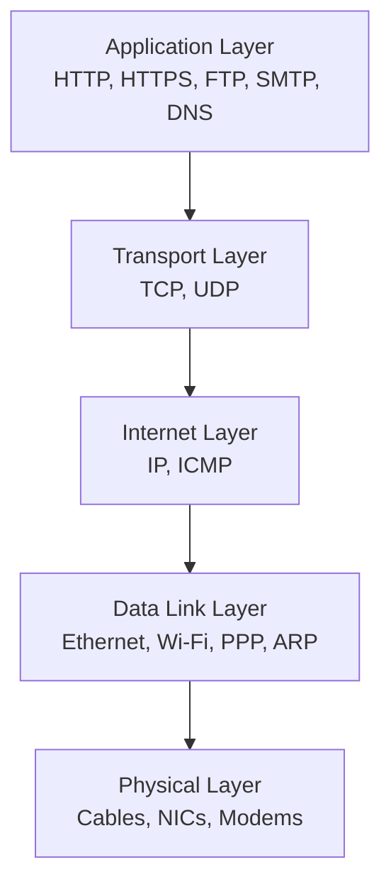
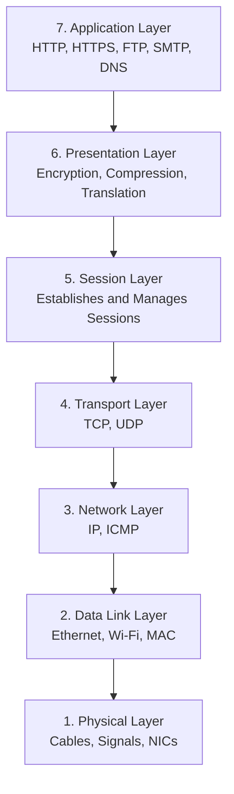

---
tags:
  - network
  - theory
---
# Computer Network 

A computer network is a system of two or more computers that are connected together by a transmission medium for the exchange of data.

### LAN (Local Area Network)

A Local Area Network (LAN) is a network that connects computers and other devices within a limited geographical area, such as a home, office, or school. This allows devices to communicate and share resources at high speeds.

##### Characteristics of LAN

- Covers a small geographical area (e.g. one building or campus)
- Usually owned and managed by a single organisation or individual
- Provides high data transfer speeds (typically 100 Mbps to 10 Gbps or more)
- Has low latency because devices are physically close together
- Can be wired (Ethernet) or wireless (Wi-Fi)
    
##### How does a LAN work?

- Devices connect to a network switch (or wireless access point if using Wi-Fi).
- Each device has its own IP address and MAC address, allowing data to be delivered to the correct destination.

##### Advantages of LAN

- High Speeds
- Low Latency
- Easy resource sharing
- More secure since its privately managed
- Relatively inexpensive

##### Disadvantages of LAN

- Limited coverage
- Requires network equipment (switches, cables, routers, etc.)
- Network failure can affect many users

### WAN (Wide Area Network)

A Wide Area Network (WAN) is a network that connects multiple LANs over large geographical areas, such as cities, countries, or continents, using communication links provided by telecommunications companies or Internet Service Providers (ISPs).

##### Characteristics of WAN

- Covers a large geographical area
- Connects multiple LANs together
- Often uses leased lines, fibre optic cables, satellites, or the Internet
- Usually managed by multiple organisations or service providers
- Generally slower and has higher latency than a LAN
    

##### Advantages of WAN

- Connects distant locations
- Enables global communication
- Support remote work
- Centralised data management
    

##### Disadvantages of WAN

- Higher cost
- Higher latency
- More complex to manage
- More security risks because data often travels over public infrastructure

### Metropolitan Area Network (MAN)

A metropolitan area network (MAN) is a network of computing devices covering a larger geographical area (two or more buildings within the same town or city) than a LAN. A MAN is typically owned and operated by a large organisation such as a cities, business or government body.

### Intranet

- An intranet is a private network built within an organisation, like a company, school, or government agency.
- Are often used to host internal resources like company documents, employee portals, collaboration tools, and communication platforms. Since access is restricted, intranets offer a more secure environment for sharing sensitive information compared to the public internet.

### Internet

- The internet is a global, public network accessible to anyone with an internet connection. It is a network of networks linked by a broad array of electronic, wireless, and optical networking technologies. It is essentially an infrastructure that provides services to applications.

### Difference in Intranet and Internet

| Feature        | Intranet                                                                    | Internet                                                                 |
| -------------- | --------------------------------------------------------------------------- | ------------------------------------------------------------------------ |
| **Scope**      | Private network within an organization                                      | Public network accessible globally                                       |
| **Access**     | Restricted to authorized users within the organization                      | Open to anyone with an internet connection                               |
| **Content**    | Internal resources relevant to the organization (documents, portals, tools) | Diverse content from various sources (news, social media, entertainment) |
| **Security**   | More secure due to restricted access                                        | Less secure due to open nature                                           |
| **Connection** | Can be isolated from the internet or connected with security measures       | Connects devices across the globe                                        |
| **Purpose**    | Internal communication, collaboration, secure resource sharing              | Global communication, information sharing, access to online services     |


# Network Hardware
### Nodes

Any device or computer that can connect to a network and generate, process, or transfer data. 

### Network nodes

Can either be endpoints or redistribution points.

- Endpoints are nodes that function as a source or destination for data transfer.
    
- Redistribution nodes are nodes that transfer data, such as router or network switches.
    

### Network topologies

- the physical or logical arrangement of devices (nodes) and connections (links) in a computer network that dictates how data flows
    
### Wi-Fi

Wi-Fi is a wireless networking technology based on the IEEE 802.11 family of standards that allows devices to connect to a Local Area Network (LAN) using radio waves instead of physical cables.

>[!Note]
>Contrary to popular belief or Mr Fong’s notes, Wi-Fi does not stand for ‘Wireless Fidelity’. The term ‘Wireless Fidelity’ was coined by a marketing firm hired by the Wireless Ethernet Compatibility Alliance (WECA, now the Wi-Fi Alliance) in 1999 because they were looking for a user-friendly name to refer to IEEE 802.11.

### WLAN (Wireless Local Area Network)

A Wireless Local Area Network (WLAN) is a Local Area Network (LAN) in which devices communicate wirelessly using Wi-Fi (IEEE 802.11) instead of Ethernet cables.

A typical WLAN uses one or more Wireless Access Points (WAPs) to allow devices to connect to the WLAN wirelessly.

### Network Interface Card (NIC)

A Network Interface Card (NIC) is a hardware component that enables a device to connect to a network by transmitting and receiving data. It provides the physical or wireless interface between the device and the network and is assigned a unique MAC (Media Access Control) address.

##### Characteristics of NIC:

- Connects a device to a network
- Can be wired (Ethernet) or wireless (Wi-Fi)
- Has a unique MAC address
- Operates primarily at the Physical Layer (Layer 1) and Data Link Layer (Layer 2) of the OSI Model
- Converts data between the computer’s internal format and signals suitable for transmission over the network
    

>[!Why is NIC needed?]
>
>A computer cannot communicate over a network on its own. The NIC acts as thecommunication interface, allowing it to:
>- Send data to other devices
>
>- Receive incoming data
  >  
> - Identify itself on the local network using its MAC address
  

##### Types of NICs

###### 1. Wired NIC (Ethernet NIC)

Uses an Ethernet cable (RJ45 connector)

```
Computer – Ethernet NIC – Ethernet Cable – Switch
```

**Advantages:**

- Faster and more stable
- Lower latency
- Less susceptible to interference
    

###### 2. Wireless NIC (Wireless LAN Adapter)

Uses Wi-Fi (IEEE 802.11) to communicate via radio waves.

**Advantages:**

- No cables needed
- Mobile
- Easy to install
    

##### Other functions of NIC

Many just think of a NIC as an Ethernet socket.

However, a NIC contains a specialised network controller that handles many networking tasks in hardware, such as:

- Framing Ethernet packets
- Calculating error-checking values (CRC)
- Managing transmission and reception
- Buffering incoming and outgoing data


# Types of Network Devices

### Hub

- A device that connects multiple devices in a local network and blindly broadcasts data to all devices in the network.
- It operates at the `Physical Layer` (`Layer 1 of the OSI Model or the TCP/IP Model`). This is because it only broadcasts digital signals and doesn’t deal with frames or packets.

### Switch

A switch is a networking device that connects multiple devices (e.g. computers, printers, servers, access points, etc.) in a LAN (Local Area Network). Its purpose is to receive data from one device and send it to the intended destination. 

The switch works at the data link layer (2nd layer of the OSI Model or TCP/IP Model). As it only examines the ethernet frames. It doesn’t rewrite any MAC addresses and IP addresses written in ethernet frames provided to it.


>[!How does a switch work? (With Example)]
>
>**Step 1:** A device is connected to the switch. It has a MAC (Media Access Control) address that uniquely identifies it.
>
>Suppose a device with a MAC address of `AA:AA:AA:AA:AA` is connected to port A of the switch.
>
>**Step 2:** The device sends a frame to the switch. The switch looks at the source of the MAC address and maps the MAC address to the port. Over time, it builds a MAC address table (or a Content Addressable Memory (CAM) Table).
>
> In this example, the switch will map port A with the MAC address of `AA:AA:AA:AA:AA` in its CAM table:
>
>#### CAM (Content Addressable Memory) Table
>
>| Port | MAC Address                     |
>| ---- | ------------------------------- |
>| `A`    | `AA:AA:AA:AA:AA` (recently added) |
>| `B`    | `BB:BB:BB:BB:BB`                  |
>| `C `   | `CC:CC:CC:CC:CC`                  |
>| `D`    | EMPTY                           |
>
>**Step 3:** The switch decides where to send the frame
>
>Suppose PC $A$ wants to send data to PC $C$.
>
>- Receives ethernet frame
>- Reads the destination MAC address
>- Looks it up on the CAM Table
>- Finds that PC $C$ is connected to port $3$
>- Sends the frame only out of port $3$
    


## Router

- A router is a networking device that routes data packets between computer networks. It also directs traffic, choosing the best route for information to travel across the network so that it’s transmitted as efficiently as possible.

- The router operates at the network layer (3rd layer of the OSI Model or TCP/IP Model). This is because a router removes the MAC addresses of the ethernet frames received and examines the IP address of the packet, before adding on new MAC addresses and forwarding the new ethernet frame.


>[!Example of how a router processes ethernet frames:]
>
>Suppose your PC wants to access a website:
>
>**Step 1.** Your PC creates an IP packet:
>
>```
>Packet Header
>------------------------------
>Source IP: 192.168.1.10
>Destination IP: 142.250.167.167
>```
>
>**Step 2:** Since the destination isn’t on the same network, the PC sends it to the default gateway (i.e. the router).
>
>To do so, the PC wraps the IP packet in an Ethernet frame:
>
>```
>Frame Header
>------------------------------
>Source MAC: PC’s MAC
>Destination MAC: Router’s MAC
>
>Packet Header
>------------------------------
>Source IP: 192.168.1.10
>Destination IP: 142.250.167.167
>```
>
>**Step 3:** The switch forwards this frame unchanged to the router.
>
>**Step 4:** The ethernet frame reaches the router.
>
>**The router:**
>
>- Removes the Frame Header  
>- Reads the destination IP address
>- Looks up the routing table to determine the next hop
>- Creates a new Ethernet Frame Header for the outgoing network
>
>
>### Routing Table (Example):
>
>|Destination Network|Subnet Mask|Next Hop|Interface|
>|---|---|---|---|
>|`192.168.1.0`|/24|Directly Connected|LAN|
>|`10.0.0.0`|/8|203.0.113.2|WAN1|
>|`172.16.0.0`|/16|203.0.113.3|WAN2|
>|`0.0.0.0`|/0|ISP Router|Internet|
>
>### Resulting Frame:
>
>```
>Frame Header
>------------------------------
>Source MAC: PC’s MAC
>Destination MAC: Next Hop’s MAC
>
>Packet Header
>------------------------------
Source IP: 192.168.1.10
Destination IP: 142.250.167.167
>```
>
>- Note: If there are multiple valid destination networks in the routing table, the router chooses the most specific route, known as the longest prefix match (the subnet mask is the largest).

### Hub v.s. Switch v.s. Router

|Network Device|OSI Layer|Uses|Forwards|
|---|---|---|---|
|Hub|Layer 1 (Physical)|Electrical Signals|Bits|
|Switch|Layer 2 (Data Link)|MAC Addresses|Unchanged Ethernet Frames|
|Router|Layer 3 (Network)|IP Addresses|Ethernet Frames with new MAC Addresses|

## Modem

‘Modem’ stands for modulator-demodulator.

A modem is a network device that demodulates signals on the WAN side into digital data for the local network and modulates digital signals from the LAN to signals to be transmitted to the WAN.

### Wireless Access Point (WAP)

A Wireless Access Point (WAP) is a networking device that allows wireless devices to connect to a wired LAN using Wi-Fi.

# IP and MAC Addresses

## IP Address

An IP (Internet Protocol) address is a logical numerical address assigned to a device on a network, used to identify the device and enable data to be routed between different networks.

### IPv4 Addresses

- Has a size of $32$ bits → allows $4,294,967,296$ addresses
    
- Format: $185.107.80.231$ → $4$ bytes, each byte separated by dots, and each byte can range from $0$ to $255$.
    

##### Five Different Classes of Networks

- There are a group of bits defining a network (or netID) and another group of bits defining a host on that network (hostID)
    

##### Class A

- Allows for $27 - 2 = 126$ large networks
- Each network has a capacity of up to $224 - 2 = 16,777,216$ hosts.
- Public IP Range: `1.0.0.0` to `126.255.255.255`
- The first octet value ranges from $1 - 126$.
- Private IP Range: `10.0.0.0 `to `10.255.255.255`
- Subnet Mask: `255.0.0.0` (8 bits) → `i.e. the netID is given by the first 8 bits, the hostID is given by the next 24 bits`
- Typically used by Internet Service Providers (ISPs) and large corporations such as Google
    

##### Class B

- Allows for $214 - 2 = 16,382$ networks
- Each network has a capacity of up to $216 - 2= 65,534$ hosts. 
- Public IP Range: `127.0.0.0` to `191.255.255`
- The first octet value ranges from $127 - 192$
- Private IP Range: `172.16.0.0` to `172.31.255.255`
- Subnet Mask: $255.255.0.0$ → i.e. the netID is given by the first $16 $bits, the hostID is given by the next $16 $bits.
- Typically used by universities or medium-sized businesses
    

##### Class C

- Allows for $221 - 2 = 2,097,150$ networks
- Each network has a capacity of up to $28 - 2 = 254$ hosts
- Public IP Range: `192.0.0.0` to `223.255.255.255`
- Private IP Range: `192.168.0.0` to `192.168.255.255`
- Subnet Mask: `255.255.255.0` ($24$ bits) → `i.e. the netID is given by the first 24 bits, the hostID is given by the next 8 bits`
- Typically used by small businesses and home networks


##### Class D

- Used for broadcasts and multicasting

##### Class E

- Used for research

###### Observation 1:

The number of available networks is $2n - 2$ for some positive integer $n$

**Why the $-2$?**

The $-2$ comes from the fact that two network numbers in each class are reserved and cannot be assigned as normal networks.

**Class A:**

The first octet cannot be $0$ → network `0.0.0.0` cannot be used as it used to mean “this network” or “unspecified address”.

The first octet also cannot be `127 (11111111)` → network `127.0.0.0` is reserved for loopback (`127.0.0.1` is localhost).

For Classes $B$ and $C$, the two network numbers are historically also reserved, but actually, the $-2$ is strictly necessary for Class $A$ only.

###### Observation 2:

The number of available hosts is $2n - 2$ for some positive integer $n$.

For hosts, the $-2$ comes from the fact that two host addresses in every subnet are reserved.

**Reserved host 1: All host bits are $0$.**

For example, `192.168.1.0/24` → the hostID = $0$

This IP address doesn’t refer to a computer, but rather, it refers to the IP address of the network itself.

**Reserved host 2: All host bits are 1.**

For example, `192.168.1.255` → the hostID = `255 (11111111)`

This IP address is known as the broadcast address. When a packet arrives at this address, it is sent to every host on the network (hence the packet is ‘broadcasted’).


##### Subnet Mask

A subnet mask is a $32$ bit number used in IPv4 networking that helps divide an IP address into two components: the network portion (netID) and the host portion (hostID).

>[!Worked Example of Subnet Masking:]
>
>IP Address: `192.168.1.10`
>
>Subnet Mask = `255.255.255.0`
>
>**In binary,**
>
IP Address: `11000000.10101000.00000001.00001010`
>
>Subnet Mask: `11111111.11111111.11111111.00000000`
>
>The mask tells us that the first $24$ bits are reserved for the network (`192.168.1`) and the last $4$ bits are available for hosts. The IP `192.168.1.10` is therefore host number $10$ on the `192.168.1.0` network.
>


##### CIDR Notation

The Classless Inter-Domain Routing (CIDR) notation is a compact method of writing an IP address and its associated subnet mask.

**Example:**

`192.168.1.10/24` → the first $24$ bits tell us the netID, the remaining $8 $bits tell us the hostID.


### IPv6 address

Internet Protocol Version 6

- $128$ bits long
- Written as eight groups of four hexadecimal digits, separated by colons
- Supports approximately $3.4 * 1038$ unique addresses
    

**Example of IPv6 address:**

`2001:0db8:85a3:0000:0000:8a2e:0370:7334`


### DHCP (Dynamic Host Configuration Protocol)

The DHCP (Dynamic Host Configuration Protocol) is the protocol that automatically assigns IP addresses and other network settings to devices when they join a network.

>[!DORA process]
>
>DHCP follows four main steps, commonly remembered as DORA.
>
>**Step 1:** Discover
>
>- The device has no IP address yet.
>
>- It cannot send packets to a specific destination because it doesn’t know who the DHCP server is.
>
>- So it sends a broadcast message to all hosts in the network. Only DHCP servers respond.
>
>**Step 2:** Offer
>
>- The DHCP server checks its pool of available addresses.
>
>- Suppose its pool is `192.168.100` to `192.168.1.200`.
>
>- It might reply by offering any one of the available IP addresses, for example 192.168.1.105. This is known as a DHCP offer.
>
>**Step 3:** Request
>
>- The client responds with the IP address that it has decided to use (it requests to use a specific IP address that has been offered). It broadcasts the IP address so that if multiple DHCP servers made offers, they all know which offer was accepted.
>
>**Step 4:** Acknowledgement (ACK)
>
>- The DHCP server responds with an acknowledgement, allowing the client to configure its IP address and start to communicate with other hosts in the network.
>
>- The server listens on UDP port number 67, and the client listens on UDP port number 68.


### MAC Address

A MAC (Media Access Control) address is a unique $48$-bit hexadecimal identifier assigned to a Network Interface Card (NIC), allowing devices to be identified and communicate on a Local Area Network (LAN).

##### Characteristics of MAC Addresses:

- $48$ bits ($6$ bytes) long
- Written as $12$ hexadecimal digits
- Used for communication within a LAN (Local Area Network)
- Assigned to a network interface, not the entire device
- Operates at the Data Link Layer (Layer $2$) of the OSI Model

**Example:**

```
00:1A:2B:3C:4D:5E
```

- Each pair of hexadecimal digits represents 1 byte (8 bits)
- Pairs are separated by colons

##### Structure of a MAC address

A MAC address consists of two parts:


```
`00:1A:2B`:`3C:4D:5E`
OUI (Organisationally Unique Identifier)> : Device Identifier
```

###### 1. Organizationally Unique Identifier (OUI)

- First $24$ bits (first $3$ bytes)
- Identifies the manufacturer
- Assigned by IEEE

##### 2. Device Identifier

- Last $24$ bits
- Assigned by the manufacturer
- Makes each network interface unique within that manufacturer’s range
    

#### Common misconceptions about MAC addresses

- A MAC address identifies a computer
- No. Instead, it identifies a network interface card (NIC). Devices may have more than one network interface. For example, a computer with both Wi-Fi and Ethernet has two MAC addresses.
- MAC addresses are used across the Internet
- No. It is only used for communication on the local network. Routers use IP addresses to forward packets between different networks.
- MAC addresses never change
- No. They are usually fixed by the manufacturer but can often be temporarily changed (spoofed) by software.


### IP v.s. MAC addresses

| IP Address                        | MAC Address                    |
| --------------------------------- | ------------------------------ |
| Logical address                   | Physical/Hardware address      |
| Network Layer `(Layer 3)`         | Data Link Layer `(Layer 2)`    |
| Used for routing between networks | Used for delivery within a LAN |
| Can change                        | Usually fixed                  |
| Assigned by DHCP/admin            | Assigned by manufacturer       |
| Used by routers                   | Used by switches               |


### IPv4 v.s. IPv6 v.s. MAC addresses

| Feature               | MAC                                                                | IPv4                                                     | IPv6                                                                                                                                               |
| --------------------- | ------------------------------------------------------------------ | -------------------------------------------------------- | -------------------------------------------------------------------------------------------------------------------------------------------------- |
| **Function**          | Used by network switches to direct data within the same network    | Used by routers to direct data across different networks | Used by routers to direct data across different networks                                                                                           |
| **Length of Address** | 48 bits                                                            | 32 bits                                                  | 128 bits                                                                                                                                           |
| **Address Format**    | Six groups of two hexadecimal digits separated by colons or dashes | Four denary numbers between 0 and 255 separated by dots  | Eight groups of four hexadecimal digits separated by colons. Can be shortened by omitting leading zeros as well as a section of consecutive zeroes |
| **Permanent**         | Yes                                                                | No                                                       | No                                                                                                                                                 |


# Packets

A packet is a unit of data at the Network Layer (`Layer 3`) of the OSI Model that contains a payload and logical addressing information (Source and Destination IP addresses), allowing data to be routed between different networks.

### Why do we need packets?

- When sending large amounts of data, sending everything as one huge block is inefficient.
- Instead, data is broken into smaller pieces called packets.

### Structure of an IP Packet Header

```
+---------+---------------+----------------+----------------+
| Version | Header Length | Type of Service| Total Length   |
+---------+---------------+----------------+----------------+
| Identification          | Flags | Fragment Offset         |
+-------------------------+-------+-------------------------+
| TTL     | Protocol      | Header Checksum                 |
+---------+---------------+---------------------------------+
| Source IP Address                                         |
+-----------------------------------------------------------+
| Destination IP Address                                    |
+-----------------------------------------------------------+
| Options                                                   |
+-----------------------------------------------------------+
| Data / Payload                                            |
+-----------------------------------------------------------+
```

### Structure of an IP Packet

```
IP Header
Payload
(Data)
```

### Packet Switching v.s. Circuit Switching

- Packet Switching **is a method of sending data across a digital network by breaking files into small blocks called packets, which travel independently and share network resources dynamically.**

- Circuit Switching is **a method of communication that sets up a dedicated communication path (or circuit) between the sender and receiver before any data moves. The path remains reserved for the entire communication session.**

| Feature           | Packet Switching                                   | Circuit Switching                                      |
| ----------------- | -------------------------------------------------- | ------------------------------------------------------ |
| **Data Transfer** | Breaks data into packets, sent independently       | Dedicated path established between sender & receiver   |
| **Routing**       | Packets can take different routes based on traffic | Dedicated path remains fixed for entire communication  |
| **Bandwidth**     | Dynamically allocated based on traffic             | Guaranteed bandwidth for the communication             |
| **Efficiency**    | More efficient for bursty data traffic             | Less efficient for bursty data traffic                 |
| **Cost**          | Generally considered more cost-effective           | Can be more expensive, especially for unused bandwidth |
| **Applications**  | Ideal for data transfer (web browsing, email)      | Ideal for real-time communication                      |
### Packet loss

- At times, some routers may receive packets faster than they are able to route them on. 
- These packets are buffered in memory and this introduces delays (referred to as a 'high latency').

>[!Why is Packet Loss bad]
>For most traffic this is not an issue; it just means that the web page takes longer to load or a file download takes more time than expected. However, for other network traffic these delays may have more of an impact, particularly if you are talking over a voice call or playing an online game. If the buffering is severe, the router may run out of memory and packets are simply discarded.


### Routing tables

- A router routes IP Packets across networks: a router device connects different links. It examines IP packet headers, looking at the destination address and consulting a routing table of known networks.

>[!Why do we need routing tables?]
>Routing tables contain the information necessary to forward a package along the shortest/best route to allow it to reach its destination. As soon as the packet reaches a router, the packet header is examined and compared with the routing table. The table supplies the router with instructions to send the packet to the next available router


# Network Protocols

## DNS (Domain Name System)

### What does the Domain Name System (DNS) do?

It translates human-readable website names (like [google.com](http://google.com/)) into machine-friendly IP addresses (like 192.168.1.1) so browsers can load internet resources. DNS uses port 53.

### What is a DNS Server?

A DNS server maintains databases containing IP addresses and their corresponding domain names.

### Types of DNS servers involved in loading a webpage:

- DNS recursive resolver - The recursive resolver can be thought of as a librarian who is asked to go find a particular book somewhere in the library. The DNS recursor is a server designed to receive queries from client machines through applications such as web browsers. Typically the recursor is then responsible for making additional requests in order to satisfy the client’s DNS query.
- Root nameserver - Tell resolvers where to find the correct Top-Level Domain (TLD) server. Note: The root server does not know the IP address of every website.
- Top-Level Domain (TLD) Name Servers - Know which authoritative server manages domains under their TLD. There is a TLD server for .com, .org, .net, .edu, etc.
- Authoritative Name Server - Stores the actual DNS records for a domain.
    

>[!How does the Domain Name Server work?]
>
>**Step 1:** A user types ‘[example.com](http://example.com/)’ into a web browser and the query travels into the Internet and is received by a DNS recursive resolver.
>
>**Step 2:** Browser checks its own DNS cache. If the IP address of ‘[example.com](http://example.com/)’ is already cached and its TTL (Time To Live) hasn’t expired, the browser immediately uses the cached IP. No DNS packets are sent. Otherwise, continue.
>
>**Step 3:** Operating System checks its DNS cache. The browser asks the operating system to resolve [example.com](http://example.com/), if the IP address is present, then it returns the IP address immediately. Otherwise, continue.
>
>**Step 4:** Check Hosts File – The hosts file is a small text file on your computer that acts as a manual DNS table.
>
>**Step 5:** The operating system sends a recursive DNS query to its configured DNS resolver.
>
>**Step 6:** The recursive resolver checks its cache. If the IP address is present, return the IP address. Otherwise, continue.
>
>**Step 7:** The resolver then sends an iterative DNS query to the DNS root nameserver.
>
>**Step 8:** The root server then responds to the resolver with the address of a Top Level Domain (TLD) DNS server (such as .com or .net), which stores the information for its domains. When searching for [example.com](http://example.com/), our request is pointed toward the .com TLD.
>
>**Step 9:** The resolver then makes a request to the .com TLD to find the authoritative server for example.com.
>
>**Step 10:** The resolver then makes a request to the authoritative server. Finally, the authoritative server returns the IP address of [example.com](http://example.com/).
>
>**Step 11:** The resolver caches the result.
>
>**Step 12:** The resolver replies to the client.
>
>**Step 13:** Browser opens a TCP connection through the TCP three-way handshake.
>
>**Step 14:** TLS handshake
>
>**Step 15:** HTTP request


### Types of DNS queries

| DNS Query Type | Description |
|---|---|
| **Recursive Query** | In a recursive query, a DNS client requires that a DNS server (typically a DNS recursive resolver) will respond to the client with either the requested resource record or an error message if the resolver can’t find the record. |
| **Iterative Query** | In this situation the DNS client will allow a DNS server to return the best answer it can.<br><br>If the queried DNS server does not have a match for the query name, it will return a referral to a DNS server authoritative for a lower level of the domain namespace.<br><br>The DNS client will then make a query to the referral address. This process continues with additional DNS servers down the query chain until either an error or timeout occurs. |
| **Non-recursive Query** | Typically this will occur when a DNS resolver client queries a DNS server for a record that it has access to either because it’s authoritative for the record or the record exists inside of its cache.<br><br>Typically, a DNS server will cache DNS records to prevent additional bandwidth consumption and load on upstream servers. |


# TCP (Transmission Control Protocol)

- Uses three-way handshake to establish a reliable connection
	- SYN (Synchronise): The client sends a packet with the SYN flag set to the server to establish a connection
	- SYN-ACK (Synchronise and Acknowledge): The server replies with another packet with both SYN and ACK flags on.
	- ACK (Acknowledge): The client replies with another packet with the ACK flag on to acknowledge that the server is listening
	- More reliable than UDP (User Datagram Protocol) but slower in general.
	- Used in HTTP, HTTPS, FTP, SMTP, etc.
    

# UDP (User Datagram Protocol)

- Connectionless, efficient but unreliable transmission of packets
- If any packets are lost, they are lost forever
- Typically used for video streaming which uses VoIP (Voice over IP) where efficiency is required
    

# HTTP v.s. HTTPS

HTTP (HyperText Transfer Protocol) is **an application-layer protocol used for communication between a client (such as a web browser) and a web server**. The client sends an HTTP request (e.g. GET or POST), and the server returns an HTTP response containing a status code, headers, and the requested resource (such as an HTML page, image, or JSON data).

HTTP uses port $80$ while HTTPS uses port $443$ with TCP.

The main difference between HTTP and HTTPS is that HTTPS uses TLS (Transpoint Layer  Security) encryption.

>[!Explanation of how it works:]
>
>**Step 1:** You type a URL into the browser and press enter:
>
>```
>https://www.google.com/search?q=cats
>```
>
>**The browser breaks this into:**
>
>- Protocol: HTTPS  
>- Domain: [www.google.com](http://www.google.com/)
  >  - Path: /search
>-Query: q=cats
  >  
>
>**Step 2:** The browser queries a DNS server to request for the IP address of the domain.
>
>**Here DNS replies with:**
>
>```
142.250.183.36
>```
>
>(The IP address for [www.google.com](http://www.google.com/))
>
>**Step 3:** The browser now needs to connect to the server.
>
>- HTTP uses TCP on port 80, performing a TCP three-way handshake.
>
>- HTTPS also uses TCP but on port 443, but after the TCP handshake, the browser also performs a TLS handshake to verify the server’s identity, exchange encryption keys, and create a secure session.
>
>**Step 4:** Browser sends an HTTP request
>
>- Now the browser sends a HTTPS request to the server:
>
>```
>GET /search?q=cats HTTP/1.1
>Host: [www.google.com](http://www.google.com)
>User-Agent: Chrome
>Accept: text/html
>Connection: keep-alive
>```
>
**Breakdown of HTTP request:**
>```
>Request Line (Line 1):
>Method: GET
>Resource: /search?q=cats
>Protocol version: HTTP/1.1
>Headers
>Which website you’re requesting: Host: [www.google.com](http://www.google.com/)
>Which browser you’re using: User-Agent: Chrome
>Types of content you accept: Accept: text/html
>Body
>GET requests usually have no body. However, POST requests often do. 
>Example of POST request:
>
>POST /login HTTP/1.1
>
>username=Alice
>password=123456
>
>```
>
**Step 5:** Request travels across the Internet
>
>- The request is broken into packets. Routers forward packets based on their destination IP address until they reach the server.
>
>**Step 6:** Server receives the request & processes it
>
>**Example:**
>
>```
>GET /search?q=cats
>```
>
>- Then the server decides what happens.
>
**Possible outcomes:**
>- Return a webpage
>- Run backend code
>- Query databases
>- Return an image
> - Return JSON
  >  
>**Step 7:** Server sends an HTTP response
>
>**Example:**
>
>```
>HTTP/1.1 200 OK
>
>Content-Type: text/html
>Content-Length: 2031
>
><html>
>…
></html>
>```
>
>**An HTTP response contains:**
>
>- Status line  
>```
>HTTP/1.1 200 OK
>```
>- Protocol: HTTP/1.1
>- Status Code: 200
>- Meaning: OK
>- Response Headers
>```
>Content-Type: text/html
>Content-Length: 2031
>```
>
>- Content-Type: text/html → A HTML file is returned  
>- Content-Length: 2031 → How many bytes follow  
>- Response Body
 > 
>##### HTML Example
>
>```
><html>
>…
></html>
>```
>
>##### JSON Example
>
>```
>{
>    “name”:”Alice”
>}
>```
>
>**Step 9:** Browser processes the response
>
**Suppose the body is HTML:**
>
>```html
><html>
><head>
>	<link href="style.css">
>	<script src="app.js"></script>
></head>
><body>
>	
></body>
></html>
>```
>
>The browser parses the HTML.
>
>Then it notices CSS, JavaScript, Images, Fonts, etc.
>
>**So it sends:**
>
>```
>GET /style.css
>GET /app.js
>GET /cat.png
>```
>
>**Step 10:** Browser renders the page (Done)

# FTP (File Transfer Protocol)

- FTP (File Transfer Protocol) is an **application-layer protocol specifically designed for transferring files between a client and a server over a network.**
- While HTTP is mainly for viewing web pages, FTP is for uploading, downloading, renaming, deleting, and managing files.
- Uses port `21`.
- Note: Usually its FTPS (FTP Secure) or SFTP (SSH File Transfer Protocol) that are more commonly used for security.


# TCP/IP Model

The Transmission Control Protocol/Internet Protocol (TCP/IP) model **is the fundamental framework for communication across the internet.**  It defines how data is broken down, addressed, routed, and delivered between devices. Think of it as a universal language that allows all sorts of computers and devices to exchange information over the vast network.




| Layer                 | Description                                                                                                    | Protocols                                                                                                                                                                    | Hardware / Software                                                                                         |
| --------------------- | -------------------------------------------------------------------------------------------------------------- | ---------------------------------------------------------------------------------------------------------------------------------------------------------------------------- | ----------------------------------------------------------------------------------------------------------- |
| **Physical Layer**    | Handles physical transmission of data packets over the network medium cables, wires, or wireless signals.      | Ethernet                                                                                                                                                                     | Network cables, Wireless adapters, Network Interface Cards (NICs), Modems                                   |
| **Data Link Layer**   | Packages the data into frames and ensures error-free transmission between devices on the same network segment. | Ethernet, Wi-Fi, PPP (Point-to-Point Protocol), ARP (Address Resolution Protocol)                                                                                            | Network Interface Cards (NICs), Switches                                                                    |
| **Internet Layer**    | Routes data packets across different networks, determining the best path to reach the destination device.      | IP (Internet Protocol), ICMP (Internet Control Message Protocol)                                                                                                             | Routers                                                                                                     |
| **Transport Layer**   | Manages reliable data transfer between applications.                                                           | TCP (Transmission Control Protocol), UDP (User Datagram Protocol)                                                                                                            | Not directly associated with specific hardware, but relies on the functionality of the Network Access Layer |
| **Application Layer** | Provides services directly to applications like web browsing, email, and file transfer.                        | HTTP (Hypertext Transfer Protocol), HTTPS (Secure Hypertext Transfer Protocol), FTP (File Transfer Protocol), SMTP (Simple Mail Transfer Protocol), DNS (Domain Name System) | Web browsers, Email clients, FTP clients, Operating Systems (for application support)                       |


# OSI Model (Outdated)



The OSI (Open Systems Interconnection) model is a 7-layer conceptual framework that standardises how data is transmitted between devices over a network by dividing network communication into separate layers, where each layer performs specific functions and provides services to the layer above it.

## Why was the OSI model created?

Before the OSI model, different companies created their own networking protocols that were often incompatible.

**For example:**

- A company’s systems might communicate differently from another company’s systems.
- Devices from different manufacturers could not easily communicate.

The OSI model provides a common framework so that different networking technologies can work together.
Note: This model is outdated, the model currently in use is actually the TCP/IP model.