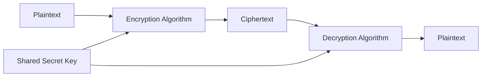
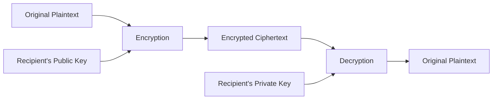
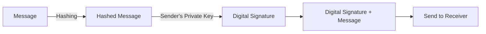
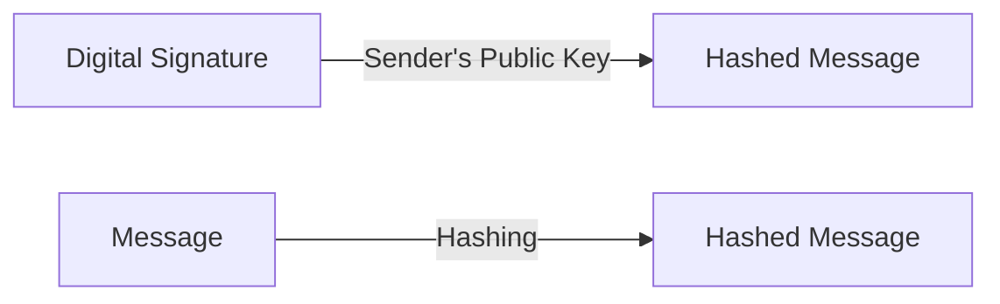

---
tags:
  - network
  - security
---
# Malmares

## Social Engineering Attacks

### Definition

A social engineering attack is a type of attack that uses deception and trickery to convince unsuspecting users to provide sensitive data or to violate security guidelines.

### Types of Social Engineering Attacks

| Type | Description |
|---|---|
| **Spoofing** | This is a human- or software-based attack in which the goal is to pretend to be someone else for the purpose of concealing their identity.  Spoofing can occur through:  - Using IP addresses (IP spoofing) - A network adapter’s hardware media access control (MAC) addresses (MAC Spoofing) - Email. Various email message headers are changed to conceal the originator’s identity. |
| **Impersonation** | This is a human-based attack in which an attacker pretends to be someone he’s not.  A common scenario is when the attacker calls an employee and pretends to be calling from the help desk. The attacker tells the employee he is reprogramming the order-entry database, and he needs the employee’s user name and password to make sure it gets entered into the new system. |
| **Phishing** | Email-based social engineering attack  In a phishing attack, the attacker sends an email message that seems to come from a respected bank or other financial institution. The message claims that the recipient needs to provide an account number, Social Security number, or other private information to the sender in order to “verify an account”. |
| **Pharming** | A cyber-attack that redirects users to fraudulent websites or manipulates their computer systems to collect sensitive information. Victims are tricked into thinking that these fraudulent websites are legitimate. |
| **Vishing / Voice Phishing** | This is a human-based attack for which the goal is to extract personal, financial, or confidential information from the victim by using services such as the telephone system and IP-based voice messaging services such as VoIP as the communication medium.  The term “vishing” is the shortened form of “voice phishing”. |
| **Spear Phishing** | This form of phishing targets specific individuals, employees or mid-level staff across an organisation to steal general credentials or access. |
| **Whaling** | This is a form of spear phishing that targets individuals who are known to be upper-level executives or other high-profile employees.  Whaling attacks are well-researched attempts to access sensitive information and often resemble a legal subpoena, customer complaint, or executive issue. The content is meant to be tailored for upper management, and usually involves an alleged company-wide concern. Like phishing messages, spear phishing / whaling attacks try to convince the target to access malicious content such as hyperlink, file, or attachment. |
| **Spam** | Spam is an email-based threat in which the user’s inbox is flooded with email messages that act as vehicles carrying advertising material for products or promotions for get-rich-quick schemes and can sometimes deliver viruses or malware. |
| **Spim** | Spim is an IM-based attack similar to spam that is propagated through instant messaging instead of through email.  Spim → **Sp**am over **i**nstant **m**essaging. |
| **Hoax** | A false message or warning about a non-existent computer virus, security threat or cyber incident. They trick people into panic, wasting time, and forwarding the fake warning to others.  Two things may happen:  1. Hoax is disseminated, clogging up communication systems, and possibly triggering a Denial of Service (DoS) condition. 2. Users react by following instructions in the hoax that direct them to defend or secure their devices in an improper or unapproved manner. |

### Malware Attacks

Malware is malicious code that is designed to gain unauthorised access to, make unauthorised use of, or damage computing devices and networks.

| Type | Description |
|---|---|
| **Virus** | A sample code that spreads from one computer to another by attaching itself to other files. The code in a virus executes when the file it is attached to is opened.  Frequently, viruses are intended to enable further attacks, send data back to the attacker, or even corrupt or destroy data. |
| **Worm** | A piece of code that spreads from one device to another on its own, not by attaching itself to another file. Like a virus, a worm can enable further attacks, transmit data, or corrupt and erase files. |
| **Trojan horse** | An insidious type of malware that is itself a software attack and can pave the way for a number of other types of attacks. There is a social engineering component to a Trojan horse attack because the user has to be fooled into executing it. |
| **Logic Bomb** | A piece of code that sits dormant on a target device until it is triggered by a specific event, such as a specific date. Once the code is triggered, the bomb “detonates”, and performs whatever actions it was programmed to do. Often, this includes erasing and corrupting data on the target device. |
| **Spyware** | Surreptitiously installed malicious software that is intended to track and report on the usage of a target device, or collect other data the author wishes to obtain.  Data collected can include web browsing history, personal information, banking and other financial information, and usernames and passwords |
| **Adware** | Software that automatically displays or downloads advertisements when it is used. While not all adware is malicious, many adware programs have been associated with spyware and other types of malicious software. Also, it can reduce user productivity by slowing down devices and simply by creating annoyances. |
| **Rootkit** | Code that is intended to take full or partial control of a device at the lowest levels.  Rootkits often attempt to hide themselves from monitoring and detection, and modify low-level system files when integrating themselves into a device. Rootkits can be used for non-malicious purposes such as virtualisation; however, most rootkit infections install backdoors, spyware, or other malicious code once they have control of the target device. |
| **Botnet** | A set of devices that have been infected by a control program called a bot that enables attackers to exploit them and mount attacks. Typically, black hats use botnets for Distributed Denial of Service, or DDoS attacks, sending spam email, and mining for personal information or passwords. |

### Types of Viruses

| Type                       | Description                                                                                                                                                                                                                                                                                                                                                                                          |
| -------------------------- | ---------------------------------------------------------------------------------------------------------------------------------------------------------------------------------------------------------------------------------------------------------------------------------------------------------------------------------------------------------------------------------------------------- |
| **Boot Sector**            | Infects any disk-based media. Writes itself into the boot sector of the disk. When a system attempts to boot from the disk, the virus is moved onto the system. Once on the system, the virus attempts to move itself to every disk placed in the system.                                                                                                                                            |
| **Macro**                  | A macro is a group of application-specific instructions that execute within a specific application, A macro virus uses other programmes’ macro engines to propagate. True macro viruses do not actually infect files or data, but attach themselves to the file’s template, document or macro code. Microsoft Office products have been popular targets for macro viruses.                           |
| **Mailer and mass mailer** | A mailer virus sends itself to other users through the email system. It simply rides along with any email that is sent.  A mass mailer virus searches the email system for mailing lists and sends itself to all users on the list.  Often, the virus does not have a payload; its purpose is to disrupt the email system by swapping it with mail messages in the form of a DOS attack. |
| **Polymorphic**            | The type of virus changes as it moves around, acting differently on different systems. It can sometimes even change the virus code, making it harder to detect                                                                                                                                                                                                                                       |
| **Script**                 | A small program that runs code by using the Windows scripting host on Windows operating systems.  It is written as a script in Visual Basic or Javascript and executes when the script runs. Scripts are often distributed by email and requires use to open them                                                                                                                              |
| **Stealth**                | A stealth virus moves and attempts to conceal itself until it can propagate. After that, it drops its payload.                                                                                                                                                                                                                                                                                       |

# Firewalls

- A firewall acts as a filter that monitors access between an organisation’s internal network and the Internet at large, allowing some packets to pass and blocking others. 
- A firewall allows a network administrator to control access between the outside world and resources within the administered network by managing the traffic flow to and from these resources.

### Software firewalls

- A hardware firewall is physical, like a broadband router – it connects the network and gateway through hardware like wires. 
- A software firewall is internal – a program on your computer that works through port numbers and applications.

### Cloud-based firewalls

- known as firewall as a service (FaaS). 
- One benefit of cloud-based firewalls is that they can grow with your organisation and, similar to hardware firewalls, do well with perimeter security (preventing unauthorised users from accessing a network).

### Host-based vs Network-based firewalls 

##### Host-based

- A host-based firewall is installed on an individual computer to protect it from activity occurring on its network. 
- The policy may affect what traffic the computer accepts from the Internet, from the local network, or even from itself. 

##### Network-based firewall

- A network-based firewall is implemented at a specified point in the network path and protects all computers on the “internal” side of the firewall from all computers on the “external” side of the firewall. 
- Network-based firewalls may be installed at the perimeter, or edge, of a network to protect a corporation from hosts on the Internet, or internally to protect one segment of the community from another, such as separating corporate and residential systems, or research systems from marketing systems. 
- A network-based firewall cannot protect one computer from another on the same network, or any computer from itself.

### Functionality and Structure of firewalls

| Function               | Description                                                                                                                                                                                                                                                                                                                                                                                                                                          |
| ---------------------- | ---------------------------------------------------------------------------------------------------------------------------------------------------------------------------------------------------------------------------------------------------------------------------------------------------------------------------------------------------------------------------------------------------------------------------------------------------- |
| **Traffic Control**    | All incoming and outgoing communication must pass through the firewall, which sits squarely at the boundary between the administered network and the rest of the Internet.  While large organisations may use multiple levels of firewalls or distributed firewalls, locating a firewall at a single access point to the network makes it easier to manage and enforce a security-access policy, creating a single choke point for inspection. |
| **Authorised Traffic** | Only authorised traffic, as defined by the local security policy, will be allowed to pass.  Unauthorised access attempts are blocked, protecting valuable network resources.                                                                                                                                                                                                                                                                   |
| **Mainting security**  | While connected to the network, the firewall itself is designed to be resistant to attacks.  It acts as a robust barrier, preventing external threats from infiltrating the internal network.                                                                                                                                                                                                                                                  |

### Types of firewall 

| Type of Firewall | Description |
|---|---|
| **Packet Filters** | Traditional packet filters occur at a gateway router that connects the internal network to its ISP. It examines each datagram based on the administrator-specific rules. |
| **Stateful Packet Filters** | Stateful packet filters track TCP connections and use this information to make filtering decisions. |
| **Application Gateways** | These are application-specific servers through which all application data (inbound and outbound) must pass. They look beyond |

### Limitations to firewalls

- They cannot protect against attacks from a source if a user has explicitly allowed it to bypass the firewall. 
	- For example, some applications may ask the user to allow adding an exception in the firewall software so that the application can send or receive data without being blocked by the firewall. 
	- However, that prevents firewalls from stopping any malicious traffic into the application.

- They also cannot protect against internal attacks since the malicious traffic may not need to pass through a firewall.

# Denial of Service (DoS)

- A distributed denial of service (DDoS) attack is a type of DoS that uses multiplier devices on disparate networks to launch the coordinated attack from many simultaneous sources.
- These can sometimes be difficult to differentiate from traffic spikes when they first begin.
- The attacker introduces unauthorized software called a zombie or drone that directs the devices to launch the attack. 
	- A botnet is a collection of Internet-connected programs communicating with other similar programs communicating with other similar programs in order to perform tasks that can be used to send spam email or participate in DDoS attacks. 

# Intrusion Detection System and Intrusion Prevention System

- IPS is a device that filters out suspicious traffic.
- IDS is a device that generates alerts when it observes potentially malicious traffic. 

>[!note]
> We will collectively refer to IDS systems and IPS systems as IDS systems.

### IDS

- An IDS can be used to detect a wide range of attacks, including network mapping (emanating, for example, from nmap), port scans, TCP stack scans, DoS bandwidth-flooding attacks, worms, and viruses, OS vulnerability attacks, and application vulnerability attacks.

IDS systems are broadly classified as either **signature-based systems** or **anomaly-based systems.**

### signature-based systems

- A signature-based IDS maintains an extensive database of attack signatures. Each signature is a set of rules pertaining to an intrusion activity. 
- A signature may simply be a list of characteristics about a single packet (e.g., source and destination port numbers, protocol type, and a specific string of bits in the packet payload), or may relate to a series of packets. 
- The signatures are normally created by skilled network security engineers who research known attacks.
- An organisation’s network administrator can customize the signatures or add its own to the database

###### How does it work?

- Operationally, a signature-based IDS sniffs every packet passing by it, comparing each sniffed packet with the signatures in its database. 
- If a packet (or series of packets) matches a signature in the database, the IDS generates an alert. 
- The alert could be sent to the network administrator in an e-mail message, could be sent to the network management system, or could simply be logged for future inspection.

###### Limitation

- They require previous knowledge of the attack to generate an accurate signature. 
	- A signature-based IDS is completely blind to new attacks that have yet to be recorded. Another disadvantage is that even if a signature is matched, it may not be the result of an attack, so that a false alarm is generated. 
- Because every packet must be compared with an extensive collection of signatures, the IDS can become overwhelmed with processing and actually fail to detect many malicious packets.

### anomaly-based IDS

- An anomaly-based IDS creates a traffic profile as it observes traffic in normal operation. It then looks for packet streams that are statistically unusual
	- For example, an inordinate percentage of ICMP packets or a sudden exponential growth in port scans and ping sweeps. 

##### Pros

- They don’t rely on previous knowledge about existing attacks—that is, they can potentially detect new, undocumented attacks

###### Limitation

-  It is an extremely challenging problem to distinguish between normal traffic and statistically unusual traffic. To date, most IDS deployments are primarily signature-based, although some include some anomaly-based features

# Secure access method

### Encryption

Encryption is a process that uses an algorithm and a key to code a message written in plain text into ciphertext, which is transmitted to the recipient. 

Decryption is decoding the ciphertext back into the original plain text using a decryption algorithm and a key.

##### Purpose

- Encryption is often used to protect data from unauthorised access by allowing only authorised users to have the secret key. 
- It can also be used in combination with file permissions so that an unauthorised user who is able to bypass file permissions would still be unable to use the accessed data without knowing the secret key.

##### Symmetric key encryption

- In symmetric key encryption, there is just one key. This key is a secret shared by the sender and the receiver of a message.

- The sender uses the encryption algorithm together with the key to encrypt some plaintext. The receiver decrypts the ciphertext using the same key
- The issue with symmetric key encryption is delivery of the secret key. The sender needs the key to encrypt but it is difficult to securely deliver the key to the receiver to allow decryption

###### Example

- Examples of old symmetric key cryptography are Caesar cipher, monoalphabetic cipher, polyalphabetic encryption. 
- Modern symmetric key cryptography is categorised into two broad areas - stream ciphers and block ciphers. The latter typically, uses a technique called Cipher Block Chaining (CBC).

##### Asymmetric encryption

- Asymmetric encryption, also known as public-key encryption, is a type of encryption that uses a pair of keys to encrypt and decrypt data.

- The pair of keys includes a public key, which can be shared with anyone, and a private key, which is kept secret by the owner.
	- allows for secure communication between two parties without the need for both parties to have the same secret key.

##### Advantage of asymmetric encryption over symmetric encryption

- It eliminates the need to exchange secret keys, which can be a challenging process, especially when communicating with multiple parties.
	- If asymmetric encryption is to be used, the process is initiated by someone in possession of two keys. One of these is a public key, which is sent to anyone who is going to partake in an encrypted communication. The other is a secret private key, which is never sent to anyone. Having a means of secure transmission of a secret key is no longer an issue.

### Example

- Examples of asymmetric encryption algorithms include Rivest-Shamir-Adleman (RSA), Diffie-Hellman, and Elliptic Curve Cryptography (ECC).

# Digital signature

- It is a cryptographic technique to indicate the owner or creator of a resource or to signify one’s agreement with a document’s content in a digital world. 
- Therefore, it must be possible to prove that a document signed by an individual was indeed signed by that individual (the signature must be verifiable) and that only that individual could have signed the document (the signature cannot be forged).

##### Asymmetric encryption allows for the creation of digital signatures

- Asymmetric encryption allows for the creation of digital signatures, which can be used to verify the authenticity of data. 
- Using asymmetric encryption, the decryption-encryption works if the keys are used the other way round.
- An individual can encrypt a message with a private key and send this to a recipient who has the corresponding public key, who can then use the public key to decrypt the received ciphertext. 
- This approach would not be used if the content of a message was confidential because anyone might be in possession of the public key.
- However, it could be used to verify who the sender was. Only the sender has the private key and the public key only works with that one specific private key
###### Limitation

- one concern with signing data by encryption is that encryption and decryption are computationally expensive

##### Public cryptographic one-way hash function

- Public cryptographic one-way hash function which creates a fixed-length hash that is uniquely defined for the particular message, called a ‘digest’.
	- A one-way function is called a Hash Function → relatively easy to compute the output from the input, but significantly harder in the reverse. 

- At the receiver end, the same public one-way hash function is used to create a digest from the received message. The encrypted version of the original digest is decrypted using the public key. If the two digests are identical, the receiver can be confident that the message is authentic and has been transmitted unaltered.

>[!Procedure of a Digital Signature]
> - Message is hashed and encrypted with sender's private key.
> - This forms the digital signature.
> - Original message is sent with the digital signature.
> - Receiver would decrypt the digital signature with sender's public key to obtain the hashed message
> - The original message is hashed and compared with the hash message in step 3.
> - If the two are identical, the receiver can be certain the message did come from the sender, and hence the message is authenticated. 

###### Sender:

###### Receiver:

# Authentication 

- End-point authentication is the process of one entity proving its identity to another entity over a computer network, for example, a user proving its identity to an e-mail server.
	- For example, a user proving its identity to an e-mail server. A concrete example is a user authenticating him or herself to an e-mail server.

- Often, network elements such as routers and client/server processes must authenticate each other. 
	- Here, authentication must be done solely on the basis of messages and data exchanged as part of an authentication protocol. 
	- Typically, an authentication protocol would run before the two communicating parties run some other protocol. 
	- The authentication protocol first establishes the identities of the parties to each other’s satisfaction; only after authentication do the parties get down to the work at hand. 

>[!Common ways of authentication include:]
>- passwords  
>- biometrics, for example: fingerprints, facial recognition, iris scans 
>-  token values, such as from a physical device, a mobile phone or a software application

- Some applications use two-factor authentication (2FA), which uses two different ways of authentication for better security

