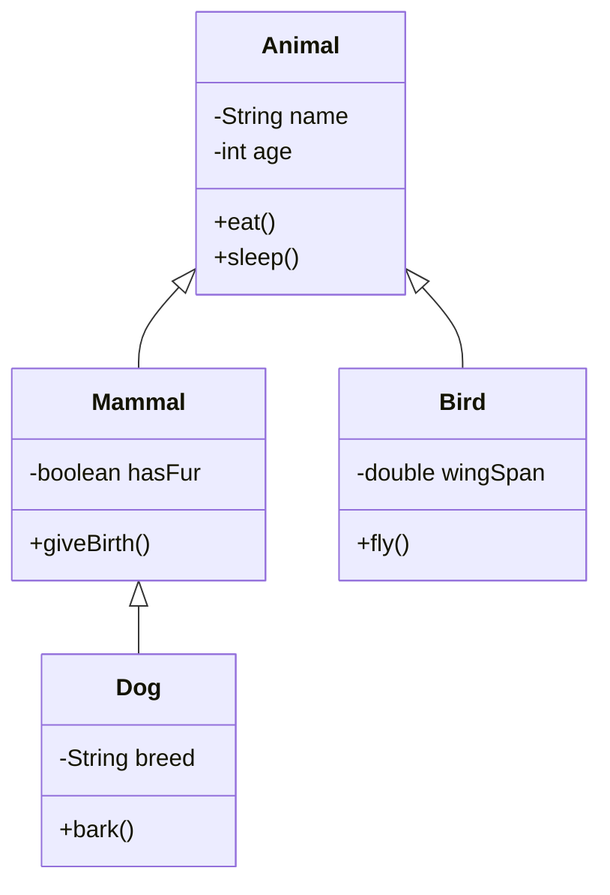

---
tags:
  - oop
  - theory
---
# Procedure v.s. OOP

### Procedure: Writing programs made of functions that perform specific tasks 

- Procedures typically operate on data items that are separate from the procedures 
- Data items commonly passed from one procedure to another 
- Focus: to create procedures that operate on the program’s data

### Object-Oriented Programming: focused on creating objects

Object: entity that contains data and procedures
- Data is known as data attributes and procedures are known as methods
- Methods perform operations on the data attributes

# OOP-General Terminologies

|Term|Definition|
|---|---|
|**Class**|Blueprint for creating objects.Defines attributes (data) and methods (behavior).|
|**Object**|An instance of a class.Represents a real-world entity with state (attributes) and behavior (methods).|
|**Abstract Data Type (ADT)**|A conceptual model that defines a set of operations and behaviours for a data structure, without specifying how these operations are implemented or how data is organised in memory|
|**Constructor**|A constructor is a method that is automatically called when an object is instantiated. It is often used to initialise data members, making dynamic memory allocation requests, opening files or communication sockets|
|**Destructor**|A destructor is a method that is invoked when the object is going to be destroyed. It is often used to end the existence of an object gracefully, by closing open files, sockets, or GUI components, as well as de-allocate dynamically allocated memory to prevent memory leakage.|
|**Class methods**|These methods can only be called through instances of a class or a subclass, which are concerned with the manipulation of class variables, and do not require the existence of any instance.|
|**Message v.s. Methods**|Method performs an activity enabling objects of a class to be manipulated. Messages are communication between objects. One object can call a public member function of another, and supply data as an argument to the function.|
|**Virtual method**|a concrete super-class method (common interface for subclass) that can be replaced ain sub-class with a new implementation.|

# Class Diagram

 "-" -> private.
"+" -> public.

# 4 Pillars of OOP

### Encapsulation:

- Bundling data (attributes) and methods (functions) that operate on that data into a single unit (class), while restricting direct access to some components (using access modifiers like private, protected, public) to enforce data hiding. 
- Restricts direct access to internal data (e.g., using private attributes).
- Separates interface (what the class exposes) from implementation (internal details).
- Provides controlled access via public methods (getters/setters).
- The goal of data hiding is where programmers can only use the given public interface (methods) to access the private attributes.
- This reduces accidental errors as programmers cannot change the attribute directly which may lead to an inconsistent state.

###### Data hiding features
- Accessor and Mutator Methods
- Hiding Attributes

### Abstraction: 

- Hiding complex implementation details and exposing only the essential features. It focuses on what an object does rather than how it does it.
- Abstraction is built on top of data hiding (restricted details) which is possible only because of encapsulation (class structure)
- Promotes modularity and reduces dependency on implementation details.

### Inheritance:

- Mechanism for creating new classes (child) from existing ones (parent)
- Child classes reuse and extend upon parent attributes and methods.
- Reduces code duplication, promotes reusability, specialization and extendability.

### Polymorphism 

- Polymorphism is the ability of objects of different types to behave in different ways / different implementations when the same message is applied to them. 
- Achieved through method overriding or interfaces/abstract classes.
- Polymorphism is the idea of allowing the same code to be used with different types, resulting in generalization and abstract implementations.
- Reduces complexity by allowing one interface, multiple behaviors.

