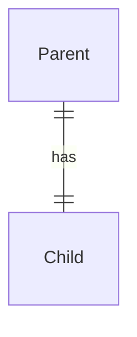
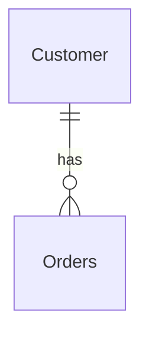

## SQL Queries

### Select Query

```sql
SELECT <field_1>, <field_2>, …, <field_n>
FROM <table>
LEFT INNER/OUTER JOIN <table> ON <condition>
WHERE <condition(s)>
GROUP BY <field_1>, <field_2>, …, <field_m>
HAVING <condition(s)>
ORDER BY <field_1>, <field_2>, …, <field_x>
```

### Update Query

```sql
UPDATE <table>
SET <field1>=<value1>, <field2>=<value2>, …, <fieldn>=<valuen>
WHERE <condition(s)>
```

### Insert Query

```sql
INSERT INTO <table> (column1, column2, column3, …)
VALUES (value1, value2, value3, …)
```

### Delete Query

```sql
DELETE FROM <table>
WHERE <condition(s)>
```

### Drop Table Query

```sql
DROP TABLE <table>
```

### Create Table Query

```sql
CREATE TABLE <table> (
    column1 datatype constraint,
    column2 datatype constraint,
    column3 datatype constraint,
    …
    PRIMARY KEY(column_k1, column_k2, column_k3, …),
    FOREIGN KEY column_x1 REFERENCES <foreign_table_1>(foreign_column_1),
    FOREIGN KEY column_x2 REFERENCES <foreign_table_2>(foreign_column_2),
    …
);
```

## ER (Entity Relationship) Diagram



One-One Relationship:
One parent has one child.




One-Many:

One customer can place many orders, but each order belongs to only one customer.

## Super key

A super key is a set of attributes that uniquely identifies any row in a table. The set is **not necessarily minimal** (i.e. there are some attributes that are redundant). There can be multiple super keys in a table.

## Candidate key

A candidate key is a minimal set of attributes that uniquely identifies any row in a table. There can be multiple candidate keys in a table.

## Primary key

A primary key is a candidate key that is chosen by the database designer to uniquely identify any row in a table. There can only be one primary key for each table.

## Secondary key

A secondary key is a candidate key that is not a primary key.

## Prime Attributes v.s. Non-prime Attributes

A prime attribute is an attribute that is **part of at least one candidate key**.

A non-prime attribute is an attribute that is not a prime attribute (i.e. it is an attribute that is not a part of any candidate key).

## Functional Dependency

`X → Y`

Means that Y is dependent on X.

X is called the **determinant**.

Y is called the **dependent attribute**.

## Transitive Dependency

An attribute Z is said to be transitively dependent on X if X → Y and Y → Z.

## Data Redundancy

Refers to data being stored more than once.

## Issues with data redundancy

- Insertion Anomaly
    
    - Occurs when you cannot insert new data into the table without inserting unrelated or unnecessary data
        
- Updating Anomaly
    
    - Occurs when updating data requires multiple rows, and failing to update all of them causes data inconsistency.
        
- Deletion Anomaly
    
    - Occurs when deleting a row unintentionally deletes important data
        
- Storage requirements
    
    - More data is required to store duplicate values if there is redundant data
        
- Security Issues
    
- Maintenance Complexity
    
    - Multiple copies of the same data has to be updated/inserted/deleted, increasing maintenance complexity
        
- Usability issues
    

## Database Normalisation

Database Normalisation is the process of structuring a relational database to reduce **data redundancy** and improve data integrity

### **1NF** (First Normal Form)

- All fields must be **atomic**, i.e. the values in each field must be indivisible
    
- There should be no repeating groups/arrays in a single row
    

### **2NF** (Second Normal Form)

- Must be 1NF
    
- Every non-key attribute must depend on the whole primary key, not just part of it, i.e. there are **no partial dependencies (A non-key attribute depends on only part of a composite primary key, instead of the whole primary key.)**
    
- This applies to tables with composite keys
    

### **3NF** (Third Normal Form)

- Must be 2NF
    
- There are no transitive dependences, i.e. all non-key attributes must be directly **functionally dependent on any super key of the table** and **not on any other non-key attributes**.
    
- For every functional dependency X → Y,
    
    1. X is a super key, or
        
    2. Y is a prime attribute (i.e. part of some candidate key)
        

### **BCNF** (Boyce-Codd Normal Form)

- Must be 3NF
    
- For every functional dependency X → Y, X must be a **candidate key**.
    

## SQL Queries (Python):

### Template Code for querying SQLite3 Databases:

```sql
import sqlite3

connection = sqlite3.connect(“<database>”)

# insert code here

connection.commit()

connection.close()
```

### Executing SQL queries:

```sql
connection.execute("<insert query here>")
```

### Retrieving results from SQL queries:

```sql
cursor = connection.execute("<insert query here>")

print(cursor.fetchall()) # this is a 2D array
```

### Taking in User Input for SQL queries:

```sql
import sqlite3
connection = sqlite3.connect("<database>")

inp = input("Enter a number: ")

cursor = connection.execute("SELECT * FROM <table> WHERE <field>=?", (inp,))

connection.commit()
connect.close()
```

## Exam tips:

ER diagrams must be normalised, if not, you would need a transition table. i.e. A student has one to many courses, and a course has many students. “Many to many” is wrong and must be normalised.

For one to one relationships, put the foreign key in the table with total participation. i.e. If one entity must have the other, but not vice versa, place the foreign key in the table that must participate.

If you are confused on the ER diagram, do the schema first and reverse engineer the ER diagram.

- What are the entities?
    
- Write out the fields in each of the table (Do schema, table description question first)
    
- Choose suitable PK for obvious tables (those with no dependencies)
    
- Identify all FK (A foreign key is an attribute in one table that refers to the primary key in another table.
    
- Choose suitable Primary keys for remaining tables.
    
- Deduce the relationship between entities based on the tip that FK always go to the many sides and that there is a relationship between the entity that has the FK and the entity with the PK.
    
- If possible, use an ER diagram to check the schema.
    

### More tips:

- Entity names should be singular.
    
- Do not draw the fields for ER diagram
    
- Draw Many in the correct direction
    
- Need to know how to use LEFT OUTER JOIN
    
    - LEFT OUTER JOIN will display everything on the left table, empty records will be shown as “NULL”
        

### SQL Syntax:

- Must be “[...] is NULL” not “[...] = NULL”